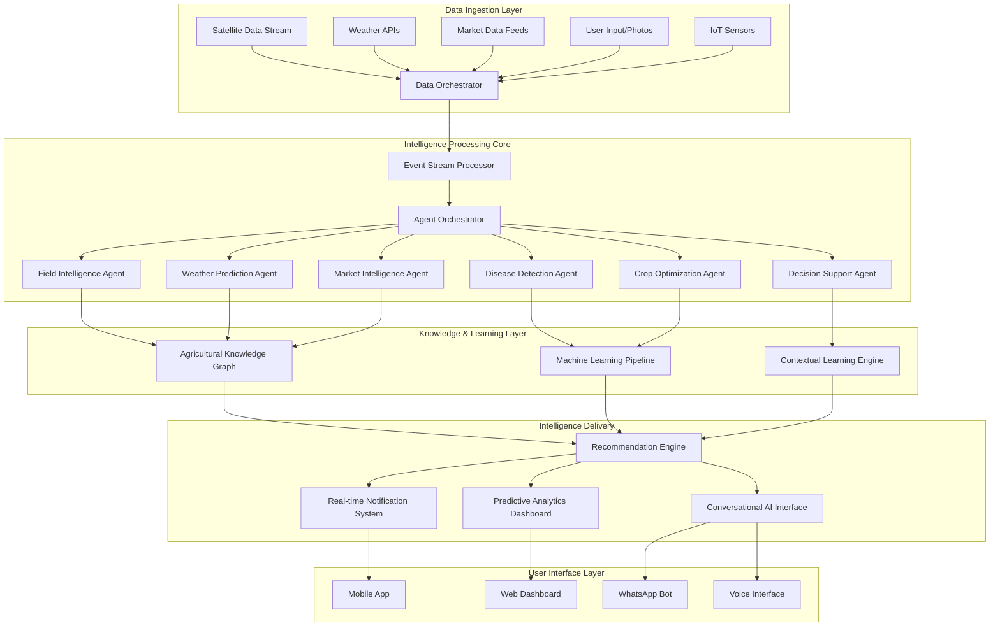

# Agricultural Superintelligence Engine Design

## Overview

The Agricultural Superintelligence Engine is a distributed, real-time AI system that transforms CropGenius into an autonomous agricultural intelligence platform. The system orchestrates multiple specialized AI agents, processes multi-modal data streams, and provides predictive, contextual, and actionable intelligence to farmers. Built on a microservices architecture with event-driven communication, the engine scales horizontally and maintains sub-second response times while processing terabytes of agricultural data.

## Architecture

### High-Level System Architecture



### Agent Architecture

Each AI agent follows a standardized architecture pattern:

```typescript
interface SuperIntelligenceAgent {
  id: string;
  capabilities: AgentCapability[];
  process(context: AgentContext): Promise<AgentResponse>;
  learn(feedback: UserFeedback): Promise<void>;
  collaborate(agents: SuperIntelligenceAgent[]): Promise<CollaborationResult>;
  getConfidence(): ConfidenceScore;
  explainReasoning(): ExplanationTree;
}
```

## Components and Interfaces

### 1. Data Orchestrator Service

**Purpose:** Unified data ingestion, validation, and routing system

**Key Interfaces:**
```typescript
interface DataOrchestrator {
  ingestSatelliteData(imagery: SatelliteImagery): Promise<ProcessingResult>;
  ingestWeatherData(forecast: WeatherForecast): Promise<ProcessingResult>;
  ingestMarketData(prices: MarketPrices): Promise<ProcessingResult>;
  ingestUserData(input: UserInput): Promise<ProcessingResult>;
  validateDataQuality(data: any): DataQualityReport;
  routeToAgents(data: ProcessedData): Promise<RoutingResult>;
}
```

**Implementation Strategy:**
- Apache Kafka for high-throughput data streaming
- Redis for real-time data caching
- PostgreSQL for structured data persistence
- Custom validation pipelines with ML-based anomaly detection

### 2. Agent Orchestrator

**Purpose:** Coordinates multiple AI agents and manages their interactions

**Key Interfaces:**
```typescript
interface AgentOrchestrator {
  registerAgent(agent: SuperIntelligenceAgent): Promise<void>;
  orchestrateAnalysis(context: AnalysisContext): Promise<OrchestratedResult>;
  resolveConflicts(recommendations: AgentRecommendation[]): Promise<UnifiedRecommendation>;
  manageWorkload(priority: Priority): Promise<WorkloadDistribution>;
  monitorAgentHealth(): Promise<HealthReport>;
}
```

**Implementation Strategy:**
- Event-driven architecture with NATS messaging
- Consensus algorithms for conflict resolution
- Dynamic load balancing based on agent performance
- Circuit breaker pattern for fault tolerance

### 3. Specialized Intelligence Agents

#### Field Intelligence Agent
```typescript
interface FieldIntelligenceAgent extends SuperIntelligenceAgent {
  analyzeSatelliteImagery(imagery: SatelliteData): Promise<FieldAnalysis>;
  detectCropStress(ndvi: NDVIData): Promise<StressAnalysis>;
  predictYield(growthData: CropGrowthData): Promise<YieldPrediction>;
  assessSoilHealth(soilData: SoilData): Promise<SoilHealthReport>;
}
```

#### Weather Prediction Agent
```typescript
interface WeatherPredictionAgent extends SuperIntelligenceAgent {
  predictWeatherImpact(forecast: WeatherForecast, crops: CropData[]): Promise<ImpactAnalysis>;
  generateAlerts(conditions: WeatherConditions): Promise<WeatherAlert[]>;
  optimizeIrrigation(weather: WeatherData, soil: SoilMoisture): Promise<IrrigationPlan>;
  predictDiseaseRisk(humidity: number, temperature: number): Promise<DiseaseRiskAssessment>;
}
```

#### Market Intelligence Agent
```typescript
interface MarketIntelligenceAgent extends SuperIntelligenceAgent {
  analyzePriceTrends(commodity: string, timeframe: TimeRange): Promise<PriceTrendAnalysis>;
  predictOptimalSelling(harvest: HarvestData, market: MarketData): Promise<SellingStrategy>;
  assessStorageValue(crop: CropData, storage: StorageOptions): Promise<StorageRecommendation>;
  identifyMarketOpportunities(location: Location, crops: CropData[]): Promise<MarketOpportunity[]>;
}
```

### 4. Real-Time Processing Pipeline

**Purpose:** Processes incoming data streams and triggers agent analyses

**Key Components:**
- Stream Processing Engine (Apache Flink)
- Event Store (EventStore DB)
- Message Queue (Apache Kafka)
- Real-time Analytics (Apache Druid)

**Processing Flow:**
1. Data ingestion from multiple sources
2. Real-time validation and enrichment
3. Event generation and routing
4. Agent trigger and orchestration
5. Result aggregation and delivery

### 5. Knowledge Graph System

**Purpose:** Maintains comprehensive agricultural knowledge and relationships

**Schema Design:**
```typescript
interface AgriculturalKnowledgeGraph {
  crops: CropNode[];
  diseases: DiseaseNode[];
  treatments: TreatmentNode[];
  weather_patterns: WeatherPatternNode[];
  market_relationships: MarketRelationshipEdge[];
  regional_practices: RegionalPracticeNode[];
}
```

**Implementation:**
- Neo4j graph database for complex relationships
- GraphQL API for flexible querying
- Automated knowledge extraction from agricultural literature
- Continuous learning from user interactions

## Data Models

### Core Data Structures

```typescript
// Field Intelligence Data Model
interface FieldIntelligenceData {
  fieldId: string;
  timestamp: Date;
  satelliteAnalysis: {
    ndvi: number;
    cropHealth: HealthScore;
    growthStage: CropStage;
    stressIndicators: StressIndicator[];
  };
  predictions: {
    yieldEstimate: YieldPrediction;
    harvestWindow: DateRange;
    riskFactors: RiskFactor[];
  };
  recommendations: ActionableRecommendation[];
}

// Agent Context Model
interface AgentContext {
  userId: string;
  fieldData: FieldData[];
  weatherData: WeatherData;
  marketData: MarketData;
  userPreferences: UserPreferences;
  historicalData: HistoricalData;
  constraints: ResourceConstraints;
}

// Unified Recommendation Model
interface UnifiedRecommendation {
  id: string;
  priority: Priority;
  category: RecommendationCategory;
  title: string;
  description: string;
  actions: ActionStep[];
  reasoning: ExplanationTree;
  confidence: ConfidenceScore;
  timeframe: TimeFrame;
  expectedOutcome: OutcomeProjection;
}
```

## Error Handling

### Multi-Layer Error Handling Strategy

1. **Agent-Level Error Handling**
   - Individual agent failures don't cascade
   - Graceful degradation with reduced functionality
   - Automatic retry with exponential backoff

2. **System-Level Error Handling**
   - Circuit breaker pattern for external services
   - Fallback to cached data when real-time data unavailable
   - Health monitoring and automatic recovery

3. **Data Quality Error Handling**
   - Automated data validation and cleaning
   - Confidence scoring for uncertain data
   - User notification for critical data issues

```typescript
interface ErrorHandlingStrategy {
  handleAgentFailure(agentId: string, error: Error): Promise<RecoveryAction>;
  handleDataQualityIssue(data: any, issue: DataQualityIssue): Promise<DataCorrectionAction>;
  handleSystemOverload(metrics: SystemMetrics): Promise<LoadBalancingAction>;
  handleExternalServiceFailure(service: string): Promise<FallbackAction>;
}
```

## Testing Strategy

### Comprehensive Testing Approach

1. **Unit Testing**
   - Individual agent logic testing
   - Data processing pipeline testing
   - Knowledge graph query testing

2. **Integration Testing**
   - Agent orchestration testing
   - End-to-end data flow testing
   - External API integration testing

3. **Performance Testing**
   - Load testing with simulated data streams
   - Latency testing for real-time responses
   - Scalability testing with increasing user base

4. **AI Model Testing**
   - Prediction accuracy validation
   - Bias detection and mitigation
   - Adversarial testing for robustness

5. **Chaos Engineering**
   - Simulated failures and recovery testing
   - Network partition testing
   - Data corruption scenario testing

### Testing Infrastructure

```typescript
interface TestingFramework {
  simulateDataStreams(volume: number, duration: Duration): Promise<SimulationResult>;
  validatePredictionAccuracy(predictions: Prediction[], actual: ActualOutcome[]): AccuracyReport;
  testAgentCollaboration(scenario: CollaborationScenario): Promise<CollaborationTestResult>;
  measureSystemPerformance(load: LoadProfile): Promise<PerformanceMetrics>;
  injectChaos(chaosType: ChaosType, intensity: number): Promise<ChaosTestResult>;
}
```

## Performance Optimization

### Scalability Design Principles

1. **Horizontal Scaling**
   - Microservices architecture for independent scaling
   - Container orchestration with Kubernetes
   - Auto-scaling based on demand metrics

2. **Data Processing Optimization**
   - Stream processing for real-time data
   - Batch processing for historical analysis
   - Intelligent caching strategies

3. **AI Model Optimization**
   - Model quantization for faster inference
   - Edge computing for reduced latency
   - Distributed training for large models

4. **Database Optimization**
   - Read replicas for query distribution
   - Partitioning for large datasets
   - Indexing strategies for fast lookups

### Performance Targets

- **Response Time:** < 2 seconds for 95% of requests
- **Throughput:** 10,000+ concurrent users
- **Availability:** 99.9% uptime
- **Data Processing:** Real-time processing of 1TB+ daily data
- **Prediction Accuracy:** > 95% for yield predictions, > 90% for disease detection

## Security Considerations

### Multi-Layer Security Architecture

1. **Data Security**
   - End-to-end encryption for sensitive data
   - Data anonymization for ML training
   - Secure data transmission protocols

2. **API Security**
   - OAuth 2.0 with PKCE for authentication
   - Rate limiting and DDoS protection
   - API key management and rotation

3. **AI Model Security**
   - Model versioning and integrity checks
   - Adversarial attack detection
   - Secure model deployment pipelines

4. **Infrastructure Security**
   - Network segmentation and firewalls
   - Container security scanning
   - Regular security audits and penetration testing

This design provides the foundation for a trillion-dollar agricultural intelligence platform that will revolutionize farming for 100M+ African farmers through autonomous, predictive, and contextual AI-powered recommendations.