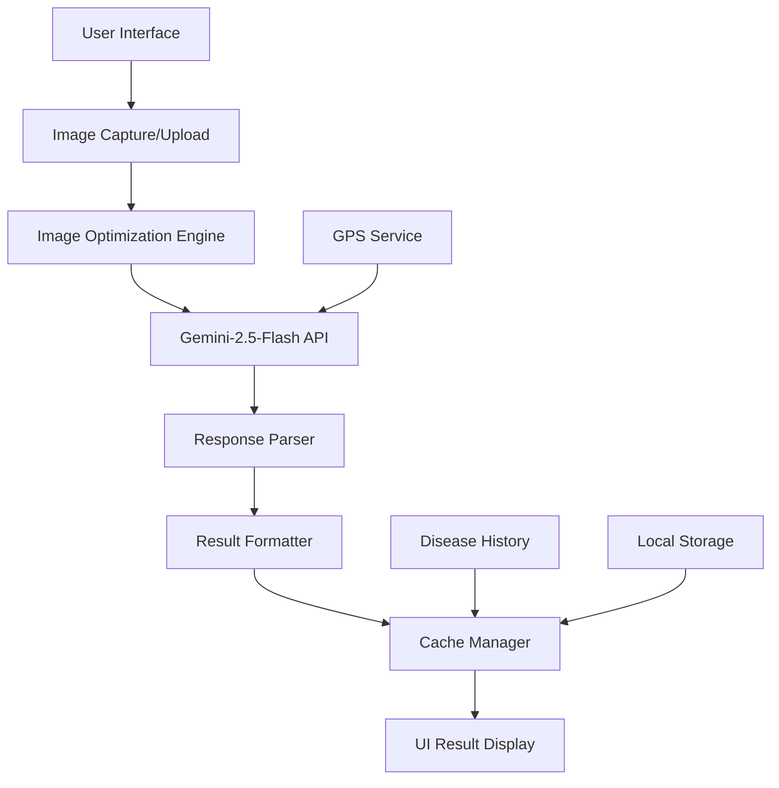

# AI Crop Scanner - Gemini-2.5-Flash Overhaul Design

## Overview

This design document outlines the complete architectural overhaul of the AI crop scanner system, transitioning from a dual PlantNet + Gemini pipeline to a streamlined, single-API Gemini-2.5-Flash LIVE implementation. The new architecture eliminates rate limiting bottlenecks, removes mock data contamination, and delivers lightning-fast crop disease diagnosis with enhanced accuracy and depth.

## Architecture

### High-Level System Architecture



### Core Components Transformation

**BEFORE (Legacy Architecture):**
```
Image → PlantNet API → Gemini API → Result Processing → UI Display
        ↓ (Rate Limited)   ↓ (Redundant)
    Fallback System    Mock Data
```

**AFTER (Streamlined Architecture):**
```
Image → Optimization → Gemini-2.5-Flash → Structured Response → UI Display
                           ↓
                    Smart Cache System
```

## Components and Interfaces

### 1. Enhanced CropDiseaseOracle Class

**Location:** `src/agents/CropDiseaseOracle.ts`

```typescript
export class CropDiseaseOracle {
  private readonly GEMINI_API_URL = 'https://generativelanguage.googleapis.com/v1beta/models/gemini-2.5-flash:generateContent';
  private readonly GEMINI_API_KEY = import.meta.env.VITE_GEMINI_API_KEY;
  
  /**
   * Direct Gemini-2.5-Flash image analysis
   * Replaces the dual PlantNet + Gemini pipeline
   */
  async diagnoseFromImage(
    imageBase64: string,
    cropType: string,
    farmLocation: GeoLocation
  ): Promise<DiseaseDetectionResult>
  
  /**
   * Image optimization before API call
   */
  private async optimizeImage(imageBase64: string): Promise<string>
  
  /**
   * Structured prompt generation for diagnosis
   */
  private generateDiagnosisPrompt(cropType: string, location: GeoLocation): string
  
  /**
   * Parse Gemini response into structured result
   */
  private parseGeminiResponse(response: any, cropType: string): DiseaseDetectionResult
}
```

### 2. Image Optimization Engine

**Location:** `src/services/ImageOptimizer.ts`

```typescript
export class ImageOptimizer {
  /**
   * Compress JPEG image while maintaining diagnostic quality
   */
  static async compressImage(
    imageBase64: string, 
    maxSizeKB: number = 1024,
    quality: number = 0.8
  ): Promise<string>
  
  /**
   * Resize image to optimal dimensions for AI analysis
   */
  static async resizeImage(
    imageBase64: string,
    maxWidth: number = 1024,
    maxHeight: number = 1024
  ): Promise<string>
  
  /**
   * Convert various formats to optimized JPEG
   */
  static async normalizeFormat(imageBase64: string): Promise<string>
}
```

### 3. Enhanced Disease Cache System

**Location:** `src/services/diseaseCache.ts` (Enhanced)

```typescript
export class EnhancedDiseaseCache {
  private cache = new Map<string, CacheEntry>();
  private readonly TTL = 24 * 60 * 60 * 1000; // 24 hours
  private readonly MAX_ENTRIES = 2000; // Increased capacity
  
  /**
   * Advanced image hashing for better cache hits
   */
  hashImage(imageBase64: string, cropType: string, location: GeoLocation): string
  
  /**
   * Intelligent cache eviction based on usage patterns
   */
  private smartEviction(): void
  
  /**
   * Persistent cache storage using IndexedDB
   */
  private async persistToStorage(): Promise<void>
  
  /**
   * Cache analytics and hit rate tracking
   */
  getAnalytics(): CacheAnalytics
}
```

### 4. GPS Location Service

**Location:** `src/services/LocationService.ts`

```typescript
export class LocationService {
  /**
   * Get current GPS coordinates with fallback
   */
  static async getCurrentLocation(): Promise<GeoLocation>
  
  /**
   * Reverse geocoding for location context
   */
  static async getLocationContext(lat: number, lng: number): Promise<LocationContext>
  

}
```

### 5. Disease History Manager

**Location:** `src/services/DiseaseHistoryManager.ts`

```typescript
export class DiseaseHistoryManager {
  /**
   * Save scan result to history
   */
  static async saveScanResult(result: DiseaseDetectionResult): Promise<void>
  
  /**
   * Retrieve user's scan history
   */
  static async getScanHistory(userId: string): Promise<HistoryItem[]>
  
  /**
   * Analyze disease patterns and trends
   */
  static async analyzePatterns(history: HistoryItem[]): Promise<PatternAnalysis>
  
  /**
   * Export history for sharing with advisors
   */
  static async exportHistory(format: 'pdf' | 'csv' | 'json'): Promise<Blob>
}
```

## Data Models

### Enhanced DiseaseDetectionResult Interface

```typescript
export interface DiseaseDetectionResult {
  // Core diagnosis
  disease_name: string;
  scientific_name?: string;
  confidence: number; // 0-100
  severity: 'low' | 'medium' | 'high' | 'critical';
  
  // Visual analysis
  affected_area_percentage: number;
  visual_symptoms: string[];
  disease_stage: 'early' | 'moderate' | 'advanced' | 'severe';
  
  // Treatment recommendations
  immediate_actions: string[];
  organic_solutions: TreatmentOption[];
  chemical_solutions: TreatmentOption[];
  preventive_measures: string[];
  
  // Location-aware data
  regional_disease_pressure: number;
  climate_risk_factors: string[];
  
  // Metadata
  location: GeoLocation;
  timestamp: string;
  processing_time_ms: number;
  source_api: 'gemini-2.5-flash';
  model_version: string;
}
```

### Treatment Option Interface

```typescript
export interface TreatmentOption {
  method: string;
  product: string;
  application_rate: string;
  frequency: string;
  timing: string;
  effectiveness_rating: number; // 1-10
  precautions: string[];
}
```

## Error Handling

### Comprehensive Error Management

```typescript
export enum DiagnosisErrorType {
  NETWORK_ERROR = 'NETWORK_ERROR',
  API_RATE_LIMIT = 'API_RATE_LIMIT',
  INVALID_IMAGE = 'INVALID_IMAGE',
  PROCESSING_TIMEOUT = 'PROCESSING_TIMEOUT',
  INSUFFICIENT_QUALITY = 'INSUFFICIENT_QUALITY',
  UNSUPPORTED_CROP = 'UNSUPPORTED_CROP'
}

export class DiagnosisError extends Error {
  constructor(
    public type: DiagnosisErrorType,
    public message: string,
    public recoverable: boolean = true,
    public retryAfter?: number
  ) {
    super(message);
  }
}
```

### Error Recovery Strategies

1. **Network Errors**: Automatic retry with exponential backoff
2. **Image Quality Issues**: Provide specific guidance for better capture
3. **API Timeouts**: Graceful degradation with cached similar results
4. **Rate Limiting**: Intelligent request queuing (though unlikely with Gemini)

## Testing Strategy

### Unit Testing Approach

```typescript
// Test file: src/agents/__tests__/CropDiseaseOracle.test.ts
describe('CropDiseaseOracle', () => {
  describe('diagnoseFromImage', () => {
    it('should process valid image and return structured diagnosis');
    it('should handle network errors gracefully');
    it('should optimize large images before processing');
    it('should cache results for identical images');
    it('should include location-specific recommendations');
  });
});
```

### Integration Testing

```typescript
// Test file: src/components/__tests__/CropScanner.integration.test.ts
describe('CropScanner Integration', () => {
  it('should complete full diagnosis flow from image capture to result display');
  it('should handle camera permissions and fallback to upload');
  it('should display loading states during processing');
  it('should cache and retrieve previous scan results');
});
```

### Performance Testing

- **Image Processing**: Measure compression and optimization times
- **API Response**: Track Gemini-2.5-Flash response times
- **Cache Performance**: Verify cache hit rates and retrieval speeds
- **Memory Usage**: Monitor memory consumption during batch processing

### User Acceptance Testing

1. **Accuracy Testing**: Compare diagnoses with expert agricultural assessments
2. **Usability Testing**: Verify farmers can complete scans without assistance
3. **Performance Testing**: Ensure scans complete within 5 seconds
4. **Reliability Testing**: Test with various image qualities and lighting conditions

## Implementation Phases

### Phase 1: Core Engine Replacement (Week 1)
- Remove PlantNet dependencies
- Implement Gemini-2.5-Flash direct integration
- Replace mock data with real API calls
- Basic image optimization

### Phase 2: Enhanced Features (Week 2)
- GPS location integration
- Advanced image compression
- Smart caching system
- Disease history tracking

### Phase 3: UI/UX Polish (Week 3)
- Component consolidation
- Performance optimizations
- Error handling improvements
- Comprehensive testing

### Phase 4: Production Deployment (Week 4)
- Load testing and optimization
- Security audit
- Documentation updates
- Monitoring and analytics setup

## Security Considerations

### API Key Protection
- Gemini API key stored securely in environment variables
- No API keys exposed in client-side code
- Rate limiting and usage monitoring

### Data Privacy
- Image data not stored permanently on servers
- User location data encrypted and anonymized
- Scan history stored locally with user consent

### Input Validation
- Image format and size validation
- Malicious file detection
- Input sanitization for all user data

## Performance Optimizations

### Image Processing
- WebP format support for better compression
- Progressive JPEG loading for large images
- Client-side image resizing before upload

### API Efficiency
- Request batching for multiple images
- Response compression
- Connection pooling and keep-alive

### Caching Strategy
- Multi-level caching (memory, localStorage, IndexedDB)
- Intelligent cache warming based on usage patterns
- Background cache cleanup and optimization

## Monitoring and Analytics

### Key Metrics
- Diagnosis accuracy rates
- API response times
- Cache hit rates
- User engagement metrics
- Error rates and types

### Logging Strategy
- Structured logging with correlation IDs
- Performance metrics collection
- Error tracking and alerting
- User behavior analytics (privacy-compliant)

This design provides a comprehensive blueprint for transforming the AI crop scanner into a world-class, single-API diagnosis system powered by Gemini-2.5-Flash LIVE.