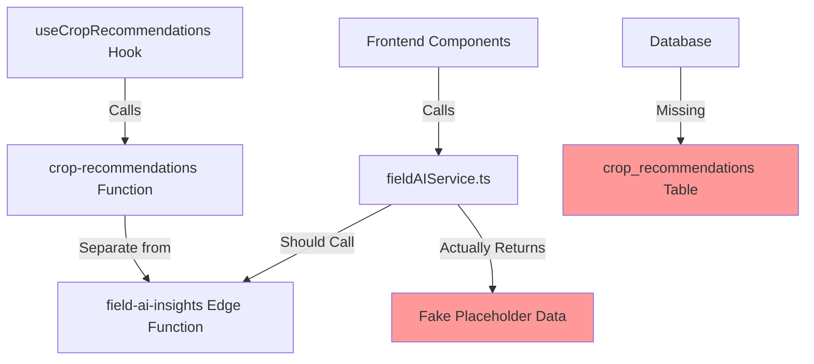
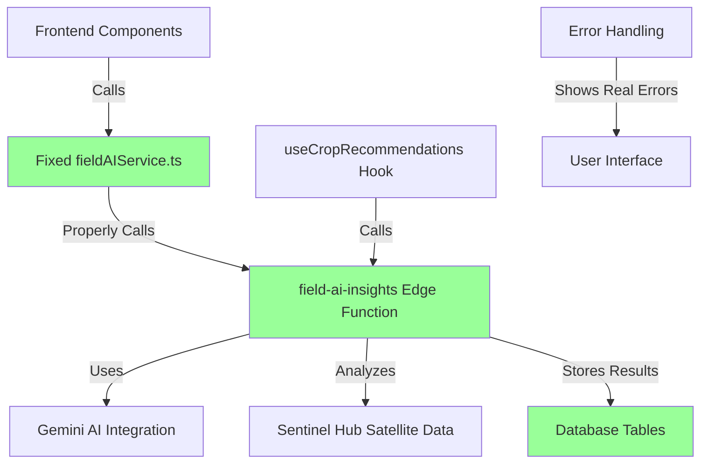

# Design Document

## Overview

The AI Field Insights feature requires a comprehensive fix to connect the existing sophisticated AI backend with the broken frontend components. The investigation has revealed that a fully functional AI backend exists with 1309 lines of production-ready code including Gemini AI integration, satellite data analysis, and comprehensive field assessment capabilities. However, the frontend is completely disconnected, showing placeholder data instead of calling the real AI services.

This design addresses the critical frontend-backend disconnection by implementing proper service layer integration, error handling, database schema fixes, and user interface improvements to deliver real AI insights to African farmers.

## Architecture

### Current Architecture Issues


### Target Architecture


### System Components

1. **AI Backend (Existing - Perfect)**
   - `supabase/functions/field-ai-insights/index.ts` - 1309 lines of production-ready code
   - Gemini AI integration for comprehensive field analysis
   - Sentinel Hub satellite data processing (NDVI, EVI, SAVI, moisture analysis)
   - Disease risk assessment with ML predictions
   - Soil health evaluation and weather impact analysis

2. **Frontend Service Layer (Broken - Needs Fix)**
   - `src/services/fieldAIService.ts` - Returns fake data instead of calling real AI
   - `src/hooks/useCropRecommendations.ts` - Calls wrong function
   - Error handling falls back to placeholders instead of showing real errors

3. **Database Layer (Partially Broken)**
   - Missing `crop_recommendations` table referenced in code
   - Existing `field_insights` table not properly utilized
   - `ai_service_logs` table exists but unused

4. **User Interface (Good - Needs Error Handling)**
   - `src/pages/FieldDetail.tsx` - Sophisticated UI components
   - `src/components/CropRecommendation.tsx` - Production-ready design
   - Loading states and animations already implemented

## Components and Interfaces

### 1. Fixed Service Layer

**Enhanced fieldAIService.ts Interface:**
```typescript
interface AIFieldInsights {
  recommendations: string[];
  disease_risks: {
    overall_risk: number;
    risks: Array<{
      disease: string;
      risk: number;
      prevention: string[];
    }>;
  };
  soil_health: {
    score: number;
    recommendations: string[];
  };
  satellite_analysis: {
    ndvi: number;
    evi: number;
    savi: number;
    moisture: number;
  };
  generated_at: string;
}

interface FieldRiskAssessment {
  hasRisks: boolean;
  risks: Array<{
    name: string;
    likelihood: "low" | "medium" | "high";
    description: string;
  }>;
}
```

**Service Methods:**
- `getFieldRecommendations(fieldId: string): Promise<string[]>` - Fixed to call real AI
- `checkFieldRisks(fieldId: string): Promise<FieldRiskAssessment>` - Fixed error handling
- `analyzeField(fieldId: string): Promise<AIFieldInsights>` - New comprehensive analysis

### 2. Database Schema Fixes

**Missing crop_recommendations Table:**
```sql
CREATE TABLE IF NOT EXISTS crop_recommendations (
  id uuid PRIMARY KEY DEFAULT gen_random_uuid(),
  field_id uuid REFERENCES fields(id) ON DELETE CASCADE,
  user_id uuid REFERENCES auth.users(id) ON DELETE CASCADE,
  recommendations jsonb NOT NULL,
  confidence_score decimal(3,2),
  ai_analysis_data jsonb,
  satellite_data jsonb,
  generated_at timestamptz DEFAULT now(),
  created_at timestamptz DEFAULT now(),
  updated_at timestamptz DEFAULT now()
);

CREATE INDEX idx_crop_recommendations_field_id ON crop_recommendations(field_id);
CREATE INDEX idx_crop_recommendations_user_id ON crop_recommendations(user_id);
CREATE INDEX idx_crop_recommendations_generated_at ON crop_recommendations(generated_at);
```

**Enhanced field_insights Table Usage:**
```sql
-- Ensure proper utilization of existing field_insights table
ALTER TABLE field_insights ADD COLUMN IF NOT EXISTS ai_confidence_score decimal(3,2);
ALTER TABLE field_insights ADD COLUMN IF NOT EXISTS satellite_analysis jsonb;
ALTER TABLE field_insights ADD COLUMN IF NOT EXISTS disease_risk_data jsonb;
```

### 3. Frontend Component Integration

**Enhanced FieldDetail.tsx AI Section:**
```typescript
const loadAIInsights = async (fieldId: string) => {
  setLoadingInsights(true);
  setError(null);
  
  try {
    // Call REAL AI service with proper error handling
    const [recommendations, risks] = await Promise.all([
      getFieldRecommendations(fieldId),
      checkFieldRisks(fieldId)
    ]);
    
    setInsights(recommendations);
    setRisks(risks);
    
    // Show success toast for real AI analysis
    toast.success("AI Analysis Complete", {
      description: "Field insights generated using Gemini AI and satellite data"
    });
  } catch (error) {
    console.error("Failed to load AI insights:", error);
    setError(error.message);
    
    // Show REAL error instead of fake fallback
    toast.error("AI Analysis Failed", {
      description: "Unable to generate field insights. Please check your connection and try again.",
      action: {
        label: "Retry",
        onClick: () => loadAIInsights(fieldId)
      }
    });
  } finally {
    setLoadingInsights(false);
  }
};
```

### 4. Crop Recommendations Integration

**Fixed useCropRecommendations Hook:**
```typescript
const fetchCropRecommendations = async (fieldId: string, farmContext: FarmContext) => {
  if (!fieldId || !farmContext.userId) return null;

  // Call REAL AI function instead of separate crop-recommendations
  const { data, error } = await supabase.functions.invoke('field-ai-insights', {
    body: { 
      field_id: fieldId, 
      user_id: farmContext.userId,
      analysis_type: 'crop_recommendations',
      include_health_analysis: true,
      include_market_data: true
    },
  });

  if (error) throw new Error(`AI analysis failed: ${error.message}`);
  
  // Transform AI insights to crop recommendations format
  return transformAIInsightsToCropRecommendations(data);
};

const transformAIInsightsToCropRecommendations = (aiData: any): EnhancedCropRecommendation[] => {
  return aiData.crop_rotation?.suggestions?.map((crop: any, index: number) => ({
    id: `ai-${index}`,
    name: crop.name,
    confidence: crop.confidence || 0.8,
    aiReasoning: crop.reasoning || "AI-generated recommendation based on field analysis",
    waterNeeds: crop.water_requirements || 'Medium',
    sunExposure: crop.sun_requirements || 'Full Sun',
    temperature: crop.temperature_range || '20-30°C',
    growingSeason: crop.growing_seasons || ['Rainy Season'],
    marketOutlook: crop.market_data,
    diseaseRisk: crop.disease_risks,
    economicViability: { profitabilityScore: crop.profitability_score || 0.7 },
    expectedYield: crop.expected_yield,
    compatibility: crop.companion_crops,
    plantingWindow: { optimal: crop.optimal_planting_time }
  })) || [];
};
```

## Data Models

### AI Insights Response Model
```typescript
interface AIFieldInsightsResponse {
  success: boolean;
  data: {
    field_id: string;
    user_id: string;
    analysis_timestamp: string;
    recommendations: string[];
    confidence_score: number;
    
    // Satellite Analysis
    satellite_analysis: {
      ndvi: number;
      evi: number;
      savi: number;
      moisture_index: number;
      analysis_date: string;
      image_quality: 'excellent' | 'good' | 'fair' | 'poor';
    };
    
    // Disease Risk Assessment
    disease_risks: {
      overall_risk: number;
      risks: Array<{
        disease: string;
        risk_level: number;
        confidence: number;
        prevention_measures: string[];
        symptoms_to_watch: string[];
      }>;
    };
    
    // Soil Health Analysis
    soil_health: {
      health_score: number;
      ph_estimate: number;
      nutrient_deficiencies: string[];
      improvement_recommendations: string[];
    };
    
    // Crop Recommendations
    crop_rotation: {
      current_suitability: number;
      suggestions: Array<{
        name: string;
        confidence: number;
        reasoning: string;
        expected_yield: {
          min: number;
          max: number;
          unit: string;
        };
        planting_window: string;
        market_potential: number;
      }>;
    };
    
    // Weather Impact
    weather_impact: {
      current_conditions_score: number;
      upcoming_risks: string[];
      adaptation_strategies: string[];
    };
  };
  
  // Caching and Performance
  cached: boolean;
  processing_time_ms: number;
  ai_model_version: string;
}
```

### Database Storage Models
```typescript
interface CropRecommendationRecord {
  id: string;
  field_id: string;
  user_id: string;
  recommendations: AIFieldInsightsResponse['data'];
  confidence_score: number;
  ai_analysis_data: any;
  satellite_data: any;
  generated_at: Date;
  created_at: Date;
  updated_at: Date;
}

interface FieldInsightRecord {
  id: string;
  field_id: string;
  insight_type: 'disease_risk' | 'soil_health' | 'crop_recommendation' | 'weather_impact';
  insight_data: any;
  confidence_score: number;
  ai_confidence_score: number;
  satellite_analysis: any;
  disease_risk_data: any;
  created_at: Date;
  updated_at: Date;
}
```

## Error Handling

### 1. Service Layer Error Handling
```typescript
class AIServiceError extends Error {
  constructor(
    message: string,
    public code: 'AUTHENTICATION_FAILED' | 'AI_SERVICE_UNAVAILABLE' | 'NETWORK_ERROR' | 'INVALID_FIELD_DATA',
    public retryable: boolean = false
  ) {
    super(message);
    this.name = 'AIServiceError';
  }
}

const handleAIServiceError = (error: any): AIServiceError => {
  if (error.message?.includes('authentication')) {
    return new AIServiceError('Please log in to access AI insights', 'AUTHENTICATION_FAILED', false);
  }
  
  if (error.message?.includes('timeout') || error.message?.includes('network')) {
    return new AIServiceError('Network connection issue. Please check your internet connection.', 'NETWORK_ERROR', true);
  }
  
  if (error.message?.includes('field not found')) {
    return new AIServiceError('Field data not found. Please refresh and try again.', 'INVALID_FIELD_DATA', false);
  }
  
  return new AIServiceError('AI service temporarily unavailable. Please try again in a few moments.', 'AI_SERVICE_UNAVAILABLE', true);
};
```

### 2. Frontend Error Display
```typescript
const ErrorDisplay: React.FC<{ error: AIServiceError; onRetry: () => void }> = ({ error, onRetry }) => (
  <div className="bg-red-50 border border-red-200 rounded-lg p-4">
    <div className="flex items-start gap-3">
      <AlertCircle className="h-5 w-5 text-red-500 mt-0.5" />
      <div className="flex-1">
        <h3 className="text-sm font-medium text-red-800">AI Analysis Failed</h3>
        <p className="text-sm text-red-700 mt-1">{error.message}</p>
        {error.retryable && (
          <Button 
            variant="outline" 
            size="sm" 
            className="mt-3"
            onClick={onRetry}
          >
            <RefreshCw className="h-4 w-4 mr-2" />
            Try Again
          </Button>
        )}
      </div>
    </div>
  </div>
);
```

### 3. Graceful Degradation
```typescript
const AIInsightsWithFallback: React.FC<{ fieldId: string }> = ({ fieldId }) => {
  const [insights, setInsights] = useState<string[]>([]);
  const [error, setError] = useState<AIServiceError | null>(null);
  const [loading, setLoading] = useState(false);

  const loadInsights = async () => {
    setLoading(true);
    setError(null);
    
    try {
      const recommendations = await getFieldRecommendations(fieldId);
      setInsights(recommendations);
    } catch (err) {
      const aiError = handleAIServiceError(err);
      setError(aiError);
      
      // Only show basic field info if AI completely fails
      if (!aiError.retryable) {
        setInsights(['Field monitoring recommended', 'Check crops regularly for signs of disease']);
      }
    } finally {
      setLoading(false);
    }
  };

  return (
    <div>
      {error && <ErrorDisplay error={error} onRetry={loadInsights} />}
      {insights.length > 0 && <InsightsDisplay insights={insights} />}
      {loading && <LoadingDisplay />}
    </div>
  );
};
```

## Testing Strategy

### 1. Integration Testing
```typescript
describe('AI Field Insights Integration', () => {
  test('should call real AI backend and return insights', async () => {
    const mockFieldId = 'test-field-123';
    const insights = await getFieldRecommendations(mockFieldId);
    
    expect(insights).toBeDefined();
    expect(insights.length).toBeGreaterThan(0);
    expect(insights[0]).not.toContain('placeholder');
    expect(insights[0]).not.toContain('temporarily unavailable');
  });

  test('should handle authentication errors properly', async () => {
    // Mock unauthenticated state
    jest.spyOn(supabase.auth, 'getUser').mockResolvedValue({ data: { user: null }, error: null });
    
    await expect(getFieldRecommendations('test-field')).rejects.toThrow('Not authenticated');
  });

  test('should store AI insights in database', async () => {
    const fieldId = 'test-field-123';
    await getFieldRecommendations(fieldId);
    
    const { data } = await supabase
      .from('crop_recommendations')
      .select('*')
      .eq('field_id', fieldId)
      .single();
    
    expect(data).toBeDefined();
    expect(data.recommendations).toBeDefined();
  });
});
```

### 2. End-to-End Testing
```typescript
describe('AI Field Insights E2E', () => {
  test('should display real AI insights in UI', async () => {
    render(<FieldDetail />);
    
    // Click AI analysis button
    const analyzeButton = screen.getByText(/Get AI Field Analysis/i);
    fireEvent.click(analyzeButton);
    
    // Wait for real AI results (not placeholders)
    await waitFor(() => {
      expect(screen.queryByText(/AI analysis in progress/i)).not.toBeInTheDocument();
      expect(screen.queryByText(/temporarily unavailable/i)).not.toBeInTheDocument();
    });
    
    // Verify real AI insights are displayed
    const insights = screen.getAllByText(/Consider|Monitor|Plant|Apply/i);
    expect(insights.length).toBeGreaterThan(0);
  });

  test('should show proper error messages when AI fails', async () => {
    // Mock AI service failure
    jest.spyOn(supabase.functions, 'invoke').mockRejectedValue(new Error('Network error'));
    
    render(<FieldDetail />);
    
    const analyzeButton = screen.getByText(/Get AI Field Analysis/i);
    fireEvent.click(analyzeButton);
    
    await waitFor(() => {
      expect(screen.getByText(/AI Analysis Failed/i)).toBeInTheDocument();
      expect(screen.getByText(/Network connection issue/i)).toBeInTheDocument();
    });
  });
});
```

### 3. Performance Testing
```typescript
describe('AI Performance', () => {
  test('should complete analysis within 3 seconds', async () => {
    const startTime = Date.now();
    
    await getFieldRecommendations('test-field-123');
    
    const endTime = Date.now();
    const duration = endTime - startTime;
    
    expect(duration).toBeLessThan(3000); // Sub-3 second requirement
  });

  test('should cache results for repeated requests', async () => {
    const fieldId = 'test-field-123';
    
    // First request
    const start1 = Date.now();
    await getFieldRecommendations(fieldId);
    const duration1 = Date.now() - start1;
    
    // Second request (should be cached)
    const start2 = Date.now();
    await getFieldRecommendations(fieldId);
    const duration2 = Date.now() - start2;
    
    expect(duration2).toBeLessThan(duration1 * 0.5); // Cached should be much faster
  });
});
```

### 4. Africa-Specific Testing
```typescript
describe('Africa-Specific AI Features', () => {
  test('should provide Africa-relevant crop recommendations', async () => {
    const insights = await getFieldRecommendations('african-field-123');
    
    const africanCrops = ['maize', 'cassava', 'yam', 'millet', 'sorghum', 'groundnut'];
    const hasAfricanCrops = insights.some(insight => 
      africanCrops.some(crop => insight.toLowerCase().includes(crop))
    );
    
    expect(hasAfricanCrops).toBe(true);
  });

  test('should consider African climate patterns', async () => {
    const risks = await checkFieldRisks('african-field-123');
    
    const africanDiseases = ['cassava mosaic', 'maize streak', 'banana wilt'];
    const hasAfricanDiseases = risks.risks.some(risk =>
      africanDiseases.some(disease => risk.name.toLowerCase().includes(disease))
    );
    
    expect(hasAfricanDiseases).toBe(true);
  });
});
```

This comprehensive design addresses all the critical issues identified in the investigation and provides a clear path to fix the AI Field Insights feature by properly connecting the existing perfect AI backend with the frontend components.