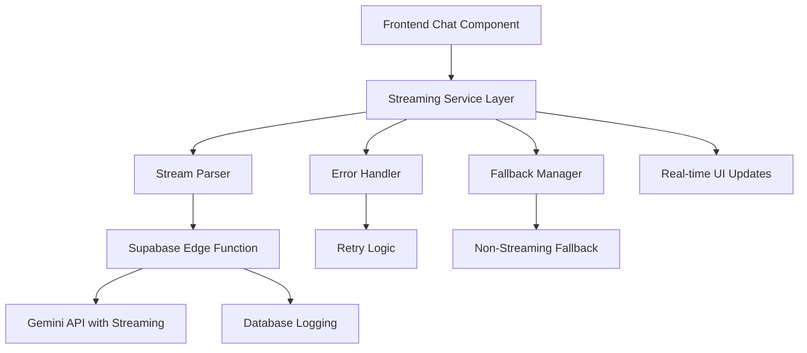

# AI Streaming Implementation Design

## Overview

This design implements robust streaming support for the CropGenius AI chat system using the Gemini 2.5 Flash API. The solution addresses the current issue where enabling `stream: true` causes complete application failure by implementing proper stream handling, error recovery, and fallback mechanisms.

## Architecture

### High-Level Architecture



### Component Interaction Flow

1. **Frontend** initiates chat request with streaming preference
2. **Streaming Service** determines if streaming is supported/enabled
3. **Edge Function** establishes streaming connection to Gemini API
4. **Stream Parser** processes incremental JSON chunks
5. **Real-time Updates** push content to UI as it arrives
6. **Error Handler** manages failures and triggers fallbacks
7. **Database** logs conversation and performance metrics

## Components and Interfaces

### 1. Frontend Streaming Service (`src/services/AIStreamingService.ts`)

```typescript
interface StreamingConfig {
  enabled: boolean;
  chunkSize: number;
  timeout: number;
  retryAttempts: number;
  fallbackThreshold: number;
}

interface StreamResponse {
  content: string;
  isComplete: boolean;
  error?: string;
  metadata?: {
    tokensUsed: number;
    latency: number;
    chunkCount: number;
  };
}

class AIStreamingService {
  async streamChat(
    message: string,
    onChunk: (chunk: string) => void,
    onComplete: (response: StreamResponse) => void,
    onError: (error: Error) => void
  ): Promise<void>
}
```

### 2. Enhanced Edge Function (`supabase/functions/ai-chat-streaming/index.ts`)

```typescript
interface StreamingRequest {
  message: string;
  context?: any;
  conversationId?: string;
  streamingEnabled: boolean;
}

interface StreamChunk {
  content: string;
  isComplete: boolean;
  metadata?: {
    tokensUsed: number;
    chunkIndex: number;
  };
}
```

### 3. Stream Parser (`src/utils/streamParser.ts`)

```typescript
class StreamParser {
  private buffer: string = '';
  private decoder: TextDecoder;
  
  parseChunk(chunk: Uint8Array): string[]
  handlePartialJSON(jsonString: string): any
  reset(): void
}
```

### 4. React Hook (`src/hooks/useStreamingChat.ts`)

```typescript
interface UseStreamingChatReturn {
  sendMessage: (message: string) => Promise<void>;
  currentResponse: string;
  isStreaming: boolean;
  error: string | null;
  retryCount: number;
}

export function useStreamingChat(): UseStreamingChatReturn
```

## Data Models

### Streaming Configuration

```typescript
interface StreamingSettings {
  id: string;
  user_id: string;
  streaming_enabled: boolean;
  chunk_size: number;
  timeout_ms: number;
  retry_attempts: number;
  fallback_enabled: boolean;
  created_at: string;
  updated_at: string;
}
```

### Performance Metrics

```typescript
interface StreamingMetrics {
  id: string;
  user_id: string;
  conversation_id: string;
  streaming_used: boolean;
  total_tokens: number;
  response_time_ms: number;
  chunk_count: number;
  error_count: number;
  fallback_triggered: boolean;
  created_at: string;
}
```

## Error Handling

### Error Categories and Responses

1. **Network Errors**
   - Connection timeout: Retry with exponential backoff
   - Connection lost: Attempt reconnection, fallback after 3 attempts
   - DNS resolution: Immediate fallback to non-streaming

2. **API Errors**
   - Rate limiting: Respect retry-after headers, queue requests
   - Authentication: Refresh tokens, retry once
   - Malformed response: Parse what's available, request missing parts

3. **Parsing Errors**
   - Invalid JSON: Accumulate in buffer, attempt parsing on next chunk
   - Incomplete chunks: Store in buffer until complete
   - Encoding issues: Use TextDecoder with error handling

### Fallback Strategy

```typescript
class FallbackManager {
  private failureCount: number = 0;
  private readonly maxFailures: number = 3;
  
  shouldFallback(): boolean {
    return this.failureCount >= this.maxFailures;
  }
  
  async executeWithFallback<T>(
    streamingFn: () => Promise<T>,
    fallbackFn: () => Promise<T>
  ): Promise<T>
}
```

## Testing Strategy

### Unit Tests

1. **Stream Parser Tests**
   - Test partial JSON handling
   - Test buffer management
   - Test malformed data recovery

2. **Service Layer Tests**
   - Test streaming configuration
   - Test error handling paths
   - Test fallback mechanisms

3. **Hook Tests**
   - Test React state management
   - Test cleanup on unmount
   - Test concurrent request handling

### Integration Tests

1. **End-to-End Streaming**
   - Test complete streaming flow
   - Test network interruption scenarios
   - Test fallback activation

2. **Performance Tests**
   - Measure streaming vs non-streaming latency
   - Test memory usage during long conversations
   - Test concurrent user streaming

### Error Simulation Tests

1. **Network Conditions**
   - Simulate slow networks
   - Simulate intermittent connectivity
   - Simulate complete network failure

2. **API Responses**
   - Simulate malformed JSON
   - Simulate incomplete responses
   - Simulate rate limiting

## Implementation Phases

### Phase 1: Core Streaming Infrastructure
- Implement StreamParser utility
- Create AIStreamingService
- Add basic error handling

### Phase 2: Edge Function Enhancement
- Modify Supabase function for streaming
- Add proper headers and response handling
- Implement streaming-specific logging

### Phase 3: Frontend Integration
- Create useStreamingChat hook
- Update chat components for real-time updates
- Add streaming indicators and controls

### Phase 4: Error Handling & Fallbacks
- Implement comprehensive error handling
- Add fallback mechanisms
- Create monitoring and alerting

### Phase 5: Performance Optimization
- Optimize chunk sizes and buffering
- Add performance metrics collection
- Implement adaptive streaming based on network conditions

## Security Considerations

1. **Rate Limiting**: Implement per-user streaming rate limits
2. **Resource Management**: Prevent memory leaks from long-running streams
3. **Authentication**: Ensure streaming requests maintain proper auth
4. **Data Validation**: Validate all streamed content before processing
5. **Logging**: Avoid logging sensitive user data in streaming logs

## Performance Optimizations

1. **Adaptive Chunk Sizes**: Adjust based on network conditions
2. **Connection Pooling**: Reuse connections for multiple requests
3. **Compression**: Use gzip compression for streaming responses
4. **Caching**: Cache streaming configurations per user
5. **Memory Management**: Implement proper cleanup for abandoned streams