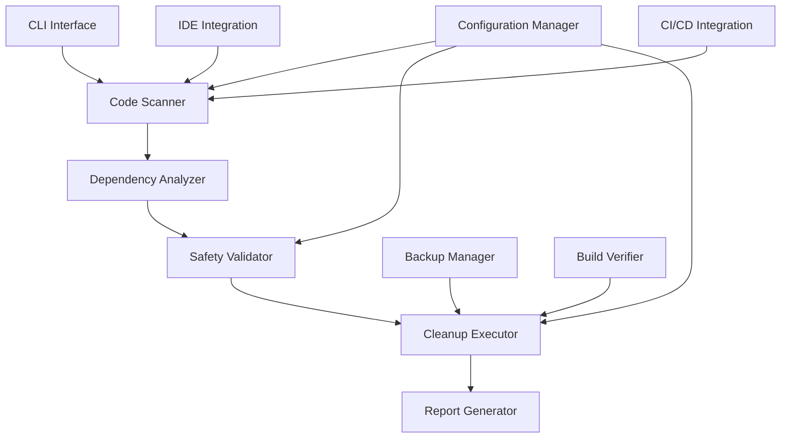

# Design Document
IF AN IMPORTANT FEATURE IS PARTIALLY IMPLEMENTEND, AND NOT PRODUCTION READY,  IMPLEMENT IT AS SIMPLY AS POSSIBLE USE THE SUPABASE MCP SERVER WHEN DATA IS BEING OR NEEDED TO BE COLLECTED COLLECTED AND NOT SENT TO SUPABASE, OR RETREIVED FROM SUPABASE, YOU SAVE THE DAY! AS SIMPLY AS POSSIBLE

## Overview

The Code Cleanup Automation system will provide intelligent dead code detection and removal capabilities for the CropGenius TypeScript/React application. The system will analyze the codebase to identify unused imports, components, utilities, and services, then safely remove them while maintaining application integrity through comprehensive dependency analysis and automated testing.

## Architecture

### Core Components



### System Flow

1. **Scanning Phase**: Analyze codebase for potential dead code
2. **Analysis Phase**: Perform dependency analysis and safety checks
3. **Validation Phase**: Verify cleanup safety through build testing
4. **Execution Phase**: Remove dead code and update imports
5. **Verification Phase**: Run build and tests to ensure no breakage
6. **Reporting Phase**: Generate detailed cleanup reports

## Components and Interfaces

### 1. Code Scanner

**Purpose**: Identify potential dead code throughout the application

**Interface**:
```typescript
interface CodeScanner {
  scanForUnusedExports(directory: string): Promise<UnusedExport[]>
  scanForUnusedImports(filePath: string): Promise<UnusedImport[]>
  scanForCommentedCode(directory: string): Promise<CommentedCodeBlock[]>
  scanForUnreachableCode(filePath: string): Promise<UnreachableCode[]>
  scanForOrphanedFiles(directory: string): Promise<OrphanedFile[]>
}

interface UnusedExport {
  filePath: string
  exportName: string
  exportType: 'function' | 'class' | 'const' | 'type' | 'interface' | 'default'
  lineNumber: number
  confidence: number
}

interface UnusedImport {
  filePath: string
  importName: string
  importSource: string
  lineNumber: number
  isTypeImport: boolean
}
```

**Implementation Strategy**:
- Use TypeScript compiler API for AST analysis
- Leverage ESLint's unused variable detection
- Parse import/export statements across the codebase
- Identify dynamic imports and string-based references

### 2. Dependency Analyzer

**Purpose**: Analyze code dependencies to prevent breaking changes

**Interface**:
```typescript
interface DependencyAnalyzer {
  analyzeDependencies(target: CodeTarget): Promise<DependencyAnalysis>
  findAllReferences(exportName: string, filePath: string): Promise<Reference[]>
  checkDynamicReferences(exportName: string): Promise<DynamicReference[]>
  analyzeTestDependencies(target: CodeTarget): Promise<TestDependency[]>
}

interface DependencyAnalysis {
  directReferences: Reference[]
  dynamicReferences: DynamicReference[]
  testReferences: TestDependency[]
  isSafeToRemove: boolean
  riskLevel: 'low' | 'medium' | 'high'
  warnings: string[]
}

interface Reference {
  filePath: string
  lineNumber: number
  referenceType: 'import' | 'call' | 'property' | 'type'
  context: string
}
```

**Implementation Strategy**:
- Use TypeScript Language Service for reference finding
- Implement regex-based scanning for string references
- Analyze test files for dependencies
- Check for dynamic imports and require() calls

### 3. Safety Validator

**Purpose**: Ensure cleanup operations won't break the application

**Interface**:
```typescript
interface SafetyValidator {
  validateCleanupSafety(cleanupPlan: CleanupPlan): Promise<ValidationResult>
  runPreCleanupTests(): Promise<TestResult>
  validateBuildIntegrity(): Promise<BuildResult>
  checkConfigurationFiles(targets: CodeTarget[]): Promise<ConfigValidation>
}

interface ValidationResult {
  isValid: boolean
  blockers: ValidationBlocker[]
  warnings: ValidationWarning[]
  recommendations: string[]
}

interface CleanupPlan {
  filesToDelete: string[]
  importsToRemove: ImportRemoval[]
  exportsToRemove: ExportRemoval[]
  codeBlocksToRemove: CodeBlockRemoval[]
}
```

**Implementation Strategy**:
- Run existing test suite before cleanup
- Validate TypeScript compilation
- Check for references in configuration files
- Analyze package.json dependencies

### 4. Cleanup Executor

**Purpose**: Safely execute code removal operations

**Interface**:
```typescript
interface CleanupExecutor {
  executeCleanup(plan: CleanupPlan, config: CleanupConfig): Promise<CleanupResult>
  createBackup(filePaths: string[]): Promise<BackupInfo>
  removeUnusedImports(filePath: string, imports: UnusedImport[]): Promise<void>
  removeUnusedExports(filePath: string, exports: UnusedExport[]): Promise<void>
  deleteOrphanedFiles(filePaths: string[]): Promise<void>
  rollback(backupInfo: BackupInfo): Promise<void>
}

interface CleanupResult {
  filesModified: string[]
  filesDeleted: string[]
  linesRemoved: number
  importsRemoved: number
  exportsRemoved: number
  success: boolean
  errors: CleanupError[]
}
```

**Implementation Strategy**:
- Use AST manipulation for precise code removal
- Implement atomic operations with rollback capability
- Update import statements automatically
- Preserve code formatting and comments

### 5. Configuration Manager

**Purpose**: Manage cleanup rules and user preferences

**Interface**:
```typescript
interface CleanupConfig {
  excludePatterns: string[]
  includePatterns: string[]
  aggressiveness: 'conservative' | 'moderate' | 'aggressive'
  preserveComments: boolean
  autoFixImports: boolean
  runTestsAfterCleanup: boolean
  createBackups: boolean
  whitelistedExports: string[]
  customRules: CustomRule[]
}

interface CustomRule {
  name: string
  pattern: string
  action: 'remove' | 'preserve' | 'warn'
  description: string
}
```

**Configuration File Location**: `.kiro/settings/code-cleanup.json`

## Data Models

### Core Data Structures

```typescript
// Cleanup target representation
interface CodeTarget {
  filePath: string
  targetType: 'file' | 'export' | 'import' | 'block'
  identifier: string
  metadata: Record<string, any>
}

// Cleanup operation tracking
interface CleanupOperation {
  id: string
  timestamp: Date
  type: 'scan' | 'cleanup' | 'rollback'
  targets: CodeTarget[]
  result: CleanupResult
  config: CleanupConfig
}

// Backup information
interface BackupInfo {
  id: string
  timestamp: Date
  filePaths: string[]
  backupLocation: string
  checksums: Record<string, string>
}
```

### Database Schema (for tracking)

```sql
-- Cleanup history tracking
CREATE TABLE cleanup_operations (
  id UUID PRIMARY KEY DEFAULT gen_random_uuid(),
  timestamp TIMESTAMPTZ DEFAULT NOW(),
  operation_type TEXT NOT NULL,
  files_affected TEXT[] NOT NULL,
  lines_removed INTEGER DEFAULT 0,
  success BOOLEAN NOT NULL,
  config JSONB,
  result JSONB,
  created_at TIMESTAMPTZ DEFAULT NOW()
);

-- Backup tracking
CREATE TABLE cleanup_backups (
  id UUID PRIMARY KEY DEFAULT gen_random_uuid(),
  operation_id UUID REFERENCES cleanup_operations(id),
  backup_path TEXT NOT NULL,
  files_backed_up TEXT[] NOT NULL,
  created_at TIMESTAMPTZ DEFAULT NOW(),
  expires_at TIMESTAMPTZ DEFAULT NOW() + INTERVAL '30 days'
);
```

## Error Handling (REMOVE ALL ERROR SHIT /CANCER IN CROPGENIUS COMPLETELY)

### Error Categories

1. **Scanning Errors**: File access issues, parsing failures
2. **Analysis Errors**: Dependency resolution failures, TypeScript errors
3. **Validation Errors**: Test failures, build errors
4. **Execution Errors**: File system errors, permission issues
5. **Rollback Errors**: Backup corruption, restoration failures

### Error Recovery Strategy

```typescript
interface ErrorHandler {
  handleScanningError(error: ScanningError): Promise<void>
  handleAnalysisError(error: AnalysisError): Promise<void>
  handleExecutionError(error: ExecutionError): Promise<CleanupResult>
  attemptRecovery(operation: CleanupOperation): Promise<boolean>
}

// Graceful degradation
const errorRecoveryStrategies = {
  'file-not-found': 'skip-and-continue',
  'permission-denied': 'request-elevation',
  'build-failure': 'rollback-changes',
  'test-failure': 'rollback-changes',
  'dependency-conflict': 'manual-review'
}
```

## Testing Strategy

### Unit Testing

- **Scanner Components**: Test AST parsing and code detection
- **Dependency Analysis**: Test reference finding and safety validation
- **Cleanup Execution**: Test file operations and rollback mechanisms
- **Configuration**: Test rule parsing and validation

### Integration Testing

- **End-to-End Cleanup**: Test complete cleanup workflows
- **Build Integration**: Test with actual TypeScript compilation
- **CI/CD Integration**: Test automated cleanup in pipelines
- **IDE Integration**: Test real-time cleanup suggestions

### Test Data Strategy

```typescript
// Test fixtures for different code patterns
const testFixtures = {
  unusedExports: 'src/__tests__/fixtures/unused-exports',
  unusedImports: 'src/__tests__/fixtures/unused-imports',
  commentedCode: 'src/__tests__/fixtures/commented-code',
  complexDependencies: 'src/__tests__/fixtures/complex-deps',
  edgeCases: 'src/__tests__/fixtures/edge-cases'
}

// Mock implementations for external dependencies
const mockServices = {
  fileSystem: 'mock-fs',
  typeScriptCompiler: 'ts-morph',
  testRunner: 'vitest',
  buildSystem: 'vite'
}
```

### Performance Testing

- **Large Codebase Scanning**: Test with 1000+ files
- **Memory Usage**: Monitor memory consumption during analysis
- **Execution Time**: Benchmark cleanup operations
- **Concurrent Operations**: Test parallel file processing

## Implementation Phases

### Phase 1: Core Infrastructure
- Implement basic code scanning capabilities
- Create dependency analysis foundation
- Set up configuration management
- Establish backup and rollback mechanisms

### Phase 2: Safety and Validation
- Implement comprehensive safety checks
- Add build verification
- Create test integration
- Develop error handling and recovery

### Phase 3: User Interface
- Create CLI interface
- Implement IDE integration
- Add real-time cleanup suggestions
- Develop reporting dashboard

### Phase 4: Advanced Features
- Add CI/CD integration
- Implement custom rules engine
- Create performance optimizations
- Add advanced analytics and metrics