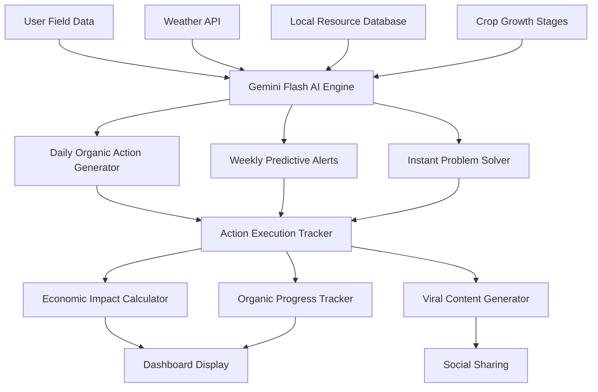
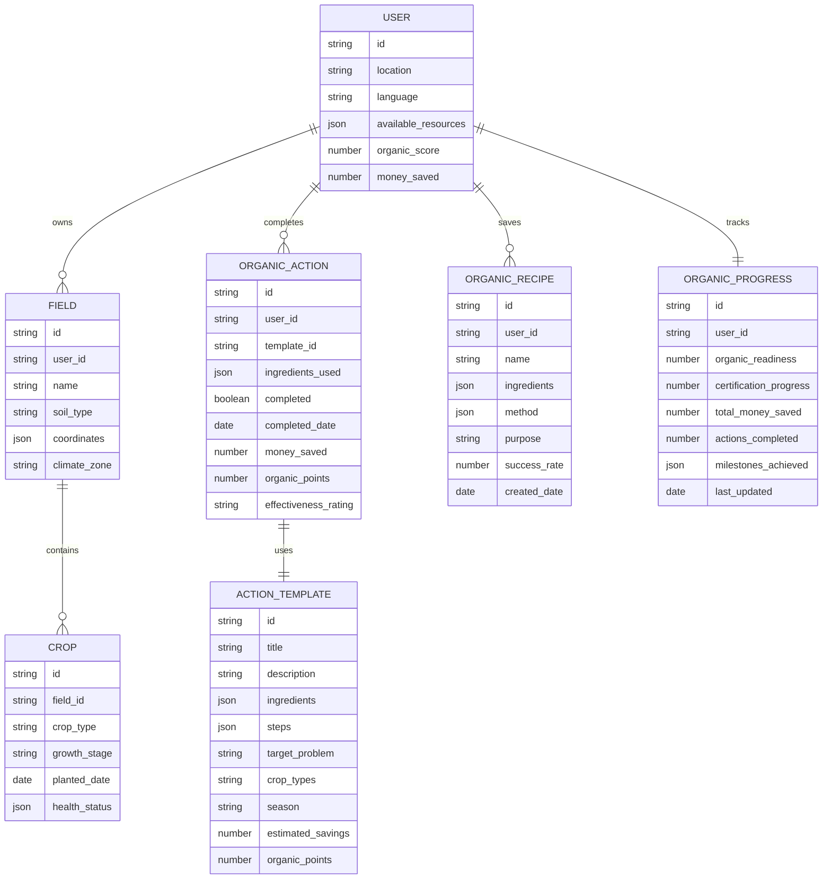

 Design Document

## Overview

The Organic AI Plan Revolution is a Gemini Flash-powered system that delivers immediate, actionable, profitable organic farming solutions using only locally available materials. The system transforms farmers from input dependency to organic independence through daily AI-generated actions, predictive alerts, and economic impact tracking.

## Architecture

### Core System Flow


### Data Architecture


## Components and Interfaces

### 1. Daily Organic Action Generator

**Purpose:** Core AI engine that generates personalized daily organic actions

**Inputs:**
- User field data (crops, soil, location)
- Current weather conditions
- Upcoming 7-day forecast
- Available resources (from user profile)
- Crop growth stages
- Historical action effectiveness

**Gemini Flash Prompt Template:**
```
You are an expert organic farming advisor for African smallholder farmers. Generate ONE specific organic action for today.

CONTEXT:
- Farmer location: {location}
- Current crops: {crops}
- Soil type: {soil_type}
- Weather today: {weather_today}
- Weather next 3 days: {weather_forecast}
- Available materials: {available_resources}
- Current problems: {reported_issues}

REQUIREMENTS:
- Use ONLY materials the farmer already has or can find locally (kitchen waste, ash, local plants)
- Provide exact quantities and step-by-step method
- Focus on immediate economic benefit (save money or increase yield)
- Complete in under 30 minutes
- Address current crop growth stage needs

OUTPUT FORMAT:
Title: [Catchy action name]
Problem: [What this solves]
Ingredients: [Exact list with quantities]
Method: [Step-by-step instructions]
Time: [Minutes to complete]
Impact: [Yield boost % and money saved]
Why Today: [Urgency explanation]
```

**Output Interface:**
```typescript
interface DailyOrganicAction {
  id: string;
  title: string;
  description: string;
  urgency: 'high' | 'medium' | 'low';
  cropType: string;
  fieldName: string;
  
  ingredients: {
    name: string;
    amount: string;
    commonName: string;
    whereToFind: string;
  }[];
  
  steps: string[];
  
  impact: {
    yieldBoost: string;
    moneyGain: number;
    timeToResults: string;
    organicScore: number;
  };
  
  weather: string;
  season: string;
  whyNow: string;
  completed: boolean;
}
```

### 2. Organic Recipe Brain

**Purpose:** Instant search and discovery of organic solutions using available materials

**Search Interface:**
```typescript
interface RecipeSearchQuery {
  availableMaterials?: string[];
  problem?: string;
  cropType?: string;
  urgency?: 'immediate' | 'this_week' | 'next_month';
  language?: string;
}

interface OrganicRecipe {
  id: string;
  title: string;
  purpose: string;
  ingredients: Ingredient[];
  method: string[];
  timeToComplete: string;
  effectiveness: number;
  costSavings: number;
  difficulty: 'easy' | 'medium' | 'hard';
  seasonality: string[];
  cropTypes: string[];
}
```

**Voice Input Processing:**
- Speech-to-text using Web Speech API
- Local language term mapping
- Fuzzy matching for ingredient recognition
- Context-aware interpretation

### 3. Weekly Predictive Alert System

**Purpose:** Proactive organic farming guidance based on predictive analysis

**Alert Generation Logic:**
```typescript
interface WeeklyAlert {
  id: string;
  type: 'pest_pressure' | 'weather_change' | 'growth_stage' | 'seasonal_prep';
  priority: 'critical' | 'important' | 'optional';
  title: string;
  description: string;
  recommendedActions: string[];
  timeframe: string;
  potentialImpact: {
    yieldRisk: number;
    moneySaved: number;
  };
}
```

**Prediction Triggers:**
- Weather pattern analysis (7-14 day forecasts)
- Seasonal pest emergence patterns
- Crop growth stage transitions
- Historical problem patterns in region

### 4. Economic Impact Calculator

**Purpose:** Real-time tracking and calculation of organic farming economic benefits

**Calculation Methods:**
```typescript
interface EconomicImpact {
  totalMoneySaved: number;
  inputCostReduction: number;
  yieldImprovement: number;
  premiumPotential: number;
  timeInvestment: number;
  roi: number;
  
  breakdown: {
    fertilizer_savings: number;
    pesticide_savings: number;
    yield_increase_value: number;
    organic_premium: number;
  };
}
```

**Tracking Metrics:**
- Avoided chemical input costs
- Yield improvements (kg/hectare)
- Time invested in organic practices
- Market premium opportunities
- Certification progress value

### 5. Viral Content Generator

**Purpose:** Automated creation of shareable success content

**Content Templates:**
```typescript
interface ViralContent {
  type: 'success_story' | 'challenge' | 'recipe_share' | 'milestone';
  title: string;
  description: string;
  image: string;
  stats: {
    money_saved: number;
    yield_boost: string;
    time_taken: string;
  };
  call_to_action: string;
  hashtags: string[];
}
```

## Data Models

### User Profile Enhancement
```sql
ALTER TABLE users ADD COLUMN organic_profile JSONB DEFAULT '{
  "available_resources": [],
  "preferred_language": "en",
  "organic_score": 0,
  "total_money_saved": 0,
  "certification_interest": false,
  "sharing_preferences": {
    "auto_share_wins": false,
    "privacy_level": "public"
  }
}';
```

### Organic Actions Tracking
```sql
CREATE TABLE organic_actions (
  id UUID PRIMARY KEY DEFAULT gen_random_uuid(),
  user_id UUID REFERENCES users(id),
  template_id UUID,
  title TEXT NOT NULL,
  description TEXT,
  ingredients JSONB,
  steps JSONB,
  impact JSONB,
  completed BOOLEAN DEFAULT FALSE,
  completed_date TIMESTAMP,
  effectiveness_rating INTEGER CHECK (effectiveness_rating >= 1 AND effectiveness_rating <= 5),
  money_saved DECIMAL(10,2) DEFAULT 0,
  organic_points INTEGER DEFAULT 0,
  created_date TIMESTAMP DEFAULT NOW()
);
```

### Organic Recipe Library
```sql
CREATE TABLE organic_recipes (
  id UUID PRIMARY KEY DEFAULT gen_random_uuid(),
  user_id UUID REFERENCES users(id),
  title TEXT NOT NULL,
  purpose TEXT,
  ingredients JSONB,
  method JSONB,
  time_to_complete TEXT,
  effectiveness_score DECIMAL(3,2),
  cost_savings DECIMAL(10,2),
  difficulty TEXT CHECK (difficulty IN ('easy', 'medium', 'hard')),
  crop_types JSONB,
  seasonality JSONB,
  success_count INTEGER DEFAULT 0,
  total_attempts INTEGER DEFAULT 0,
  created_date TIMESTAMP DEFAULT NOW()
);
```

## Error Handling

### AI Generation Failures
- Fallback to cached successful actions for similar conditions
- Generic location-based recommendations when personalization fails
- Graceful degradation to basic organic principles

### Offline Scenarios
- Cache last 30 days of successful actions
- Store essential organic recipe database locally
- Queue completed actions for sync when online

### Data Quality Issues
- Validate ingredient availability against regional databases
- Cross-reference weather data from multiple sources
- Implement user feedback loops for action effectiveness

## Testing Strategy

### AI Response Quality Testing
- Validate generated actions against organic farming principles
- Test ingredient availability in target regions
- Verify economic impact calculations
- A/B test different prompt templates

### User Experience Testing
- Test with farmers in different regions
- Validate local language support
- Test offline functionality
- Measure action completion rates

### Performance Testing
- AI response time under 3 seconds
- Offline functionality performance
- Database query optimization
- Mobile app responsiveness

### Integration Testing
- Weather API reliability
- Gemini Flash API integration
- Social sharing functionality
- Data synchronization accuracy

## Security and Privacy

### Data Protection
- Encrypt sensitive farmer data
- Anonymize shared success stories
- Secure API communications
- GDPR compliance for data handling

### AI Safety
- Content moderation for generated actions
- Validation against harmful practices
- User reporting system for bad recommendations
- Expert review of high-impact suggestions

## Localization Strategy

### Language Support
- Primary: English, Swahili, Hausa, French
- Local term mapping for ingredients
- Voice recognition in local languages
- Cultural adaptation of farming practices

### Regional Customization
- Climate-specific recommendations
- Local crop variety support
- Regional pest and disease patterns
- Market price integration by region

## Performance Requirements

### Response Times
- Daily action generation: < 3 seconds
- Recipe search: < 2 seconds
- Progress updates: < 1 second
- Offline functionality: Instant

### Scalability
- Support 100,000+ concurrent users
- Handle 1M+ daily action generations
- Store 10M+ completed actions
- Process 100K+ recipe searches daily

### Reliability
- 99.9% uptime for core features
- Graceful degradation during outages
- Automatic failover for critical services
- Data backup and recovery procedures