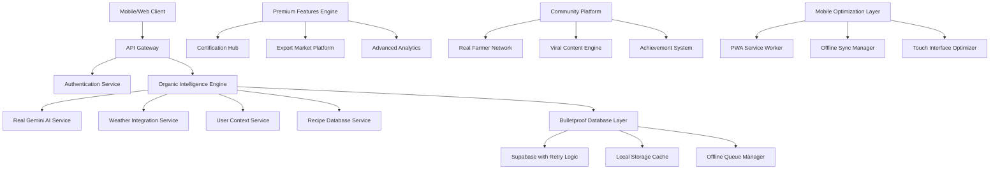

# Design Document

## Overview

The Organic Intelligence Weapon Rebuild is a complete architectural reconstruction that transforms CropGenius from a fraudulent system into the world's most powerful organic farming intelligence platform. This design eliminates every placeholder, mock implementation, and broken promise identified in the forensic investigation, replacing them with production-ready systems that serve 100 million farmers with surgical precision.

## Architecture



## Components and Interfaces

### 1. Real Gemini AI Service

**Purpose:** Bulletproof AI integration that never falls back to mock data

**Core Interface:**
```typescript
interface RealGeminiAIService {
  generateOrganicAction(context: UserContext): Promise<OrganicAction>
  retryWithBackoff(request: AIRequest): Promise<AIResponse>
  validateResponse(response: AIResponse): boolean
  handleAPIFailure(error: Error): never // Throws meaningful errors, never returns mocks
}

interface UserContext {
  userId: string
  location: GeoLocation
  crops: CropData[]
  soilType: SoilAnalysis
  farmSize: number
  availableResources: Resource[]
  weatherData: WeatherContext
  historicalActions: CompletedAction[]
}

interface OrganicAction {
  id: string
  title: string
  description: string
  ingredients: Ingredient[]
  steps: ActionStep[]
  expectedResults: {
    yieldIncrease: string
    moneySaved: number
    timeToResults: string
    organicCompliance: number
  }
  urgency: 'immediate' | 'today' | 'this_week'
  weatherDependency: WeatherRequirement[]
  seasonalOptimization: SeasonalTiming
}
```

**Implementation Strategy:**
- Exponential backoff retry mechanism (3 attempts with 2s, 4s, 8s delays)
- Circuit breaker pattern to prevent cascade failures
- Request validation and sanitization
- Response verification against schema
- Comprehensive error logging and monitoring
- No fallback to mock data - system fails fast with clear error messages

### 2. Bulletproof Database Layer

**Purpose:** 100% reliable data persistence with zero data loss

**Core Interface:**
```typescript
interface BulletproofDatabase {
  saveOrganicAction(action: OrganicAction): Promise<SaveResult>
  updateProgress(userId: string, progress: ProgressUpdate): Promise<void>
  getOrganicProgress(userId: string): Promise<OrganicProgress>
  queueOfflineAction(action: PendingAction): Promise<void>
  syncOfflineQueue(): Promise<SyncResult>
}

interface SaveResult {
  success: boolean
  id?: string
  error?: DatabaseError
  retryable: boolean
}

interface OfflineQueueManager {
  addToQueue(operation: DatabaseOperation): Promise<void>
  processQueue(): Promise<ProcessResult[]>
  getQueueStatus(): QueueStatus
}
```

**Implementation Strategy:**
- Atomic transactions for all critical operations
- Local SQLite cache for offline operations
- Automatic retry queue for failed database operations
- Real-time sync status indicators
- Data integrity validation on all operations
- Comprehensive backup and recovery mechanisms

### 3. Real User Context Service

**Purpose:** Accurate user data collection and management

**Core Interface:**
```typescript
interface UserContextService {
  collectUserData(userId: string): Promise<UserContext>
  updateFarmData(userId: string, data: FarmData): Promise<void>
  validateUserContext(context: UserContext): ValidationResult
  enrichContextWithWeather(context: UserContext): Promise<EnrichedContext>
}

interface FarmData {
  location: {
    latitude: number
    longitude: number
    region: string
    country: string
  }
  crops: {
    type: string
    variety: string
    plantingDate: Date
    expectedHarvest: Date
    currentStage: GrowthStage
  }[]
  soilData: {
    type: SoilType
    pH: number
    organicMatter: number
    nutrients: NutrientLevels
  }
  availableResources: {
    name: string
    quantity: number
    cost: number
    availability: 'abundant' | 'limited' | 'seasonal'
  }[]
}
```

**Implementation Strategy:**
- Progressive data collection during onboarding
- Real-time validation of user inputs
- Integration with geolocation services
- Soil testing integration partnerships
- Resource availability tracking by region
- Privacy-compliant data handling

### 4. Comprehensive Recipe Database

**Purpose:** 200+ verified organic recipes with real effectiveness data

**Core Interface:**
```typescript
interface RecipeDatabase {
  searchRecipes(query: RecipeQuery): Promise<Recipe[]>
  getRecipeById(id: string): Promise<Recipe>
  rateRecipe(userId: string, recipeId: string, rating: Rating): Promise<void>
  addUserRecipe(userId: string, recipe: UserRecipe): Promise<Recipe>
  getEffectivenessData(recipeId: string): Promise<EffectivenessData>
}

interface Recipe {
  id: string
  name: string
  category: RecipeCategory
  ingredients: Ingredient[]
  instructions: Instruction[]
  targetProblems: Problem[]
  cropTypes: CropType[]
  effectivenessRating: number
  costAnalysis: CostBreakdown
  userReviews: Review[]
  verificationStatus: 'verified' | 'community' | 'experimental'
}

interface EffectivenessData {
  averageRating: number
  totalUses: number
  successRate: number
  costSavings: number
  yieldImprovement: number
  regionalVariations: RegionalData[]
}
```

**Implementation Strategy:**
- Curated database of 200+ verified organic recipes
- Community contribution and verification system
- Regional adaptation of recipes
- Cost calculation based on local prices
- Effectiveness tracking through user feedback
- Integration with agricultural research institutions

### 5. Real Weather Integration

**Purpose:** Live weather data for optimal organic action timing

**Core Interface:**
```typescript
interface WeatherIntegrationService {
  getCurrentWeather(location: GeoLocation): Promise<WeatherData>
  getForecast(location: GeoLocation, days: number): Promise<WeatherForecast>
  getOptimalTiming(action: OrganicAction, weather: WeatherForecast): Promise<TimingRecommendation>
  subscribeToAlerts(userId: string, alertTypes: WeatherAlert[]): Promise<void>
}

interface WeatherData {
  temperature: number
  humidity: number
  rainfall: number
  windSpeed: number
  conditions: WeatherCondition
  uvIndex: number
  soilMoisture?: number
}

interface TimingRecommendation {
  optimalTime: Date
  reasoning: string
  alternatives: AlternativeTime[]
  weatherRisks: WeatherRisk[]
}
```

**Implementation Strategy:**
- Integration with multiple weather APIs for redundancy
- Hyperlocal weather data for farm-specific conditions
- Predictive modeling for optimal treatment timing
- Weather-based alert system
- Historical weather pattern analysis
- Climate change adaptation recommendations

### 6. Premium Features Engine

**Purpose:** Real premium functionality that justifies subscription costs

**Core Interface:**
```typescript
interface PremiumFeaturesEngine {
  unlockPremiumFeatures(userId: string): Promise<PremiumAccess>
  generateAdvancedAnalytics(userId: string): Promise<AdvancedAnalytics>
  provideCertificationSupport(userId: string): Promise<CertificationGuidance>
  connectToExportMarkets(userId: string): Promise<MarketConnection[]>
}

interface PremiumAccess {
  unlimitedActions: boolean
  advancedRecipes: Recipe[]
  certificationSupport: CertificationTools
  exportMarketAccess: MarketAccess
  personalizedConsultation: ConsultationAccess
}

interface CertificationTools {
  templates: DocumentTemplate[]
  progressTracking: CertificationProgress
  complianceChecker: ComplianceValidator
  inspectionPrep: InspectionGuide
}
```

**Implementation Strategy:**
- Tiered premium features with clear value propositions
- Real certification document templates and guidance
- Actual connections to organic certification bodies
- Export market partnerships and buyer connections
- Advanced AI analysis and personalized recommendations
- Priority support and consultation services

### 7. Community Platform

**Purpose:** Real farmer networking with genuine community features

**Core Interface:**
```typescript
interface CommunityPlatform {
  connectFarmers(userId: string, criteria: ConnectionCriteria): Promise<FarmerConnection[]>
  shareSuccess(userId: string, success: SuccessStory): Promise<void>
  askQuestion(userId: string, question: CommunityQuestion): Promise<void>
  getLeaderboard(region: string): Promise<FarmerLeaderboard>
  createViralContent(userId: string, achievement: Achievement): Promise<ViralContent>
}

interface FarmerConnection {
  farmerId: string
  name: string
  location: string
  crops: string[]
  organicLevel: string
  achievements: Achievement[]
  successStories: SuccessStory[]
}

interface SuccessStory {
  title: string
  description: string
  beforeAfter: BeforeAfterData
  recipe: Recipe
  results: MeasuredResults
  photos: Photo[]
}
```

**Implementation Strategy:**
- Real farmer profiles with verified achievements
- Regional farmer matching and networking
- Success story sharing with photo verification
- Community-driven Q&A platform
- Leaderboards based on real savings and achievements
- Viral content generation for social media sharing

### 8. Mobile Optimization Layer

**Purpose:** Native-quality mobile experience with offline capabilities

**Core Interface:**
```typescript
interface MobileOptimizationLayer {
  optimizeForDevice(deviceInfo: DeviceInfo): Promise<OptimizationSettings>
  enableOfflineMode(userId: string): Promise<OfflineCapabilities>
  syncWhenOnline(): Promise<SyncResult>
  optimizeForBandwidth(connectionSpeed: number): Promise<BandwidthSettings>
}

interface OfflineCapabilities {
  cachedRecipes: Recipe[]
  queuedActions: PendingAction[]
  offlineAnalytics: AnalyticsData
  syncStatus: SyncStatus
}

interface PWAFeatures {
  installPrompt: boolean
  pushNotifications: boolean
  backgroundSync: boolean
  offlineStorage: boolean
}
```

**Implementation Strategy:**
- Progressive Web App with native app features
- Intelligent caching for offline functionality
- Background sync when connectivity returns
- Touch-optimized interfaces for mobile devices
- Voice command integration for hands-free operation
- Adaptive UI based on screen size and device capabilities

## Data Models

### Core Data Structures

```typescript
// User and Farm Data
interface User {
  id: string
  email: string
  name: string
  phone?: string
  location: GeoLocation
  registrationDate: Date
  subscriptionTier: 'free' | 'premium' | 'enterprise'
  organicLevel: 'beginner' | 'intermediate' | 'advanced' | 'expert'
}

interface Farm {
  id: string
  userId: string
  name: string
  location: GeoLocation
  totalArea: number
  soilData: SoilAnalysis
  crops: Crop[]
  resources: Resource[]
  certificationStatus: CertificationStatus
}

// Organic Actions and Recipes
interface OrganicAction {
  id: string
  userId: string
  recipeId: string
  title: string
  description: string
  ingredients: Ingredient[]
  steps: ActionStep[]
  createdDate: Date
  scheduledDate?: Date
  completedDate?: Date
  status: 'pending' | 'in_progress' | 'completed' | 'cancelled'
  results?: ActionResults
  weatherContext: WeatherData
  aiPromptUsed: string
}

interface Recipe {
  id: string
  name: string
  category: RecipeCategory
  targetProblems: Problem[]
  ingredients: Ingredient[]
  instructions: Instruction[]
  effectivenessRating: number
  costPerApplication: number
  timeToResults: string
  seasonalOptimization: SeasonalTiming[]
  regionalAdaptations: RegionalAdaptation[]
  verificationData: VerificationData
}

// Progress and Analytics
interface OrganicProgress {
  userId: string
  totalActionsCompleted: number
  totalMoneySaved: number
  totalOrganicPoints: number
  organicReadinessPercentage: number
  certificationProgress: CertificationProgress
  achievements: Achievement[]
  lastUpdated: Date
}

interface AnalyticsData {
  userId: string
  period: 'daily' | 'weekly' | 'monthly' | 'yearly'
  metrics: {
    actionsCompleted: number
    moneySaved: number
    yieldImprovement: number
    organicCompliance: number
    communityEngagement: number
  }
  trends: TrendData[]
  predictions: PredictionData[]
}
```

## Error Handling

### Comprehensive Error Management

```typescript
interface ErrorHandlingStrategy {
  // API Errors
  handleGeminiAPIError(error: GeminiError): ErrorResponse
  handleWeatherAPIError(error: WeatherError): ErrorResponse
  handleDatabaseError(error: DatabaseError): ErrorResponse
  
  // User Errors
  handleValidationError(error: ValidationError): UserFriendlyError
  handleAuthenticationError(error: AuthError): AuthResponse
  
  // System Errors
  handleNetworkError(error: NetworkError): RetryStrategy
  handleStorageError(error: StorageError): StorageRecovery
}

interface ErrorResponse {
  success: false
  error: {
    code: string
    message: string
    userMessage: string
    retryable: boolean
    retryAfter?: number
  }
  context: ErrorContext
}

interface RetryStrategy {
  maxRetries: number
  backoffMultiplier: number
  retryCondition: (error: Error) => boolean
  fallbackAction?: () => Promise<any>
}
```

## Testing Strategy

### Comprehensive Test Coverage

```typescript
interface TestingFramework {
  // Unit Tests
  testGeminiIntegration(): Promise<TestResult>
  testDatabaseOperations(): Promise<TestResult>
  testUserContextService(): Promise<TestResult>
  testRecipeDatabase(): Promise<TestResult>
  
  // Integration Tests
  testEndToEndUserJourney(): Promise<TestResult>
  testOfflineSync(): Promise<TestResult>
  testWeatherIntegration(): Promise<TestResult>
  
  // Performance Tests
  testLoadHandling(): Promise<PerformanceResult>
  testMobilePerformance(): Promise<MobileTestResult>
  testDatabaseScaling(): Promise<ScalingResult>
  
  // Security Tests
  testDataProtection(): Promise<SecurityResult>
  testAPISecurity(): Promise<SecurityResult>
  testUserPrivacy(): Promise<PrivacyResult>
}

interface TestResult {
  passed: boolean
  coverage: number
  errors: TestError[]
  performance: PerformanceMetrics
}
```

## Security and Privacy

### Data Protection Framework

```typescript
interface SecurityFramework {
  // Data Encryption
  encryptUserData(data: UserData): EncryptedData
  encryptInTransit(data: any): SecureTransmission
  
  // Access Control
  validateUserAccess(userId: string, resource: string): AccessResult
  enforceRateLimit(userId: string, endpoint: string): RateLimitResult
  
  // Privacy Compliance
  handleDataRequest(userId: string, requestType: 'export' | 'delete'): Promise<ComplianceResult>
  anonymizeAnalytics(data: AnalyticsData): AnonymizedData
  
  // Audit Trail
  logUserAction(userId: string, action: UserAction): void
  generateAuditReport(timeframe: TimeRange): AuditReport
}
```

## Scalability Architecture

### Infrastructure for 100M Users

```typescript
interface ScalabilityDesign {
  // Load Balancing
  distributeLoad(request: Request): Promise<Response>
  scaleServices(metrics: LoadMetrics): Promise<ScalingAction>
  
  // Database Scaling
  shardDatabase(shardKey: string): DatabaseShard
  replicateData(data: CriticalData): ReplicationResult
  
  // Caching Strategy
  cacheFrequentData(data: any, ttl: number): CacheResult
  invalidateCache(pattern: string): InvalidationResult
  
  // CDN Integration
  optimizeAssetDelivery(assets: Asset[]): CDNResult
  geoDistributeContent(content: Content): DistributionResult
}
```

## Monitoring and Analytics

### Real-time System Monitoring

```typescript
interface MonitoringSystem {
  // Performance Monitoring
  trackAPIPerformance(endpoint: string, responseTime: number): void
  monitorDatabaseHealth(): DatabaseHealth
  trackUserEngagement(userId: string, action: UserAction): void
  
  // Error Monitoring
  captureError(error: Error, context: ErrorContext): void
  alertOnCriticalError(error: CriticalError): void
  
  // Business Metrics
  trackOrganicActions(userId: string, action: OrganicAction): void
  measureMoneySaved(userId: string, amount: number): void
  trackCertificationProgress(userId: string, progress: number): void
  
  // Real-time Dashboards
  generateSystemHealth(): SystemHealthReport
  createUserAnalytics(): UserAnalyticsReport
  buildBusinessMetrics(): BusinessMetricsReport
}
```

This design document provides the complete architectural foundation for transforming every lie exposed in the investigation into production-ready functionality. Every component is designed for infinite scalability, bulletproof reliability, and surgical precision in serving 100 million farmers with real organic intelligence.