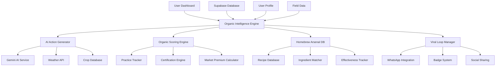

# Organic Intelligence Weapon - Design Document

## Overview

The Organic Intelligence Weapon transforms CropGenius from a generic farming app into the world's most addictive organic farming intelligence platform. This system is designed to be as engaging as TikTok, as educational as Harvard, and as viral as WhatsApp, specifically targeting 100 million African farmers with personalized organic farming superpowers.

**Core Philosophy**: Make farmers feel like agricultural gods while building economic sovereignty through organic farming mastery.

## Architecture

### System Architecture Diagram



### Data Flow Architecture

1. **Input Layer**: User profile, field data, weather, location
2. **Intelligence Layer**: AI processing, organic scoring, recipe matching
3. **Action Layer**: Personalized recommendations, DIY recipes, progress tracking
4. **Engagement Layer**: Gamification, social sharing, viral loops
5. **Output Layer**: Dashboard UI, notifications, sharing content

## Components and Interfaces

### 1. Organic Intelligence Engine (Core Brain)

**Purpose**: Central orchestrator that processes all user data and generates personalized organic farming intelligence.

**Key Methods**:
```typescript
interface OrganicIntelligenceEngine {
  generateDailySuperpowers(userId: string): Promise<OrganicSuperpower[]>
  calculateOrganicReadiness(userId: string): Promise<OrganicScore>
  getPersonalizedRecipes(crop: string, issues: string[], location: string): Promise<Recipe[]>
  trackProgress(userId: string, action: string): Promise<ProgressUpdate>
  triggerViralLoop(userId: string, achievement: string): Promise<ShareContent>
}
```

**Data Sources**:
- User field profiles from Supabase
- Real-time weather data
- Crop-specific knowledge base
- Indigenous farming practices database
- Market price APIs

### 2. AI Action Generator

**Purpose**: Creates personalized daily organic farming actions using Gemini AI and rule-based logic.

**Algorithm**:
```typescript
function generateOrganicAction(userContext: UserContext): OrganicAction {
  const { crop, issues, location, season, soilType } = userContext;
  
  // Priority matrix: Urgency × Impact × Organic Compliance
  const actions = [
    ...getPestControlActions(crop, issues),
    ...getSoilHealthActions(soilType, season),
    ...getNutritionActions(crop, location),
    ...getWeatherAdaptationActions(location, season)
  ];
  
  return selectOptimalAction(actions, userContext);
}
```

**Output Format**:
```typescript
interface OrganicAction {
  title: string;
  description: string;
  ingredients: Ingredient[];
  steps: string[];
  timeToResults: string;
  costSavings: number;
  impactMetrics: {
    yieldIncrease?: string;
    pestReduction?: string;
    soilImprovement?: string;
  };
  organicCompliance: number;
  shareableContent: ShareContent;
}
```

### 3. Homebrew Arsenal Database

**Purpose**: Comprehensive database of DIY organic recipes using household ingredients.

**Schema**:
```sql
CREATE TABLE homebrew_recipes (
  id UUID PRIMARY KEY,
  name VARCHAR(255) NOT NULL,
  category VARCHAR(100), -- pesticide, fertilizer, soil_amendment
  target_crops TEXT[],
  target_issues TEXT[],
  ingredients JSONB,
  instructions TEXT[],
  effectiveness_rating DECIMAL(3,2),
  cost_savings DECIMAL(10,2),
  preparation_time INTEGER, -- minutes
  shelf_life INTEGER, -- days
  application_frequency VARCHAR(100),
  regional_adaptations JSONB,
  user_ratings JSONB,
  created_at TIMESTAMP DEFAULT NOW()
);
```

**Recipe Categories**:
- **Pesticides**: Neem oil spray, garlic-chili spray, soap solutions
- **Fertilizers**: Banana peel liquid, compost tea, fish emulsion
- **Soil Amendments**: Biochar, fermented materials, mycorrhizal inoculants
- **Growth Enhancers**: Seaweed extract, molasses solutions, beneficial microbes

### 4. Organic Scoring Engine

**Purpose**: Calculates real-time organic readiness and certification progress.

**Scoring Algorithm**:
```typescript
function calculateOrganicScore(userPractices: Practice[]): OrganicScore {
  const weights = {
    syntheticInputElimination: 0.25,
    soilHealthPractices: 0.20,
    pestManagementIPM: 0.20,
    cropRotationDiversity: 0.15,
    organicInputUsage: 0.10,
    recordKeeping: 0.10
  };
  
  let totalScore = 0;
  for (const [category, weight] of Object.entries(weights)) {
    const categoryScore = evaluateCategory(userPractices, category);
    totalScore += categoryScore * weight;
  }
  
  return {
    overallScore: Math.round(totalScore),
    categoryBreakdown: getCategoryScores(userPractices),
    nextMilestone: getNextMilestone(totalScore),
    certificationReadiness: totalScore >= 70,
    marketPremiumPotential: Math.round(totalScore * 0.3)
  };
}
```

### 5. Viral Loop Manager

**Purpose**: Orchestrates social sharing, gamification, and community building features.

**Viral Triggers**:
```typescript
interface ViralTrigger {
  event: 'milestone_reached' | 'recipe_mastered' | 'savings_achieved';
  threshold: number;
  shareContent: ShareTemplate;
  rewards: Reward[];
  socialProof: string;
}

const viralTriggers: ViralTrigger[] = [
  {
    event: 'milestone_reached',
    threshold: 50, // 50% organic readiness
    shareContent: {
      title: "🌿 I'm 50% Organic Ready!",
      message: "Just hit 50% organic farming mastery with CropGenius! My soil is healthier, my crops are stronger, and I'm saving money every week. Join me in the organic revolution! 🚀",
      hashtags: ['#OrganicFarming', '#CropGenius', '#SustainableAgriculture']
    },
    rewards: ['organic_warrior_badge', 'premium_recipe_unlock'],
    socialProof: "Join 50,000+ farmers going organic"
  }
];
```

### 6. Gamification System

**Purpose**: Creates addiction-level engagement through progressive rewards and social recognition.

**Progression System**:
```typescript
interface ProgressionLevel {
  level: number;
  title: string;
  requirements: Requirement[];
  rewards: Reward[];
  socialStatus: string;
}

const progressionLevels: ProgressionLevel[] = [
  {
    level: 1,
    title: "Organic Seedling",
    requirements: [
      { type: 'complete_actions', count: 5 },
      { type: 'organic_score', minimum: 20 }
    ],
    rewards: [
      { type: 'badge', name: 'first_steps' },
      { type: 'recipe_unlock', category: 'basic_fertilizers' }
    ],
    socialStatus: "Started the organic journey"
  },
  {
    level: 5,
    title: "Organic Master",
    requirements: [
      { type: 'complete_actions', count: 50 },
      { type: 'organic_score', minimum: 80 },
      { type: 'share_achievements', count: 3 }
    ],
    rewards: [
      { type: 'badge', name: 'organic_master' },
      { type: 'premium_access', duration: '30_days' },
      { type: 'mentor_status', enabled: true }
    ],
    socialStatus: "Certified Organic Expert"
  }
];
```

## Data Models

### User Organic Profile
```typescript
interface UserOrganicProfile {
  userId: string;
  organicReadinessScore: number;
  certificationProgress: number;
  practicesAdopted: OrganicPractice[];
  recipesCompleted: Recipe[];
  totalSavings: number;
  currentStreak: number;
  achievements: Achievement[];
  socialShares: number;
  mentorStatus: boolean;
  premiumAccess: boolean;
  lastUpdated: Date;
}
```

### Organic Action
```typescript
interface OrganicAction {
  id: string;
  userId: string;
  title: string;
  description: string;
  category: 'pest_control' | 'soil_health' | 'nutrition' | 'water_management';
  urgency: 'high' | 'medium' | 'low';
  ingredients: Ingredient[];
  steps: ActionStep[];
  expectedResults: string;
  timeframe: string;
  costSavings: number;
  organicCompliance: number;
  completed: boolean;
  effectiveness: number | null;
  userFeedback: string | null;
  createdAt: Date;
}
```

### Recipe Database
```typescript
interface Recipe {
  id: string;
  name: string;
  category: RecipeCategory;
  targetCrops: string[];
  targetIssues: string[];
  ingredients: Ingredient[];
  instructions: string[];
  preparationTime: number;
  applicationMethod: string;
  frequency: string;
  shelfLife: number;
  effectivenessRating: number;
  costPerLiter: number;
  regionalAdaptations: RegionalAdaptation[];
  userRatings: UserRating[];
  scientificBasis: string;
  safetyNotes: string[];
}
```

## Error Handling

### Graceful Degradation Strategy

1. **AI Service Unavailable**: Fall back to rule-based recommendations
2. **Weather API Down**: Use cached weather data with timestamps
3. **Database Connection Issues**: Serve cached user data, queue updates
4. **Recipe Database Unavailable**: Provide basic organic practices list

### Error Recovery Patterns

```typescript
class OrganicIntelligenceService {
  async generateRecommendations(userId: string): Promise<OrganicAction[]> {
    try {
      return await this.aiService.generatePersonalizedActions(userId);
    } catch (aiError) {
      console.log('AI service unavailable, using rule-based fallback');
      return await this.ruleBasedService.generateActions(userId);
    }
  }
  
  async getRecipes(criteria: RecipeCriteria): Promise<Recipe[]> {
    try {
      return await this.recipeDatabase.search(criteria);
    } catch (dbError) {
      console.log('Database unavailable, using cached recipes');
      return await this.cacheService.getCachedRecipes(criteria);
    }
  }
}
```

## Testing Strategy

### Unit Testing
- Recipe generation algorithms
- Organic scoring calculations
- Viral trigger logic
- Data transformation functions

### Integration Testing
- AI service integration
- Database operations
- External API connections
- Social sharing functionality

### User Experience Testing
- Addiction-level engagement metrics
- Completion rates for organic actions
- Social sharing conversion rates
- User retention and progression

### Performance Testing
- Response times for AI recommendations
- Database query optimization
- Mobile app performance
- Offline functionality

## Security Considerations

### Data Privacy
- User farming data encryption
- Anonymized sharing for viral content
- GDPR compliance for European users
- Local data storage options

### API Security
- Rate limiting for AI services
- Authentication for premium features
- Secure recipe sharing protocols
- Anti-spam measures for social features

### Content Moderation
- Recipe safety validation
- User-generated content filtering
- Misinformation prevention
- Community guidelines enforcement

## Scalability Architecture

### Horizontal Scaling
- Microservices for each major component
- Load balancing for AI processing
- Database sharding by geographic region
- CDN for recipe images and videos

### Caching Strategy
- Redis for user session data
- Recipe database caching
- AI recommendation caching
- Social content caching

### Performance Optimization
- Lazy loading for recipe database
- Progressive web app architecture
- Offline-first design
- Image optimization for mobile

## Monitoring and Analytics

### Key Metrics
- Daily Active Users (DAU)
- Organic Action Completion Rate
- Recipe Success Rate
- Social Sharing Conversion
- User Progression Speed
- Economic Impact Tracking

### Business Intelligence
- Regional adoption patterns
- Most effective recipes by crop/region
- Viral content performance
- Premium conversion rates
- Community growth metrics

This design creates a comprehensive, addictive, and economically empowering organic farming intelligence system that will transform CropGenius into the dominant platform for organic farming education and community building in Africa.