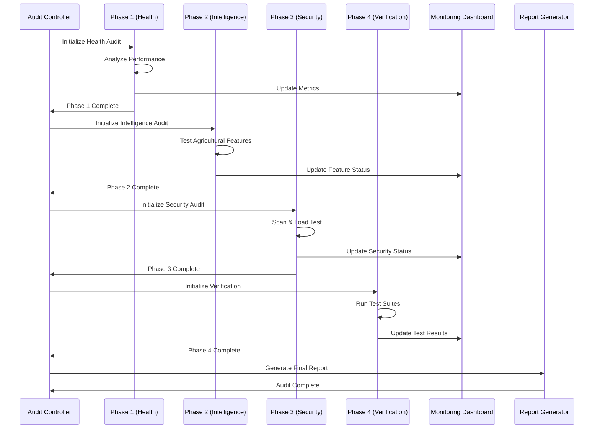

# Design Document

## Overview

The CropGenius Platform Audit and Optimization system is designed as a comprehensive, multi-phase assessment and improvement framework that systematically evaluates, optimizes, and hardens the agricultural intelligence platform. The system implements automated monitoring, performance optimization, security hardening, and continuous verification protocols to ensure reliable service delivery to 100 million African farmers.

## Architecture

### High-Level System Architecture

```mermaid
graph TB
    subgraph "Audit Control Center"
        AC[Audit Controller]
        RM[Report Manager]
        AM[Alert Manager]
    end
    
    subgraph "Phase 1: Health & Performance"
        FPA[Frontend Performance Analyzer]
        BPA[Backend Performance Analyzer]
        DCA[Data Contract Analyzer]
        PM[Performance Monitor]
    end
    
    subgraph "Phase 2: Agricultural Intelligence"
        CDA[Crop Disease Analyzer]
        WFA[Weather Feature Analyzer]
        MIA[Market Intelligence Analyzer]
        SIA[Satellite Intelligence Analyzer]
    end
    
    subgraph "Phase 3: Security & Scalability"
        VS[Vulnerability Scanner]
        LT[Load Tester]
        SA[Security Analyzer]
        SC[Scalability Controller]
    end
    
    subgraph "Phase 4: Verification"
        AT[Automated Tester]
        MT[Manual Tester]
        RT[Regression Tester]
        PV[Performance Validator]
    end
    
    subgraph "Monitoring Infrastructure"
        MD[Monitoring Dashboard]
        AS[Alerting System]
        ML[Metrics Logger]
        RG[Report Generator]
    end
    
    AC --> FPA
    AC --> CDA
    AC --> VS
    AC --> AT
    
    FPA --> PM
    BPA --> PM
    DCA --> PM
    
    CDA --> MD
    WFA --> MD
    MIA --> MD
    SIA --> MD
    
    VS --> AS
    LT --> AS
    SA --> AS
    
    AT --> RG
    MT --> RG
    RT --> RG
    PV --> RG
    
    RM --> RG
    AM --> AS
```



### Component Integration Flow



## Components and Interfaces

### 1. Audit Controller Interface

```typescript
interface AuditController {
  executePhase(phase: AuditPhase): Promise<PhaseResult>
  generateReport(phases: PhaseResult[]): Promise<AuditReport>
  scheduleAudit(schedule: AuditSchedule): Promise<void>
  getAuditStatus(): AuditStatus
}

interface AuditPhase {
  id: string
  name: string
  tasks: AuditTask[]
  dependencies: string[]
  timeout: number
}

interface PhaseResult {
  phaseId: string
  status: 'success' | 'failure' | 'warning'
  findings: Finding[]
  metrics: PerformanceMetrics
  recommendations: Recommendation[]
}
```

### 2. Performance Analysis Components

```typescript
interface PerformanceAnalyzer {
  analyzeFrontendPerformance(): Promise<FrontendMetrics>
  analyzeBackendPerformance(): Promise<BackendMetrics>
  validateDataContracts(): Promise<ContractValidation[]>
  optimizePerformance(issues: PerformanceIssue[]): Promise<OptimizationResult>
}

interface FrontendMetrics {
  responseTime: number
  renderTime: number
  bundleSize: number
  memoryUsage: number
  errorRate: number
}

interface BackendMetrics {
  apiLatency: number
  databaseQueryTime: number
  throughput: number
  errorRate: number
  resourceUtilization: ResourceUsage
}
```

### 3. Agricultural Intelligence Testing Framework

```typescript
interface AgricultureFeatureTester {
  testCropDiseaseDetection(): Promise<AccuracyResult>
  testWeatherForecasting(): Promise<WeatherAccuracy>
  testMarketIntelligence(): Promise<MarketDataValidation>
  testSatelliteIntelligence(): Promise<SatelliteAnalysis>
  validateUserExperience(): Promise<UXValidation>
}

interface AccuracyResult {
  accuracy: number
  testCases: number
  falsePositives: number
  falseNegatives: number
  responseTime: number
}
```

### 4. Security and Scalability Framework

```typescript
interface SecurityScalabilityTester {
  scanVulnerabilities(): Promise<VulnerabilityReport>
  performLoadTest(config: LoadTestConfig): Promise<LoadTestResult>
  analyzeScalability(): Promise<ScalabilityAnalysis>
  validateSecurity(): Promise<SecurityValidation>
}

interface LoadTestConfig {
  concurrentUsers: number
  duration: number
  rampUpTime: number
  endpoints: string[]
}

interface LoadTestResult {
  maxConcurrentUsers: number
  averageResponseTime: number
  errorRate: number
  throughput: number
  resourceUtilization: ResourceUsage
}
```

## Data Models

### Audit Report Schema

```typescript
interface AuditReport {
  id: string
  timestamp: Date
  version: string
  phases: PhaseReport[]
  summary: AuditSummary
  recommendations: Recommendation[]
  metrics: AggregatedMetrics
}

interface PhaseReport {
  phase: AuditPhase
  status: PhaseStatus
  duration: number
  findings: Finding[]
  beforeMetrics: PerformanceMetrics
  afterMetrics: PerformanceMetrics
  improvements: Improvement[]
}

interface Finding {
  id: string
  severity: 'critical' | 'high' | 'medium' | 'low'
  category: string
  description: string
  impact: string
  resolution: string
  status: 'open' | 'resolved' | 'mitigated'
}
```

### Monitoring Data Models

```typescript
interface MonitoringMetrics {
  timestamp: Date
  systemHealth: SystemHealth
  performanceMetrics: PerformanceMetrics
  securityStatus: SecurityStatus
  userExperience: UXMetrics
}

interface SystemHealth {
  uptime: number
  errorRate: number
  responseTime: number
  throughput: number
  resourceUtilization: ResourceUsage
}

interface UXMetrics {
  pageLoadTime: number
  interactionLatency: number
  errorEncounters: number
  featureUsage: FeatureUsageStats
  userSatisfaction: number
}
```

## Error Handling

### Audit Error Recovery System

```typescript
class AuditErrorHandler {
  async handlePhaseFailure(phase: AuditPhase, error: Error): Promise<RecoveryAction> {
    const severity = this.assessErrorSeverity(error)
    
    switch (severity) {
      case 'critical':
        return this.executeCriticalRecovery(phase, error)
      case 'high':
        return this.executeHighPriorityRecovery(phase, error)
      case 'medium':
        return this.executeMediumPriorityRecovery(phase, error)
      default:
        return this.executeStandardRecovery(phase, error)
    }
  }
  
  private async executeCriticalRecovery(phase: AuditPhase, error: Error): Promise<RecoveryAction> {
    // Immediate escalation and system protection
    await this.notifyEmergencyTeam(error)
    await this.enableEmergencyMode()
    return { action: 'abort', reason: 'Critical system failure detected' }
  }
}
```

### Performance Degradation Handling

```typescript
class PerformanceDegradationHandler {
  async handlePerformanceIssue(issue: PerformanceIssue): Promise<void> {
    const impact = await this.assessImpact(issue)
    
    if (impact.severity === 'critical') {
      await this.implementEmergencyOptimization(issue)
      await this.notifyOperationsTeam(issue)
    }
    
    await this.logPerformanceIssue(issue)
    await this.scheduleOptimization(issue)
  }
}
```

## Testing Strategy

### Automated Testing Framework

```typescript
interface AutomatedTestSuite {
  runUnitTests(): Promise<TestResult>
  runIntegrationTests(): Promise<TestResult>
  runE2ETests(): Promise<TestResult>
  runPerformanceTests(): Promise<PerformanceTestResult>
  runSecurityTests(): Promise<SecurityTestResult>
}

interface TestResult {
  passed: number
  failed: number
  skipped: number
  coverage: number
  duration: number
  failures: TestFailure[]
}
```

### Agricultural Feature Testing

```typescript
class AgricultureTestSuite {
  async testCropDiseaseAccuracy(): Promise<AccuracyTestResult> {
    const testImages = await this.loadTestImages()
    const results = []
    
    for (const image of testImages) {
      const prediction = await this.cropDiseaseService.detectDisease(image)
      const accuracy = this.validatePrediction(prediction, image.expectedResult)
      results.push(accuracy)
    }
    
    return this.calculateOverallAccuracy(results)
  }
  
  async testWeatherForecastAccuracy(): Promise<WeatherTestResult> {
    const historicalData = await this.getHistoricalWeatherData()
    const forecasts = await this.getHistoricalForecasts()
    
    return this.compareAccuracy(forecasts, historicalData)
  }
}
```

### Load Testing Configuration

```typescript
const loadTestScenarios = {
  normalLoad: {
    concurrentUsers: 1000,
    duration: '10m',
    rampUpTime: '2m'
  },
  peakLoad: {
    concurrentUsers: 5000,
    duration: '15m',
    rampUpTime: '5m'
  },
  stressTest: {
    concurrentUsers: 10000,
    duration: '20m',
    rampUpTime: '10m'
  },
  scalabilityTest: {
    concurrentUsers: 50000,
    duration: '30m',
    rampUpTime: '15m'
  }
}
```

## Implementation Architecture

### Phase 1: System Health & Performance Implementation

```typescript
class SystemHealthAuditor {
  async auditFrontendPerformance(): Promise<FrontendAuditResult> {
    const metrics = await this.collectFrontendMetrics()
    const issues = await this.identifyPerformanceIssues(metrics)
    const optimizations = await this.generateOptimizations(issues)
    
    return {
      metrics,
      issues,
      optimizations,
      recommendations: await this.generateRecommendations(issues)
    }
  }
  
  async auditBackendPerformance(): Promise<BackendAuditResult> {
    const apiMetrics = await this.analyzeAPIPerformance()
    const dbMetrics = await this.analyzeDatabasePerformance()
    const bottlenecks = await this.identifyBottlenecks(apiMetrics, dbMetrics)
    
    return {
      apiMetrics,
      dbMetrics,
      bottlenecks,
      optimizations: await this.generateBackendOptimizations(bottlenecks)
    }
  }
}
```

### Phase 2: Agricultural Intelligence Implementation

```typescript
class AgricultureIntelligenceAuditor {
  async auditCropDiseaseDetection(): Promise<CropDiseaseAuditResult> {
    const accuracyTest = await this.testDiseaseDetectionAccuracy()
    const performanceTest = await this.testDiseaseDetectionPerformance()
    const integrationTest = await this.testPlantNetGeminiIntegration()
    
    return {
      accuracy: accuracyTest,
      performance: performanceTest,
      integration: integrationTest,
      recommendations: await this.generateDiseaseDetectionRecommendations()
    }
  }
  
  async auditWeatherIntelligence(): Promise<WeatherAuditResult> {
    const accuracyTest = await this.testWeatherForecastAccuracy()
    const localityTest = await this.testLocalityAccuracy()
    const apiIntegration = await this.testWeatherAPIIntegration()
    
    return {
      accuracy: accuracyTest,
      locality: localityTest,
      integration: apiIntegration,
      recommendations: await this.generateWeatherRecommendations()
    }
  }
}
```

### Monitoring and Alerting System

```typescript
class MonitoringSystem {
  async initializeMonitoring(): Promise<void> {
    await this.setupMetricsCollection()
    await this.configureAlerts()
    await this.initializeDashboards()
    await this.setupReporting()
  }
  
  async setupMetricsCollection(): Promise<void> {
    // Real-time metrics collection for all system components
    this.metricsCollector.collectSystemMetrics()
    this.metricsCollector.collectUserMetrics()
    this.metricsCollector.collectBusinessMetrics()
  }
  
  async configureAlerts(): Promise<void> {
    const alertRules = [
      { metric: 'response_time', threshold: 500, severity: 'warning' },
      { metric: 'error_rate', threshold: 0.01, severity: 'critical' },
      { metric: 'uptime', threshold: 0.999, severity: 'high' }
    ]
    
    await this.alertManager.configureRules(alertRules)
  }
}
```

This design provides a comprehensive framework for conducting the four-phase audit while maintaining system reliability and providing actionable insights for continuous improvement of the CropGenius platform.