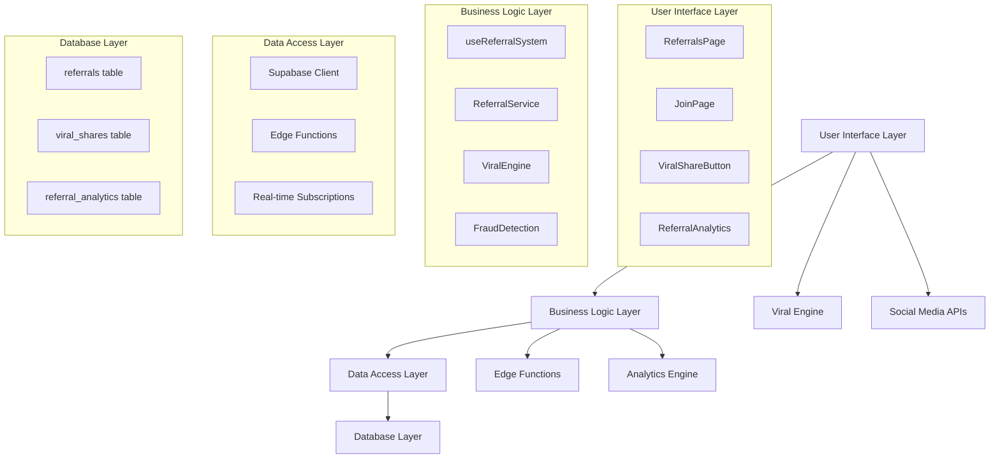
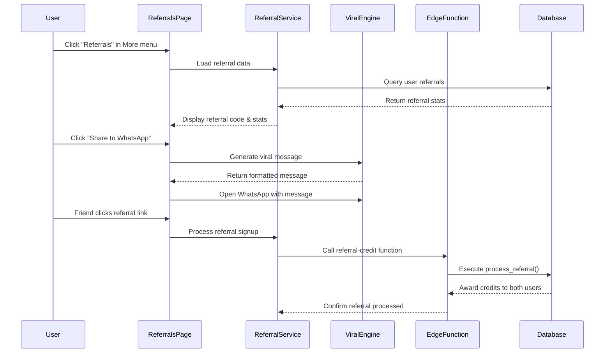

# Design Document

## Overview

The referral system reconstruction transforms CropGenius from a broken 404-generating disaster into a viral growth engine capable of reaching 100 million farmers. The design leverages existing solid backend infrastructure while building a comprehensive user interface and advanced features that make users feel superior for sharing their farming achievements.

## Architecture

### High-Level System Architecture



### Component Interaction Flow



## Components and Interfaces

### 1. ReferralsPage Component

**Location:** `src/pages/ReferralsPage.tsx`

**Purpose:** Main user interface for the referral system

**Key Features:**
- Displays user's referral code prominently
- Shows referral statistics (count, credits earned)
- Provides multiple sharing options
- Integrates with viral message generation
- Shows referral history and achievements

**Interface:**
```typescript
interface ReferralsPageProps {
  // No props - uses hooks for data
}

interface ReferralStats {
  count: number;
  credits: number;
  conversionRate: number;
  totalClicks: number;
}
```

### 2. JoinPage Component

**Location:** `src/pages/JoinPage.tsx`

**Purpose:** Landing page for referral links with attribution tracking

**Key Features:**
- Extracts referral code from URL parameters
- Stores referral attribution in localStorage
- Displays welcoming message for referred users
- Integrates with signup flow

**Interface:**
```typescript
interface JoinPageProps {
  // No props - uses URL parameters
}

interface ReferralAttribution {
  referralCode: string;
  timestamp: Date;
  source: 'whatsapp' | 'social' | 'email' | 'sms';
}
```

### 3. Enhanced useReferralSystem Hook

**Location:** `src/hooks/useReferralSystem.ts`

**Purpose:** Centralized referral system logic and state management

**Enhanced Features:**
- Referral link generation
- Advanced analytics
- Fraud detection integration
- Real-time updates

**Interface:**
```typescript
interface UseReferralSystemReturn {
  referralCode: string;
  referralLink: string;
  referralStats: ReferralStats;
  referralHistory: ReferralRecord[];
  achievements: ReferralAchievement[];
  loading: boolean;
  error: string | null;
  
  // Actions
  generateReferralLink: () => Promise<void>;
  shareToWhatsApp: (message: string) => void;
  shareToSocial: (platform: string, message: string) => void;
  copyToClipboard: (text: string) => Promise<boolean>;
  processReferral: (referredUserId: string) => Promise<void>;
  loadAnalytics: () => Promise<void>;
}
```

### 4. Enhanced ViralEngine Service

**Location:** `src/services/ViralEngine.ts`

**Purpose:** Generate compelling viral messages and handle sharing

**Enhanced Features:**
- A/B testing for message variants
- Platform-specific message optimization
- Achievement-based message generation
- Performance tracking

**Interface:**
```typescript
interface ViralEngineInterface {
  // Message Generation
  createAchievementMessage(stats: UserStats, variant?: string): string;
  createMilestoneMessage(milestone: string, stats: UserStats): string;
  createRecipeMessage(recipeName: string, savings: number): string;
  
  // Sharing Methods
  shareToWhatsApp(message: string): void;
  shareToSocial(platform: SocialPlatform, message: string): void;
  copyToClipboard(message: string): Promise<boolean>;
  
  // Analytics
  trackShare(platform: string, messageVariant: string, userId: string): Promise<void>;
  getMessagePerformance(variant: string): Promise<MessageAnalytics>;
}
```

### 5. ReferralAnalytics Component

**Location:** `src/components/referrals/ReferralAnalytics.tsx`

**Purpose:** Advanced analytics dashboard for referral performance

**Features:**
- Conversion rate tracking
- Geographic distribution
- Time-based trends
- A/B testing results

**Interface:**
```typescript
interface ReferralAnalyticsProps {
  userId: string;
  isPremium: boolean;
}

interface AnalyticsData {
  totalReferrals: number;
  conversionRate: number;
  clickThroughRate: number;
  geographicDistribution: GeographicData[];
  timeBasedTrends: TrendData[];
  topPerformingChannels: ChannelData[];
}
```

### 6. FraudDetectionService

**Location:** `src/services/FraudDetectionService.ts`

**Purpose:** Detect and prevent referral fraud

**Features:**
- IP address tracking
- Device fingerprinting
- Behavioral analysis
- Real-time monitoring

**Interface:**
```typescript
interface FraudDetectionInterface {
  analyzeReferral(referralData: ReferralAttempt): Promise<FraudAnalysis>;
  trackDeviceFingerprint(userId: string): string;
  monitorSuspiciousActivity(): Promise<SuspiciousActivity[]>;
  flagForReview(referralId: string, reason: string): Promise<void>;
}
```

## Data Models

### Enhanced Referrals Table

```sql
-- Extend existing referrals table
ALTER TABLE public.referrals ADD COLUMN IF NOT EXISTS referral_link TEXT;
ALTER TABLE public.referrals ADD COLUMN IF NOT EXISTS source_platform TEXT;
ALTER TABLE public.referrals ADD COLUMN IF NOT EXISTS click_count INTEGER DEFAULT 0;
ALTER TABLE public.referrals ADD COLUMN IF NOT EXISTS conversion_rate DECIMAL(5,2);
ALTER TABLE public.referrals ADD COLUMN IF NOT EXISTS referrer_ip INET;
ALTER TABLE public.referrals ADD COLUMN IF NOT EXISTS referred_ip INET;
ALTER TABLE public.referrals ADD COLUMN IF NOT EXISTS device_fingerprint TEXT;
ALTER TABLE public.referrals ADD COLUMN IF NOT EXISTS suspicious_activity BOOLEAN DEFAULT FALSE;
ALTER TABLE public.referrals ADD COLUMN IF NOT EXISTS fraud_score INTEGER DEFAULT 0;
```

### Viral Shares Tracking Table

```sql
CREATE TABLE IF NOT EXISTS public.viral_shares (
  id UUID PRIMARY KEY DEFAULT gen_random_uuid(),
  user_id UUID REFERENCES auth.users(id) ON DELETE CASCADE,
  platform TEXT NOT NULL,
  message_variant TEXT NOT NULL,
  referral_link TEXT NOT NULL,
  click_count INTEGER DEFAULT 0,
  conversion_count INTEGER DEFAULT 0,
  created_at TIMESTAMPTZ NOT NULL DEFAULT NOW(),
  last_clicked_at TIMESTAMPTZ
);
```

### Referral Analytics Table

```sql
CREATE TABLE IF NOT EXISTS public.referral_analytics (
  id UUID PRIMARY KEY DEFAULT gen_random_uuid(),
  user_id UUID REFERENCES auth.users(id) ON DELETE CASCADE,
  date DATE NOT NULL,
  total_shares INTEGER DEFAULT 0,
  total_clicks INTEGER DEFAULT 0,
  total_conversions INTEGER DEFAULT 0,
  conversion_rate DECIMAL(5,2) DEFAULT 0,
  top_platform TEXT,
  geographic_data JSONB,
  created_at TIMESTAMPTZ NOT NULL DEFAULT NOW(),
  
  UNIQUE(user_id, date)
);
```

### Referral Achievements Table

```sql
CREATE TABLE IF NOT EXISTS public.referral_achievements (
  id UUID PRIMARY KEY DEFAULT gen_random_uuid(),
  user_id UUID REFERENCES auth.users(id) ON DELETE CASCADE,
  achievement_id TEXT NOT NULL,
  achievement_name TEXT NOT NULL,
  achievement_description TEXT NOT NULL,
  reward_credits INTEGER NOT NULL,
  earned_at TIMESTAMPTZ NOT NULL DEFAULT NOW(),
  
  UNIQUE(user_id, achievement_id)
);
```

## Error Handling

### Client-Side Error Handling

```typescript
// Comprehensive error handling in useReferralSystem
const handleReferralError = (error: Error, context: string) => {
  console.error(`Referral System Error [${context}]:`, error);
  
  // User-friendly error messages
  const errorMessages = {
    'NETWORK_ERROR': 'Unable to connect. Please check your internet connection.',
    'INVALID_REFERRAL_CODE': 'This referral code is invalid or expired.',
    'DUPLICATE_REFERRAL': 'This user has already been referred.',
    'FRAUD_DETECTED': 'Suspicious activity detected. Please contact support.',
    'RATE_LIMIT_EXCEEDED': 'Too many attempts. Please try again later.'
  };
  
  const userMessage = errorMessages[error.code] || 'Something went wrong. Please try again.';
  toast.error(userMessage);
  
  // Track errors for analytics
  trackError(error, context);
};
```

### Server-Side Error Handling

```typescript
// Enhanced error handling in edge functions
const handleEdgeFunctionError = (error: any, context: string) => {
  const errorResponse = {
    error: error.message,
    code: error.code || 'UNKNOWN_ERROR',
    context,
    timestamp: new Date().toISOString()
  };
  
  // Log for monitoring
  console.error('Edge Function Error:', errorResponse);
  
  // Return appropriate HTTP status
  const statusCode = getStatusCodeForError(error.code);
  return new Response(JSON.stringify(errorResponse), { 
    status: statusCode,
    headers: { 'Content-Type': 'application/json' }
  });
};
```

## Testing Strategy

### Unit Testing

**Components to Test:**
- ReferralsPage component rendering and interactions
- useReferralSystem hook functionality
- ViralEngine message generation
- FraudDetectionService algorithms

**Test Framework:** Jest + React Testing Library

**Example Test:**
```typescript
describe('useReferralSystem', () => {
  it('should generate referral code from user ID', async () => {
    const { result } = renderHook(() => useReferralSystem());
    
    await waitFor(() => {
      expect(result.current.referralCode).toMatch(/^[A-Z0-9]{8}$/);
    });
  });
  
  it('should handle referral processing errors gracefully', async () => {
    // Mock failed referral processing
    mockSupabase.functions.invoke.mockRejectedValue(new Error('Network error'));
    
    const { result } = renderHook(() => useReferralSystem());
    
    await act(async () => {
      await result.current.processReferral('invalid-user-id');
    });
    
    expect(mockToast.error).toHaveBeenCalledWith(
      expect.stringContaining('Unable to connect')
    );
  });
});
```

### Integration Testing

**Scenarios to Test:**
- Complete referral flow from link click to reward issuance
- Fraud detection and prevention mechanisms
- Social media sharing integrations
- Analytics data collection and reporting

**Test Environment:** Supabase local development setup

### End-to-End Testing

**User Journeys to Test:**
- User accesses referrals page without 404 error
- User generates and shares referral link
- New user signs up through referral link
- Both users receive appropriate rewards
- Analytics are properly tracked

**Test Framework:** Playwright

### Performance Testing

**Metrics to Monitor:**
- Page load times for referrals dashboard
- Database query performance for analytics
- Edge function response times
- Viral sharing success rates

**Tools:** Lighthouse, Supabase Performance Insights

## Security Considerations

### Data Protection

- Referral codes are generated from user IDs but not reversible
- Personal information is never included in viral messages
- All database queries use Row Level Security (RLS)
- Fraud detection data is encrypted at rest

### Rate Limiting

- Referral processing limited to prevent abuse
- Sharing actions rate-limited per user
- Analytics queries cached to prevent overload
- Email/SMS campaigns have daily limits

### Input Validation

- All referral codes validated against expected format
- User-generated content sanitized before sharing
- SQL injection prevention through parameterized queries
- XSS prevention in viral message generation

## Monitoring and Observability

### Key Metrics to Track

1. **Growth Metrics:**
   - Daily/Monthly Active Referrers
   - Referral Conversion Rate
   - Viral Coefficient
   - Time to First Referral

2. **Performance Metrics:**
   - Page Load Times
   - API Response Times
   - Error Rates
   - Database Query Performance

3. **Business Metrics:**
   - Total Referrals Processed
   - Credits Issued
   - Premium Conversions from Referrals
   - Geographic Distribution

### Alerting

- Real-time alerts for fraud detection
- Performance degradation notifications
- Error rate threshold alerts
- Unusual referral pattern detection

### Dashboards

- Real-time referral activity dashboard
- Weekly/monthly growth reports
- Fraud detection monitoring
- A/B testing results tracking

This design provides a comprehensive foundation for rebuilding the referral system into a viral growth engine that will help CropGenius reach 100 million farmers while maintaining security, performance, and user experience standards.