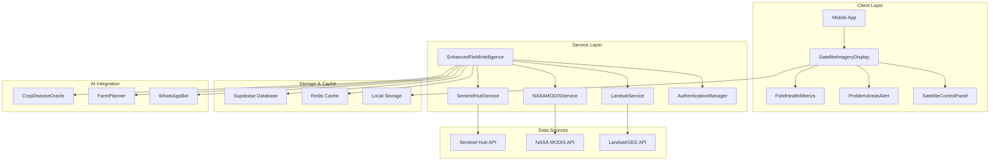
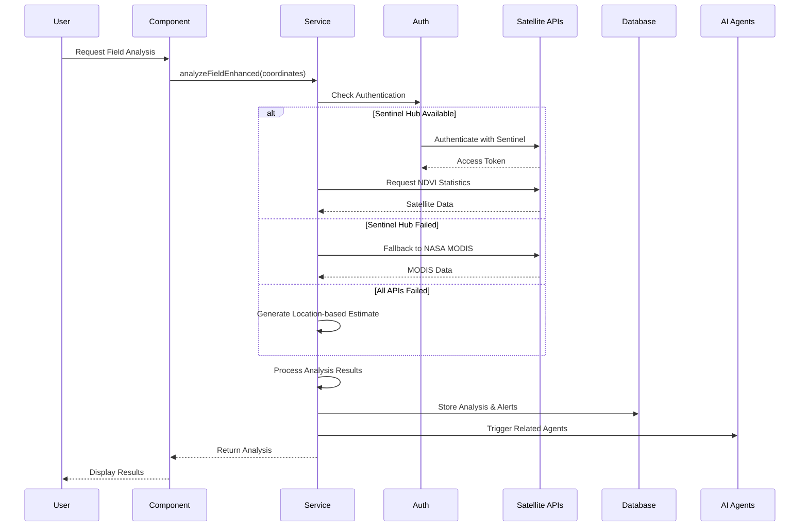

# Satellite Intelligence System Design

## Overview

The Satellite Intelligence System is architected as a resilient, multi-source satellite data processing engine that transforms raw imagery into actionable agricultural intelligence for 100 million African farmers. The system employs a cascading fallback architecture, ensuring farmers always receive field analysis regardless of individual API availability.

**Core Architecture Principle**: Fail-safe intelligence delivery through redundant data sources, intelligent caching, and graceful degradation.

## Architecture

### High-Level System Architecture



### Data Flow Architecture



## Components and Interfaces

### Core Service Interface

```typescript
interface SatelliteIntelligenceService {
  analyzeField(coordinates: GeoLocation[], farmerId?: string): Promise<EnhancedFieldAnalysis>
  setupContinuousMonitoring(fieldId: string, coordinates: GeoLocation[]): Promise<void>
  checkFieldAlerts(fieldId: string, coordinates: GeoLocation[]): Promise<void>
  getCachedAnalysis(fieldId: string): Promise<EnhancedFieldAnalysis | null>
  getDataSourceStatus(): Promise<DataSourceStatus>
}

interface EnhancedFieldAnalysis {
  fieldHealth: number // 0-1 composite health score
  problemAreas: ProblemArea[]
  yieldPrediction: number // tonnes/ha
  moistureStress: 'low' | 'moderate' | 'high' | 'critical'
  vegetationIndices: VegetationIndices
  soilAnalysis: SoilAnalysis
  recommendations: string[]
  alerts: Alert[]
  dataQuality: DataQuality
}

interface DataQuality {
  source: 'Sentinel-2' | 'NASA_MODIS' | 'Landsat' | 'Estimated'
  resolution: string
  confidence: number // 0-100
  acquisitionDate: string
  cloudCoverage?: number
  limitations?: string[]
}
```

### Authentication Architecture

```typescript
class SentinelHubAuthManager {
  private clientId: string
  private clientSecret: string
  private tokenEndpoint: string
  private currentToken: SentinelHubToken | null
  
  async getAccessToken(): Promise<string>
  private async refreshToken(): Promise<void>
  async authenticatedFetch(url: string, options?: RequestInit): Promise<Response>
  private isTokenValid(): boolean
}

interface SentinelHubToken {
  access_token: string
  token_type: string
  expires_in: number
  expires_at: number
}
```

### Multi-Source Data Integration

```typescript
class MultiSourceSatelliteEngine {
  private sentinelService: SentinelHubService
  private modisService: NASAMODISService
  private landsatService: LandsatService
  
  async analyzeWithFallback(coordinates: GeoLocation[]): Promise<EnhancedFieldAnalysis>
  private async trySentinelHub(coordinates: GeoLocation[]): Promise<EnhancedFieldAnalysis>
  private async tryNASAMODIS(coordinates: GeoLocation[]): Promise<EnhancedFieldAnalysis>
  private async tryLandsat(coordinates: GeoLocation[]): Promise<EnhancedFieldAnalysis>
  private generateLocationBasedEstimate(coordinates: GeoLocation[]): Promise<EnhancedFieldAnalysis>
}
```

### Component Architecture

```typescript
// Main Display Component
interface SatelliteImageryDisplayProps {
  fieldCoordinates?: GeoLocation[]
  fieldId?: string
  autoAnalyze?: boolean
  onAnalysisComplete?: (analysis: EnhancedFieldAnalysis) => void
}

// Control Panel Component
interface SatelliteControlPanelProps {
  viewMode: ViewMode
  setViewMode: (mode: ViewMode) => void
  onAnalyze: () => void
  isAnalyzing: boolean
  error: string | null
  dataSourceStatus: DataSourceStatus
}

// Health Metrics Component
interface FieldHealthMetricsProps {
  data: EnhancedFieldAnalysis | null
  showDetailedIndices?: boolean
  onMetricClick?: (metric: string) => void
}

// Problem Areas Component
interface ProblemAreasAlertProps {
  data: EnhancedFieldAnalysis | null
  onProblemAreaClick?: (area: ProblemArea) => void
  showActionButtons?: boolean
}
```

## Data Models

### Core Analysis Models

```typescript
interface VegetationIndices {
  ndvi: number      // Normalized Difference Vegetation Index
  evi: number       // Enhanced Vegetation Index
  savi: number      // Soil Adjusted Vegetation Index
  ndmi: number      // Normalized Difference Moisture Index
}

interface ProblemArea {
  id: string
  coordinates: GeoLocation
  severity: 'low' | 'medium' | 'high' | 'critical'
  issue: string
  ndviValue: number
  estimatedArea: number // hectares
  recommendedAction: string
  urgency: 'immediate' | 'within_week' | 'within_month'
  economicImpact: number // potential loss in USD
}

interface Alert {
  id: string
  type: 'water_stress' | 'pest_risk' | 'nutrient_deficiency' | 'disease_risk'
  severity: 'low' | 'medium' | 'high' | 'critical'
  message: string
  actionRequired: boolean
  coordinates?: GeoLocation
  estimatedCost?: number
  potentialSavings?: number
  deadline?: string
}

interface SoilAnalysis {
  dataSource: string
  spatialResolution: string
  confidenceScore: number
  analysisDate: string
  moistureLevel?: number
  organicMatter?: number
  erosionRisk?: string
  recommendations: string[]
  limitations?: string[]
}
```

### Database Schema

```sql
-- Field monitoring configuration
CREATE TABLE field_monitoring (
  id UUID PRIMARY KEY DEFAULT gen_random_uuid(),
  field_id UUID REFERENCES fields(id),
  user_id UUID REFERENCES profiles(id),
  monitoring_active BOOLEAN DEFAULT true,
  analysis_frequency TEXT DEFAULT 'weekly',
  last_analysis TIMESTAMP WITH TIME ZONE,
  alert_thresholds JSONB,
  created_at TIMESTAMP WITH TIME ZONE DEFAULT NOW(),
  updated_at TIMESTAMP WITH TIME ZONE DEFAULT NOW()
);

-- Satellite analysis results
CREATE TABLE satellite_analyses (
  id UUID PRIMARY KEY DEFAULT gen_random_uuid(),
  field_id UUID REFERENCES fields(id),
  user_id UUID REFERENCES profiles(id),
  analysis_data JSONB NOT NULL,
  data_source TEXT NOT NULL,
  confidence_score INTEGER,
  created_at TIMESTAMP WITH TIME ZONE DEFAULT NOW()
);

-- Field alerts
CREATE TABLE field_alerts (
  id UUID PRIMARY KEY DEFAULT gen_random_uuid(),
  field_id UUID REFERENCES fields(id),
  user_id UUID REFERENCES profiles(id),
  alert_type TEXT NOT NULL,
  severity TEXT NOT NULL,
  message TEXT NOT NULL,
  coordinates JSONB,
  resolved BOOLEAN DEFAULT false,
  resolved_at TIMESTAMP WITH TIME ZONE,
  created_at TIMESTAMP WITH TIME ZONE DEFAULT NOW()
);

-- Problem areas tracking
CREATE TABLE problem_areas (
  id UUID PRIMARY KEY DEFAULT gen_random_uuid(),
  field_id UUID REFERENCES fields(id),
  analysis_id UUID REFERENCES satellite_analyses(id),
  coordinates JSONB NOT NULL,
  severity TEXT NOT NULL,
  issue_type TEXT NOT NULL,
  ndvi_value DECIMAL,
  estimated_area DECIMAL,
  recommended_action TEXT,
  status TEXT DEFAULT 'active',
  created_at TIMESTAMP WITH TIME ZONE DEFAULT NOW()
);
```

## Error Handling

### Cascading Fallback Strategy

```typescript
class ErrorHandlingStrategy {
  async executeWithFallback<T>(
    operations: (() => Promise<T>)[],
    context: string
  ): Promise<T> {
    const errors: Error[] = []
    
    for (const operation of operations) {
      try {
        return await operation()
      } catch (error) {
        errors.push(error)
        console.warn(`${context} failed, trying next option:`, error.message)
      }
    }
    
    throw new AggregateError(errors, `All ${context} operations failed`)
  }
}
```

### Error Classification and Response

```typescript
enum ErrorType {
  AUTHENTICATION_FAILED = 'auth_failed',
  API_RATE_LIMITED = 'rate_limited',
  INSUFFICIENT_CREDITS = 'no_credits',
  NETWORK_ERROR = 'network_error',
  INVALID_COORDINATES = 'invalid_coords',
  NO_DATA_AVAILABLE = 'no_data'
}

interface ErrorResponse {
  type: ErrorType
  message: string
  userMessage: string
  retryable: boolean
  fallbackAvailable: boolean
  estimatedRetryTime?: number
}

class SatelliteErrorHandler {
  handleError(error: Error, context: string): ErrorResponse {
    if (error.message.includes('401') || error.message.includes('403')) {
      return {
        type: ErrorType.AUTHENTICATION_FAILED,
        message: error.message,
        userMessage: 'Authentication failed. Please check API credentials.',
        retryable: false,
        fallbackAvailable: true
      }
    }
    
    if (error.message.includes('429')) {
      return {
        type: ErrorType.API_RATE_LIMITED,
        message: error.message,
        userMessage: 'Service temporarily busy. Trying alternative data source.',
        retryable: true,
        fallbackAvailable: true,
        estimatedRetryTime: 60000 // 1 minute
      }
    }
    
    // Additional error handling logic...
  }
}
```

## Testing Strategy

### Unit Testing Approach

```typescript
describe('SatelliteIntelligenceService', () => {
  describe('analyzeFieldEnhanced', () => {
    it('should use Sentinel Hub when credentials are configured', async () => {
      // Mock successful Sentinel Hub response
      const mockAnalysis = createMockAnalysis()
      jest.spyOn(sentinelService, 'analyze').mockResolvedValue(mockAnalysis)
      
      const result = await service.analyzeFieldEnhanced(testCoordinates)
      
      expect(result.soilAnalysis.data_source).toBe('Sentinel-2_L2A')
      expect(result.soilAnalysis.confidence_score).toBeGreaterThan(90)
    })
    
    it('should fallback to NASA MODIS when Sentinel Hub fails', async () => {
      jest.spyOn(sentinelService, 'analyze').mockRejectedValue(new Error('Auth failed'))
      const mockAnalysis = createMockAnalysis('NASA_MODIS')
      jest.spyOn(modisService, 'analyze').mockResolvedValue(mockAnalysis)
      
      const result = await service.analyzeFieldEnhanced(testCoordinates)
      
      expect(result.soilAnalysis.data_source).toBe('NASA_MODIS_MOD13Q1')
    })
    
    it('should generate location-based estimates when all APIs fail', async () => {
      jest.spyOn(sentinelService, 'analyze').mockRejectedValue(new Error('Failed'))
      jest.spyOn(modisService, 'analyze').mockRejectedValue(new Error('Failed'))
      jest.spyOn(landsatService, 'analyze').mockRejectedValue(new Error('Failed'))
      
      const result = await service.analyzeFieldEnhanced(testCoordinates)
      
      expect(result.soilAnalysis.data_source).toBe('Landsat_8_OLI')
      expect(result.soilAnalysis.confidence_score).toBeLessThan(80)
    })
  })
})
```

### Integration Testing

```typescript
describe('Satellite Intelligence Integration', () => {
  it('should complete full analysis workflow', async () => {
    const coordinates = [
      { lat: -1.2921, lng: 36.8219 },
      { lat: -1.2921, lng: 36.8229 },
      { lat: -1.2911, lng: 36.8229 },
      { lat: -1.2911, lng: 36.8219 }
    ]
    
    const analysis = await analyzeFieldEnhanced(coordinates, 'test-farmer-id')
    
    expect(analysis.fieldHealth).toBeGreaterThanOrEqual(0)
    expect(analysis.fieldHealth).toBeLessThanOrEqual(1)
    expect(analysis.vegetationIndices.ndvi).toBeGreaterThanOrEqual(-1)
    expect(analysis.vegetationIndices.ndvi).toBeLessThanOrEqual(1)
    expect(analysis.recommendations).toHaveLength.greaterThan(0)
    expect(analysis.soilAnalysis.confidence_score).toBeGreaterThan(0)
  })
})
```

### Performance Testing

```typescript
describe('Performance Requirements', () => {
  it('should complete analysis within 3 seconds', async () => {
    const startTime = Date.now()
    
    await analyzeFieldEnhanced(testCoordinates)
    
    const duration = Date.now() - startTime
    expect(duration).toBeLessThan(3000)
  })
  
  it('should handle concurrent requests efficiently', async () => {
    const requests = Array(10).fill(null).map(() => 
      analyzeFieldEnhanced(testCoordinates)
    )
    
    const startTime = Date.now()
    const results = await Promise.all(requests)
    const duration = Date.now() - startTime
    
    expect(results).toHaveLength(10)
    expect(duration).toBeLessThan(10000) // 10 seconds for 10 concurrent requests
  })
})
```

## Security Considerations

### API Key Management

```typescript
class SecureCredentialManager {
  private static validateCredentials(): void {
    const clientId = import.meta.env.VITE_SENTINEL_CLIENT_ID
    const clientSecret = import.meta.env.VITE_SENTINEL_CLIENT_SECRET
    
    if (!clientId || !clientSecret) {
      throw new Error('Satellite API credentials not configured')
    }
    
    if (clientId.length < 32 || clientSecret.length < 32) {
      throw new Error('Invalid credential format detected')
    }
  }
  
  static getCredentials(): { clientId: string; clientSecret: string } {
    this.validateCredentials()
    return {
      clientId: import.meta.env.VITE_SENTINEL_CLIENT_ID,
      clientSecret: import.meta.env.VITE_SENTINEL_CLIENT_SECRET
    }
  }
}
```

### Data Privacy and Compliance

```typescript
interface PrivacyCompliantAnalysis {
  // Remove or hash personally identifiable information
  anonymizeCoordinates(coordinates: GeoLocation[]): GeoLocation[]
  
  // Ensure data retention compliance
  scheduleDataDeletion(analysisId: string, retentionDays: number): void
  
  // Audit trail for data access
  logDataAccess(userId: string, fieldId: string, operation: string): void
}
```

## Performance Optimization

### Caching Strategy

```typescript
class SatelliteDataCache {
  private redis: RedisClient
  private localStorage: LocalStorageManager
  
  async getCachedAnalysis(fieldId: string): Promise<EnhancedFieldAnalysis | null> {
    // Try Redis first (server-side cache)
    const serverCache = await this.redis.get(`analysis:${fieldId}`)
    if (serverCache && !this.isExpired(serverCache)) {
      return JSON.parse(serverCache)
    }
    
    // Fallback to local storage (client-side cache)
    const localCache = this.localStorage.get(`analysis:${fieldId}`)
    if (localCache && !this.isExpired(localCache)) {
      return JSON.parse(localCache)
    }
    
    return null
  }
  
  async cacheAnalysis(fieldId: string, analysis: EnhancedFieldAnalysis): Promise<void> {
    const cacheData = {
      data: analysis,
      timestamp: Date.now(),
      ttl: 24 * 60 * 60 * 1000 // 24 hours
    }
    
    // Cache on server (Redis)
    await this.redis.setex(`analysis:${fieldId}`, 86400, JSON.stringify(cacheData))
    
    // Cache locally for offline access
    this.localStorage.set(`analysis:${fieldId}`, JSON.stringify(cacheData))
  }
}
```

### API Rate Limiting and Cost Optimization

```typescript
class APIRateLimiter {
  private requestQueue: RequestQueue
  private costTracker: CostTracker
  
  async executeWithRateLimit<T>(
    apiCall: () => Promise<T>,
    priority: 'high' | 'medium' | 'low' = 'medium'
  ): Promise<T> {
    // Check cost limits
    if (await this.costTracker.isNearLimit()) {
      throw new Error('Monthly API cost limit approaching')
    }
    
    // Queue request based on priority
    return this.requestQueue.add(apiCall, priority)
  }
}
```

This design ensures the Satellite Intelligence System delivers reliable, accurate, and actionable intelligence to 100 million African farmers while maintaining performance, cost-effectiveness, and scalability.