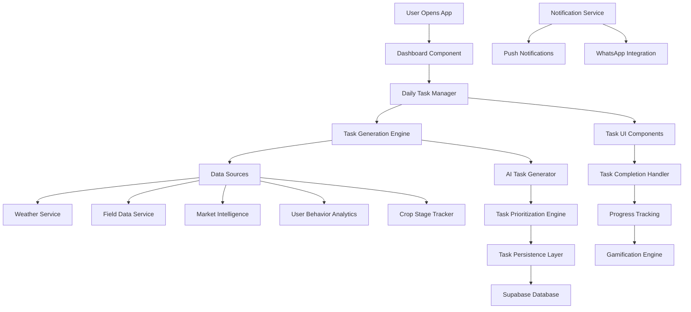
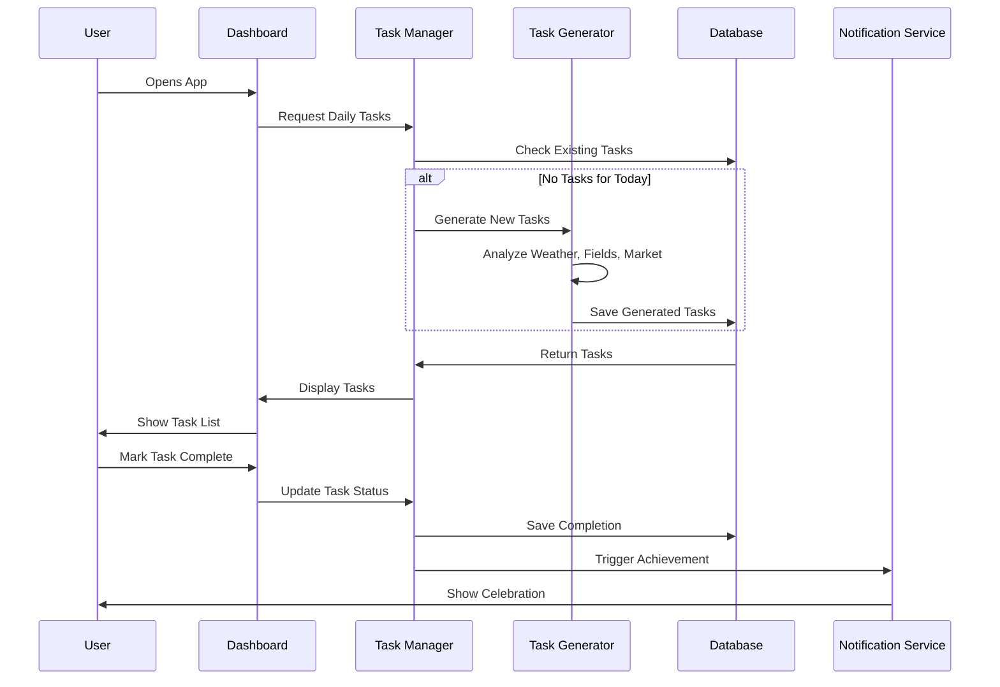

# Design Document

## Overview

The "Today's Genius Tasks" system is a comprehensive AI-powered daily task management platform that transforms CropGenius from a reactive farming tool into a proactive agricultural command center. The system leverages real-time weather data, field conditions, crop stages, market intelligence, and user behavior patterns to generate personalized, actionable daily tasks that maximize farm profitability and sustainability.

The system operates on a "morning brain" philosophy - providing farmers with clear, prioritized actions the moment they open the app, eliminating decision paralysis and ensuring optimal farm management decisions are made consistently.

## Architecture

### High-Level System Architecture



### Data Flow Architecture



## Components and Interfaces

### 1. Daily Task Manager Service

**Purpose:** Central orchestrator for all daily task operations

```typescript
interface DailyTaskManager {
  // Core task operations
  generateDailyTasks(userId: string): Promise<GeniusTask[]>;
  getTodaysTasks(userId: string): Promise<GeniusTask[]>;
  completeTask(taskId: string, completionData?: TaskCompletionData): Promise<void>;
  skipTask(taskId: string, reason: string): Promise<void>;
  
  // Task lifecycle management
  refreshTasks(userId: string): Promise<GeniusTask[]>;
  archiveCompletedTasks(userId: string): Promise<void>;
  
  // Analytics and learning
  recordTaskInteraction(taskId: string, interaction: TaskInteraction): Promise<void>;
  getUserTaskPreferences(userId: string): Promise<TaskPreferences>;
}
```

### 2. AI Task Generation Engine

**Purpose:** Intelligent task generation based on multiple data sources

```typescript
interface TaskGenerationEngine {
  // Primary generation methods
  generateWeatherBasedTasks(weather: WeatherData, fields: FieldData[]): Promise<GeniusTask[]>;
  generateCropStageTasks(fields: FieldData[]): Promise<GeniusTask[]>;
  generateMarketOpportunityTasks(marketData: MarketData, fields: FieldData[]): Promise<GeniusTask[]>;
  generateMaintenanceTasks(fields: FieldData[], lastMaintenance: MaintenanceRecord[]): Promise<GeniusTask[]>;
  
  // Personalization
  personalizeTasksForUser(tasks: GeniusTask[], userProfile: UserProfile): Promise<GeniusTask[]>;
  applyUserPreferences(tasks: GeniusTask[], preferences: TaskPreferences): Promise<GeniusTask[]>;
}
```

### 3. Task Prioritization Engine

**Purpose:** Intelligent prioritization based on impact, urgency, and user context

```typescript
interface TaskPrioritizationEngine {
  prioritizeTasks(tasks: GeniusTask[], context: PrioritizationContext): Promise<GeniusTask[]>;
  calculateTaskImpact(task: GeniusTask, context: FarmContext): Promise<number>;
  calculateTaskUrgency(task: GeniusTask, weather: WeatherData): Promise<number>;
  applyUserBehaviorWeights(tasks: GeniusTask[], userBehavior: UserBehaviorData): Promise<GeniusTask[]>;
}
```

### 4. Task UI Components

**Purpose:** React components for displaying and interacting with tasks

```typescript
// Main task display component
interface TodaysGeniusTasksProps {
  userId: string;
  onTaskComplete: (taskId: string) => void;
  onTaskSkip: (taskId: string, reason: string) => void;
}

// Individual task card component
interface GeniusTaskCardProps {
  task: GeniusTask;
  onComplete: () => void;
  onSkip: (reason: string) => void;
  onViewDetails: () => void;
}

// Task completion modal
interface TaskCompletionModalProps {
  task: GeniusTask;
  isOpen: boolean;
  onComplete: (data: TaskCompletionData) => void;
  onCancel: () => void;
}
```

## Data Models

### Core Task Model

```typescript
interface GeniusTask {
  // Basic identification
  id: string;
  type: TaskType;
  category: TaskCategory;
  
  // Task content
  title: string;
  description: string;
  detailedInstructions?: string;
  
  // Prioritization and timing
  priority: TaskPriority;
  urgency: TaskUrgency;
  estimatedDuration: number; // minutes
  optimalTimeWindow?: TimeWindow;
  deadline?: Date;
  
  // Context and relationships
  fieldId?: string;
  cropType?: string;
  weatherDependency?: WeatherDependency;
  marketContext?: MarketContext;
  
  // Impact and value
  expectedImpact: TaskImpact;
  fpsiImpactPoints: number;
  roiEstimate?: number;
  
  // Status and completion
  status: TaskStatus;
  createdAt: Date;
  completedAt?: Date;
  completionData?: TaskCompletionData;
  
  // User interaction
  userFeedback?: TaskFeedback;
  skipReason?: string;
  
  // AI metadata
  generationSource: TaskGenerationSource;
  confidenceScore: number;
  learningTags: string[];
}

enum TaskType {
  WEATHER_RESPONSE = 'weather_response',
  CROP_MANAGEMENT = 'crop_management',
  FIELD_MAINTENANCE = 'field_maintenance',
  MARKET_OPPORTUNITY = 'market_opportunity',
  PREVENTIVE_ACTION = 'preventive_action',
  PLANNING = 'planning',
  MONITORING = 'monitoring'
}

enum TaskCategory {
  PLANTING = 'planting',
  IRRIGATION = 'irrigation',
  PEST_CONTROL = 'pest_control',
  DISEASE_PREVENTION = 'disease_prevention',
  FERTILIZATION = 'fertilization',
  HARVESTING = 'harvesting',
  MARKET_TIMING = 'market_timing',
  FIELD_PREPARATION = 'field_preparation'
}

enum TaskPriority {
  CRITICAL = 1,    // Must do today
  HIGH = 2,        // Should do today
  MEDIUM = 3,      // Good to do today
  LOW = 4          // Can be postponed
}

interface TaskImpact {
  fpsiPoints: number;
  yieldImpact: number;      // Percentage impact on yield
  costImpact: number;       // Financial impact in local currency
  riskReduction: number;    // Risk mitigation percentage
  timeWindow: number;       // Days before opportunity/risk expires
}
```

### Task Generation Context

```typescript
interface TaskGenerationContext {
  user: UserProfile;
  fields: FieldData[];
  weather: WeatherData;
  forecast: WeatherForecast[];
  marketData: MarketData;
  userBehavior: UserBehaviorData;
  seasonalContext: SeasonalContext;
  farmHealth: FarmHealthData;
}

interface UserBehaviorData {
  taskCompletionRate: number;
  preferredTaskTypes: TaskType[];
  averageTasksPerDay: number;
  peakActivityHours: number[];
  skipPatterns: TaskSkipPattern[];
  feedbackHistory: TaskFeedback[];
}
```

### Task Completion and Feedback

```typescript
interface TaskCompletionData {
  completedAt: Date;
  actualDuration: number;
  difficultyRating: number;    // 1-5 scale
  effectivenessRating: number; // 1-5 scale
  notes?: string;
  photosUploaded?: string[];
  gpsLocation?: Coordinates;
}

interface TaskFeedback {
  taskId: string;
  rating: number;              // 1-5 scale
  relevanceScore: number;      // How relevant was this task
  clarityScore: number;        // How clear were the instructions
  timingScore: number;         // Was the timing appropriate
  comments?: string;
  wouldRecommendToOthers: boolean;
}
```

## Error Handling

### Graceful Degradation Strategy

1. **No Internet Connection**
   - Display cached tasks from previous day
   - Show offline indicator
   - Queue task completions for sync when online

2. **Weather API Failure**
   - Use cached weather data
   - Generate tasks based on seasonal patterns
   - Reduce weather-dependent task confidence scores

3. **Field Data Unavailable**
   - Generate generic farming tasks
   - Focus on planning and educational content
   - Prompt user to add field information

4. **AI Generation Failure**
   - Fall back to rule-based task generation
   - Use predefined task templates
   - Maintain minimum viable task list

### Error Recovery Mechanisms

```typescript
interface TaskGenerationFallback {
  // Fallback strategies
  useRuleBasedGeneration(): Promise<GeniusTask[]>;
  loadTaskTemplates(context: Partial<TaskGenerationContext>): Promise<GeniusTask[]>;
  generateMinimalTaskSet(userId: string): Promise<GeniusTask[]>;
  
  // Error handling
  handleWeatherServiceFailure(): Promise<WeatherData>;
  handleFieldDataMissing(): Promise<FieldData[]>;
  handleAIServiceTimeout(): Promise<GeniusTask[]>;
}
```

## Testing Strategy

### Unit Testing

1. **Task Generation Logic**
   - Test weather-based task generation with various weather conditions
   - Verify crop-stage task generation for different growth phases
   - Validate market opportunity task creation

2. **Prioritization Engine**
   - Test priority calculation algorithms
   - Verify urgency scoring based on weather changes
   - Validate user preference application

3. **Task Completion Flow**
   - Test task status updates
   - Verify completion data persistence
   - Validate FPSI score updates

### Integration Testing

1. **End-to-End Task Flow**
   - User opens app → sees tasks → completes task → receives feedback
   - Test with various user profiles and field configurations
   - Verify real-time updates and synchronization

2. **External Service Integration**
   - Weather API integration testing
   - Market data service integration
   - Push notification delivery testing

3. **Database Operations**
   - Task persistence and retrieval
   - User behavior tracking
   - Performance under load

### Performance Testing

1. **Task Generation Performance**
   - Measure task generation time for various user profiles
   - Test with large numbers of fields and complex weather data
   - Validate caching effectiveness

2. **UI Responsiveness**
   - Task list rendering performance
   - Smooth animations and transitions
   - Offline functionality testing

### User Acceptance Testing

1. **Farmer Usability Testing**
   - Task relevance and clarity assessment
   - Completion flow usability
   - Mobile interface testing in field conditions

2. **Agricultural Expert Validation**
   - Task accuracy and agricultural soundness
   - Seasonal appropriateness validation
   - Regional farming practice alignment

## Implementation Architecture

### Frontend Components Structure

```
src/features/daily-tasks/
├── components/
│   ├── TodaysGeniusTasks.tsx          # Main task display component
│   ├── GeniusTaskCard.tsx             # Individual task card
│   ├── TaskCompletionModal.tsx        # Task completion interface
│   ├── TaskProgressIndicator.tsx      # Progress visualization
│   └── TaskCelebration.tsx            # Completion celebration
├── hooks/
│   ├── useDailyTasks.ts              # Main task management hook
│   ├── useTaskCompletion.ts          # Task completion logic
│   └── useTaskNotifications.ts       # Notification management
├── services/
│   ├── DailyTaskManager.ts           # Core task management service
│   ├── TaskGenerationEngine.ts       # AI task generation
│   ├── TaskPrioritizationEngine.ts   # Task prioritization
│   └── TaskAnalyticsService.ts       # User behavior tracking
└── types/
    ├── task.ts                       # Task-related type definitions
    └── taskGeneration.ts             # Generation context types
```

### Backend Services Structure

```
supabase/functions/
├── generate-daily-tasks/
│   ├── index.ts                      # Main task generation endpoint
│   ├── weatherTaskGenerator.ts       # Weather-based task generation
│   ├── cropStageTaskGenerator.ts     # Crop stage task generation
│   ├── marketTaskGenerator.ts        # Market opportunity tasks
│   └── taskPrioritizer.ts           # Task prioritization logic
├── complete-task/
│   ├── index.ts                      # Task completion endpoint
│   └── fpsiUpdater.ts               # FPSI score calculation
└── task-analytics/
    ├── index.ts                      # User behavior tracking
    └── learningEngine.ts            # Machine learning for personalization
```

### Database Schema Extensions

```sql
-- Daily tasks table (extends existing tasks table)
CREATE TABLE IF NOT EXISTS public.daily_genius_tasks (
    id UUID DEFAULT gen_random_uuid() PRIMARY KEY,
    user_id UUID NOT NULL REFERENCES auth.users(id) ON DELETE CASCADE,
    field_id UUID REFERENCES public.fields(id) ON DELETE SET NULL,
    
    -- Task content
    title VARCHAR(255) NOT NULL,
    description TEXT NOT NULL,
    detailed_instructions TEXT,
    
    -- Classification
    task_type VARCHAR(50) NOT NULL,
    category VARCHAR(50) NOT NULL,
    
    -- Prioritization
    priority INTEGER NOT NULL CHECK (priority BETWEEN 1 AND 4),
    urgency_score DECIMAL(3,2) NOT NULL,
    impact_score DECIMAL(3,2) NOT NULL,
    
    -- Timing
    estimated_duration INTEGER, -- minutes
    optimal_start_time TIME,
    optimal_end_time TIME,
    deadline TIMESTAMP WITH TIME ZONE,
    
    -- Context
    weather_dependency JSONB,
    market_context JSONB,
    crop_context JSONB,
    
    -- Impact tracking
    fpsi_impact_points INTEGER DEFAULT 0,
    roi_estimate DECIMAL(10,2),
    
    -- Status and completion
    status VARCHAR(20) DEFAULT 'pending' CHECK (status IN ('pending', 'in_progress', 'completed', 'skipped', 'expired')),
    completed_at TIMESTAMP WITH TIME ZONE,
    completion_data JSONB,
    skip_reason TEXT,
    
    -- AI metadata
    generation_source VARCHAR(50) NOT NULL,
    confidence_score DECIMAL(3,2) NOT NULL,
    learning_tags TEXT[],
    
    -- Timestamps
    created_at TIMESTAMP WITH TIME ZONE DEFAULT NOW(),
    updated_at TIMESTAMP WITH TIME ZONE DEFAULT NOW()
);

-- Task user feedback table
CREATE TABLE IF NOT EXISTS public.task_feedback (
    id UUID DEFAULT gen_random_uuid() PRIMARY KEY,
    task_id UUID NOT NULL REFERENCES public.daily_genius_tasks(id) ON DELETE CASCADE,
    user_id UUID NOT NULL REFERENCES auth.users(id) ON DELETE CASCADE,
    
    rating INTEGER CHECK (rating BETWEEN 1 AND 5),
    relevance_score INTEGER CHECK (relevance_score BETWEEN 1 AND 5),
    clarity_score INTEGER CHECK (clarity_score BETWEEN 1 AND 5),
    timing_score INTEGER CHECK (timing_score BETWEEN 1 AND 5),
    
    comments TEXT,
    would_recommend BOOLEAN,
    
    created_at TIMESTAMP WITH TIME ZONE DEFAULT NOW()
);

-- User task preferences table
CREATE TABLE IF NOT EXISTS public.user_task_preferences (
    id UUID DEFAULT gen_random_uuid() PRIMARY KEY,
    user_id UUID NOT NULL REFERENCES auth.users(id) ON DELETE CASCADE,
    
    preferred_task_types TEXT[],
    avoided_task_types TEXT[],
    preferred_time_windows JSONB, -- Array of {start, end} time objects
    max_daily_tasks INTEGER DEFAULT 7,
    
    -- Behavioral data
    completion_rate DECIMAL(3,2) DEFAULT 0.0,
    average_tasks_per_day DECIMAL(3,1) DEFAULT 0.0,
    peak_activity_hours INTEGER[],
    
    updated_at TIMESTAMP WITH TIME ZONE DEFAULT NOW()
);
```

This design provides a comprehensive foundation for building the "Today's Genius Tasks" system that will transform CropGenius into a proactive agricultural command center, delivering personalized, actionable daily tasks that maximize farm profitability and sustainability.