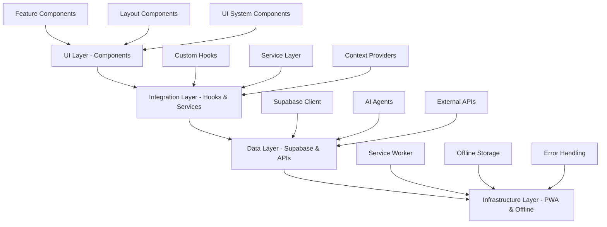

# UI Resurrection Design Document

## Overview

The CropGenius UI resurrection project will systematically audit, document, and integrate 150+ existing UI components into a fully functional, production-ready agricultural intelligence platform. The system currently has a solid routing foundation with 18 pages and comprehensive component library, but lacks proper component integration, data connections, and visual cohesion.

This design outlines a three-phase approach: **Audit & Documentation**, **Strategic Integration**, and **Production Optimization** to transform isolated component fragments into a unified, mobile-first agricultural platform.

## Architecture

### Current State Analysis

**Strengths:**
- Complete routing system with 18 pages (Auth, Dashboard, Fields, Weather, Scan, Chat, Market, etc.)
- 150+ components organized in 25+ feature directories
- Solid foundation with React Query, Supabase, and mobile-first architecture
- Complete shadcn/ui design system with glassmorphism styling
- Offline-first PWA infrastructure with service worker

**Critical Issues:**
- Components exist as isolated fragments without integration
- No visual connection between UI components and data sources
- Missing component-to-page wiring and layout orchestration
- Incomplete error boundaries and fallback states
- Lack of systematic component documentation and usage patterns

### System Architecture Layers



## Components and Interfaces

### Component Audit System

**ComponentAuditor Interface:**
```typescript
interface ComponentAuditResult {
  name: string;
  path: string;
  status: 'connected' | 'orphaned' | 'partial' | 'broken';
  dependencies: string[];
  dataRequirements: DataRequirement[];
  integrationIssues: IntegrationIssue[];
  fixPlan: FixAction[];
}

interface DataRequirement {
  type: 'supabase' | 'api' | 'context' | 'props';
  source: string;
  required: boolean;
  currentStatus: 'missing' | 'partial' | 'connected';
}

interface IntegrationIssue {
  severity: 'critical' | 'high' | 'medium' | 'low';
  category: 'routing' | 'data' | 'styling' | 'props' | 'imports';
  description: string;
  solution: string;
}
```

### Component Categories & Integration Strategy

**1. Core Layout Components (Priority 1)**
- `MobileLayout` - Already integrated ✅
- `BottomNavigation` - Needs routing integration
- `TopNav` - Needs auth state connection
- `ResponsiveLayout` - Needs breakpoint logic

**2. Dashboard & Intelligence Components (Priority 1)**
- `SuperDashboard` - Needs data connections
- `FieldIntelligence` - Needs satellite service integration
- `MissionControl` - Needs real-time data feeds
- `IntelligenceHubDashboard` - Needs AI agent connections

**3. Field Management Components (Priority 2)**
- `MapboxFieldMap` - Needs Mapbox API integration
- `AddFieldWizard` - Needs form validation and Supabase
- `FieldCard` - Needs field data and actions
- `SatelliteFieldViewer` - Needs satellite imagery service

**4. AI & Chat Components (Priority 2)**
- `AIChatWidget` - Needs AI agent integration
- `FieldBrainAssistant` - Needs field analysis service
- `CropRecommendation` - Needs recommendation engine
- `DiseaseDetectionResult` - Needs disease detection API

**5. Weather & Market Components (Priority 3)**
- `WeatherWidget` - Needs weather API integration
- `MarketIntelligenceDashboard` - Needs market data service
- `MarketPriceChart` - Needs chart data and real-time updates
- `ForecastPanel` - Needs weather forecast integration

### Integration Patterns

**Data Connection Pattern:**
```typescript
// Standard component integration pattern
const ComponentWithData = () => {
  const { data, loading, error } = useQuery({
    queryKey: ['component-data'],
    queryFn: () => serviceLayer.getData(),
    staleTime: 5 * 60 * 1000, // 5 minutes
  });

  if (loading) return <ComponentSkeleton />;
  if (error) return <ErrorFallback error={error} />;
  
  return <Component data={data} />;
};
```

**Service Layer Integration:**
```typescript
// Service layer for component data
export class ComponentDataService {
  static async getData(): Promise<ComponentData> {
    const { data, error } = await supabase
      .from('table')
      .select('*')
      .eq('user_id', userId);
    
    if (error) throw new Error(error.message);
    return data;
  }
}
```

## Data Models

### Component Registry Model

```typescript
interface ComponentRegistry {
  components: ComponentEntry[];
  categories: ComponentCategory[];
  integrationStatus: IntegrationStatus;
  lastAudit: Date;
}

interface ComponentEntry {
  id: string;
  name: string;
  path: string;
  category: string;
  status: ComponentStatus;
  dependencies: Dependency[];
  dataConnections: DataConnection[];
  pages: string[]; // Pages where component is used
  tests: TestStatus;
  documentation: DocumentationStatus;
}

interface ComponentStatus {
  integration: 'complete' | 'partial' | 'missing';
  functionality: 'working' | 'broken' | 'untested';
  styling: 'complete' | 'partial' | 'missing';
  responsive: 'complete' | 'partial' | 'missing';
}
```

### Integration Tracking Model

```typescript
interface IntegrationPlan {
  phases: IntegrationPhase[];
  dependencies: PhaseDependency[];
  timeline: Timeline;
  riskAssessment: Risk[];
}

interface IntegrationPhase {
  id: string;
  name: string;
  components: string[];
  prerequisites: string[];
  deliverables: Deliverable[];
  estimatedHours: number;
}
```

## Error Handling

### Component Error Boundaries

**Hierarchical Error Boundary Strategy:**
```typescript
// App-level error boundary
<ErrorBoundary fallback={<AppErrorFallback />}>
  <App />
</ErrorBoundary>

// Page-level error boundaries
<ErrorBoundary fallback={<PageErrorFallback />}>
  <Page />
</ErrorBoundary>

// Component-level error boundaries
<ErrorBoundary fallback={<ComponentErrorFallback />}>
  <CriticalComponent />
</ErrorBoundary>
```

**Error Recovery Patterns:**
- Automatic retry for transient failures
- Graceful degradation for non-critical components
- Offline fallbacks for network-dependent components
- User-friendly error messages with actionable solutions

### Data Error Handling

**Service Layer Error Handling:**
```typescript
export const withErrorHandling = <T>(
  operation: () => Promise<T>
): Promise<Result<T>> => {
  return operation()
    .then(data => ({ success: true, data }))
    .catch(error => ({
      success: false,
      error: {
        message: error.message,
        code: error.code,
        recoverable: isRecoverableError(error)
      }
    }));
};
```

## Testing Strategy

### Component Integration Testing

**Test Categories:**
1. **Unit Tests** - Individual component functionality
2. **Integration Tests** - Component-to-service connections
3. **Visual Tests** - Component rendering and styling
4. **E2E Tests** - Complete user workflows

**Testing Framework:**
```typescript
// Component integration test pattern
describe('ComponentIntegration', () => {
  it('should connect to data source', async () => {
    const { result } = renderHook(() => useComponentData());
    await waitFor(() => {
      expect(result.current.data).toBeDefined();
    });
  });

  it('should handle error states', async () => {
    mockService.mockRejectedValue(new Error('API Error'));
    render(<Component />);
    expect(screen.getByText(/error/i)).toBeInTheDocument();
  });
});
```

### Audit Validation Testing

**Automated Component Discovery:**
```typescript
// Automated component audit testing
const auditComponents = async () => {
  const components = await discoverComponents('./src/components');
  const auditResults = await Promise.all(
    components.map(component => auditComponent(component))
  );
  return generateAuditReport(auditResults);
};
```

## Implementation Phases

### Phase 1: Audit & Documentation (Week 1)

**Objectives:**
- Complete component inventory and status assessment
- Generate "Components Pages Book of Lies" documentation
- Identify critical integration gaps and dependencies
- Prioritize components by user journey importance

**Deliverables:**
- Component audit report with 150+ component analysis
- Integration priority matrix
- Missing dependency identification
- Fix action plans for each component

**Key Activities:**
1. Automated component discovery and analysis
2. Manual component functionality assessment
3. Data requirement mapping
4. Integration issue documentation
5. Priority scoring based on user impact

### Phase 2: Strategic Integration (Weeks 2-3)

**Objectives:**
- Connect high-priority components to data sources
- Implement missing page layouts and routing
- Establish component-to-service integration patterns
- Create reusable integration utilities

**Deliverables:**
- Functional dashboard with connected components
- Working field management interface
- Integrated AI chat and recommendation systems
- Mobile-optimized navigation and layouts

**Key Activities:**
1. Core dashboard component integration
2. Field management workflow completion
3. AI service connections and chat interfaces
4. Weather and market data integration
5. Mobile layout optimization

### Phase 3: Production Optimization (Week 4)

**Objectives:**
- Performance optimization and code splitting
- Comprehensive error handling and fallbacks
- Offline functionality validation
- Production deployment preparation

**Deliverables:**
- Production-ready UI with all components integrated
- Comprehensive error handling and recovery
- Offline-first functionality validation
- Performance benchmarks and optimization

**Key Activities:**
1. Performance profiling and optimization
2. Error boundary implementation
3. Offline functionality testing
4. Mobile responsiveness validation
5. Production deployment verification

## Success Metrics

### Technical Metrics
- **Component Integration Rate**: 100% of components connected to appropriate data sources
- **Page Functionality**: All 18 pages fully functional with proper component integration
- **Error Handling Coverage**: 100% of critical components have error boundaries
- **Mobile Responsiveness**: All components optimized for mobile-first experience
- **Performance**: Page load times under 2 seconds, component render times under 100ms

### User Experience Metrics
- **Navigation Completeness**: All user journeys from onboarding to advanced features functional
- **Data Connectivity**: Real-time updates working across all dashboard components
- **Offline Functionality**: Core features accessible without internet connection
- **Visual Consistency**: Unified glassmorphism design system applied across all components
- **Accessibility**: WCAG 2.1 AA compliance maintained throughout integration

### Business Impact Metrics
- **Feature Accessibility**: All agricultural intelligence features accessible through UI
- **User Onboarding**: Complete onboarding flow from registration to first field analysis
- **Core Workflows**: Field management, disease detection, weather intelligence, and market analysis fully functional
- **Scalability**: UI architecture supports 100M+ users with proper performance optimization

This design provides a systematic approach to resurrect the CropGenius UI from component fragments into a unified, production-ready agricultural intelligence platform that serves smallholder farmers across Africa with enterprise-grade reliability and mobile-first user experience.