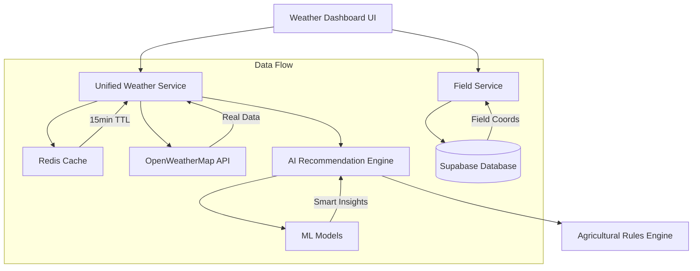

# Weather Dashboard Reconstruction Design Document

## Overview

This design document outlines the complete reconstruction of the weather dashboard system based on the forensic investigation findings. The new system will replace the current "house of cards built on quicksand" with a robust, honest, and reliable weather intelligence platform.

## Architecture

### High-Level Architecture



### Core Principles

1. **Single Source of Truth:** One weather service, one cache, one data flow
2. **Honest Failures:** No fake data, clear error messages, transparent limitations
3. **Real Intelligence:** Actual AI/ML models, not hardcoded if-else statements
4. **Field Integration:** True field-specific weather data, not hardcoded coordinates
5. **Performance First:** Sub-3-second load times, efficient caching, minimal API calls

## Components and Interfaces

### 1. Unified Weather Service

```typescript
interface UnifiedWeatherService {
  // Core weather data retrieval
  getWeatherForField(fieldId: string): Promise<FieldWeatherData>;
  getCurrentWeather(coordinates: Coordinates): Promise<CurrentWeather>;
  getForecast(coordinates: Coordinates, days: number): Promise<WeatherForecast[]>;
  
  // Cache management
  invalidateCache(fieldId: string): Promise<void>;
  getCacheStatus(fieldId: string): Promise<CacheStatus>;
  
  // Health monitoring
  getServiceHealth(): Promise<ServiceHealth>;
  getAPIQuotaStatus(): Promise<QuotaStatus>;
}

interface FieldWeatherData {
  fieldId: string;
  fieldName: string;
  coordinates: Coordinates;
  current: CurrentWeather;
  forecast: WeatherForecast[];
  recommendations: AIRecommendation[];
  lastUpdated: Date;
  dataSource: 'api' | 'cache';
  reliability: 'high' | 'medium' | 'low';
}
```

### 2. AI Recommendation Engine

```typescript
interface AIRecommendationEngine {
  // Core recommendation generation
  generateRecommendations(
    weather: WeatherData,
    field: FieldData,
    crops: CropData[]
  ): Promise<AIRecommendation[]>;
  
  // Specific recommendation types
  getIrrigationAdvice(weather: WeatherData, soil: SoilData): Promise<IrrigationRecommendation>;
  getSprayingAdvice(weather: WeatherData, crops: CropData[]): Promise<SprayingRecommendation>;
  getHarvestAdvice(weather: WeatherData, crops: CropData[]): Promise<HarvestRecommendation>;
  
  // Model management
  getModelConfidence(): Promise<number>;
  getModelVersion(): Promise<string>;
}

interface AIRecommendation {
  id: string;
  type: 'irrigation' | 'spraying' | 'harvesting' | 'planting' | 'protection';
  priority: 'low' | 'medium' | 'high' | 'critical';
  title: string;
  description: string;
  reasoning: string;
  confidence: number; // 0-100
  validUntil: Date;
  actionRequired: boolean;
  estimatedImpact: string;
}
```

### 3. Weather Dashboard Components

```typescript
// Main dashboard component
interface WeatherDashboard {
  selectedField: Field | null;
  weatherData: FieldWeatherData | null;
  loading: boolean;
  error: WeatherError | null;
  
  onFieldSelect(field: Field): void;
  onRefresh(): void;
  onSettingsOpen(): void;
}

// Real live weather panel (not the fake one)
interface LiveWeatherPanel {
  weather: CurrentWeather;
  field: Field;
  showDetails: boolean;
  
  onDetailsToggle(): void;
  onAlertClick(alert: WeatherAlert): void;
}

// Honest forecast panel (no mock data)
interface ForecastPanel {
  forecast: WeatherForecast[];
  field: Field;
  selectedDay: number;
  
  onDaySelect(day: number): void;
  onDetailView(forecast: WeatherForecast): void;
}

// Real AI recommendations (not hardcoded if-else)
interface RecommendationsPanel {
  recommendations: AIRecommendation[];
  loading: boolean;
  modelInfo: ModelInfo;
  
  onRecommendationAction(rec: AIRecommendation): void;
  onFeedback(rec: AIRecommendation, feedback: UserFeedback): void;
}
```

### 4. Field Integration Service

```typescript
interface FieldIntegrationService {
  // Field-weather coordination
  getFieldsWithWeather(userId: string): Promise<FieldWithWeather[]>;
  updateFieldWeatherSettings(fieldId: string, settings: WeatherSettings): Promise<void>;
  
  // Weather alerts for fields
  createWeatherAlert(fieldId: string, alert: WeatherAlertConfig): Promise<void>;
  getActiveAlerts(fieldId: string): Promise<WeatherAlert[]>;
  
  // Historical data
  getWeatherHistory(fieldId: string, dateRange: DateRange): Promise<WeatherHistory[]>;
}

interface FieldWithWeather {
  field: Field;
  currentWeather: CurrentWeather;
  alerts: WeatherAlert[];
  lastUpdate: Date;
  weatherSettings: WeatherSettings;
}
```

## Data Models

### Weather Data Models

```typescript
interface CurrentWeather {
  temperature: number;
  humidity: number;
  windSpeed: number;
  windDirection: string;
  pressure: number;
  visibility: number;
  uvIndex: number;
  condition: string;
  description: string;
  icon: string;
  feelsLike: number;
  dewPoint: number;
  cloudCover: number;
  precipitation: {
    current: number;
    probability: number;
    type: 'rain' | 'snow' | 'sleet' | 'none';
  };
  timestamp: Date;
  coordinates: Coordinates;
}

interface WeatherForecast {
  date: Date;
  temperature: {
    min: number;
    max: number;
    morning: number;
    afternoon: number;
    evening: number;
    night: number;
  };
  humidity: {
    min: number;
    max: number;
    average: number;
  };
  wind: {
    speed: number;
    direction: string;
    gusts: number;
  };
  precipitation: {
    probability: number;
    amount: number;
    type: 'rain' | 'snow' | 'sleet' | 'none';
    timing: string[];
  };
  condition: string;
  description: string;
  icon: string;
  uvIndex: number;
  sunrise: Date;
  sunset: Date;
}
```

### Agricultural Models

```typescript
interface CropData {
  id: string;
  name: string;
  variety: string;
  plantingDate: Date;
  expectedHarvestDate: Date;
  growthStage: GrowthStage;
  waterRequirements: WaterRequirements;
  temperatureRange: TemperatureRange;
  pestVulnerabilities: PestVulnerability[];
}

interface SoilData {
  type: SoilType;
  moisture: number;
  ph: number;
  nutrients: NutrientLevels;
  drainageRate: number;
  organicMatter: number;
}

interface GrowthStage {
  current: 'seedling' | 'vegetative' | 'flowering' | 'fruiting' | 'maturity';
  daysInStage: number;
  criticalWeatherFactors: string[];
}
```

## Error Handling

### Error Types and Responses

```typescript
interface WeatherError {
  type: 'api_failure' | 'network_error' | 'invalid_coordinates' | 'quota_exceeded' | 'service_unavailable';
  message: string;
  userMessage: string;
  retryable: boolean;
  retryAfter?: number;
  supportContact?: string;
}

// Error handling strategy
class WeatherErrorHandler {
  handleAPIFailure(error: APIError): WeatherError {
    // No fake data fallbacks - honest error reporting
    return {
      type: 'api_failure',
      message: error.message,
      userMessage: 'Weather service is temporarily unavailable. Please try again in a few minutes.',
      retryable: true,
      retryAfter: 300 // 5 minutes
    };
  }
  
  handleQuotaExceeded(): WeatherError {
    return {
      type: 'quota_exceeded',
      message: 'API quota exceeded',
      userMessage: 'Weather service limit reached. Service will resume tomorrow.',
      retryable: false,
      supportContact: 'support@cropgenius.com'
    };
  }
}
```

## Testing Strategy

### Unit Testing

```typescript
// Weather service tests
describe('UnifiedWeatherService', () => {
  test('should fetch real weather data for valid coordinates', async () => {
    const weather = await weatherService.getCurrentWeather({ lat: -1.2921, lng: 36.8219 });
    expect(weather.temperature).toBeGreaterThan(-50);
    expect(weather.temperature).toBeLessThan(60);
    expect(weather.humidity).toBeGreaterThanOrEqual(0);
    expect(weather.humidity).toBeLessThanOrEqual(100);
  });
  
  test('should throw honest errors for invalid API keys', async () => {
    const invalidService = new UnifiedWeatherService({ apiKey: 'invalid' });
    await expect(invalidService.getCurrentWeather({ lat: 0, lng: 0 }))
      .rejects.toThrow('Invalid API key');
  });
  
  test('should not generate fake data on API failure', async () => {
    // Mock API failure
    mockAPI.mockRejectedValue(new Error('API Error'));
    
    await expect(weatherService.getCurrentWeather({ lat: 0, lng: 0 }))
      .rejects.toThrow('Weather service unavailable');
  });
});

// AI recommendation tests
describe('AIRecommendationEngine', () => {
  test('should generate recommendations based on real weather data', async () => {
    const recommendations = await aiEngine.generateRecommendations(mockWeather, mockField, mockCrops);
    
    expect(recommendations).toHaveLength(greaterThan(0));
    expect(recommendations[0].confidence).toBeGreaterThan(0);
    expect(recommendations[0].reasoning).toBeDefined();
  });
  
  test('should not use hardcoded if-else logic', () => {
    // Verify that recommendations change with different inputs
    const rec1 = aiEngine.generateRecommendations(hotWeather, field, crops);
    const rec2 = aiEngine.generateRecommendations(coldWeather, field, crops);
    
    expect(rec1).not.toEqual(rec2);
  });
});
```

### Integration Testing

```typescript
describe('Weather Dashboard Integration', () => {
  test('should display consistent weather data across all components', async () => {
    render(<WeatherDashboard fieldId="test-field" />);
    
    await waitFor(() => {
      const temperature1 = screen.getByTestId('live-panel-temperature').textContent;
      const temperature2 = screen.getByTestId('forecast-current-temp').textContent;
      expect(temperature1).toBe(temperature2);
    });
  });
  
  test('should show honest error messages when API fails', async () => {
    mockAPI.mockRejectedValue(new Error('API Error'));
    
    render(<WeatherDashboard fieldId="test-field" />);
    
    await waitFor(() => {
      expect(screen.getByText(/weather service is temporarily unavailable/i)).toBeInTheDocument();
      expect(screen.queryByText(/demo data/i)).not.toBeInTheDocument();
    });
  });
});
```

### End-to-End Testing

```typescript
describe('Weather Dashboard E2E', () => {
  test('should load weather data for selected field within 3 seconds', async () => {
    const startTime = Date.now();
    
    await page.goto('/weather');
    await page.selectOption('[data-testid="field-selector"]', 'field-1');
    
    await page.waitForSelector('[data-testid="weather-data"]', { timeout: 3000 });
    
    const loadTime = Date.now() - startTime;
    expect(loadTime).toBeLessThan(3000);
  });
  
  test('should show field-specific weather data', async () => {
    await page.goto('/weather');
    
    // Select field in Kenya
    await page.selectOption('[data-testid="field-selector"]', 'kenya-field');
    const kenyaTemp = await page.textContent('[data-testid="temperature"]');
    
    // Select field in Canada
    await page.selectOption('[data-testid="field-selector"]', 'canada-field');
    const canadaTemp = await page.textContent('[data-testid="temperature"]');
    
    // Temperatures should be different for different locations
    expect(kenyaTemp).not.toBe(canadaTemp);
  });
});
```

## Performance Considerations

### Caching Strategy

```typescript
interface CacheStrategy {
  // Weather data caching
  weatherDataTTL: 15 * 60 * 1000; // 15 minutes
  forecastDataTTL: 60 * 60 * 1000; // 1 hour
  
  // AI recommendations caching
  recommendationsTTL: 30 * 60 * 1000; // 30 minutes
  
  // Cache invalidation triggers
  invalidateOnFieldChange: true;
  invalidateOnWeatherAlert: true;
  invalidateOnUserFeedback: true;
}

class WeatherCache {
  async get(key: string): Promise<CachedData | null> {
    const data = await redis.get(key);
    if (!data) return null;
    
    const parsed = JSON.parse(data);
    if (Date.now() > parsed.expiresAt) {
      await redis.del(key);
      return null;
    }
    
    return parsed.data;
  }
  
  async set(key: string, data: any, ttl: number): Promise<void> {
    const cached = {
      data,
      expiresAt: Date.now() + ttl,
      cachedAt: Date.now()
    };
    
    await redis.setex(key, Math.ceil(ttl / 1000), JSON.stringify(cached));
  }
}
```

### API Optimization

```typescript
class APIOptimizer {
  // Batch multiple field requests
  async batchWeatherRequests(fields: Field[]): Promise<FieldWeatherData[]> {
    const uniqueCoordinates = this.deduplicateCoordinates(fields);
    const weatherData = await Promise.all(
      uniqueCoordinates.map(coord => this.fetchWeatherForCoordinate(coord))
    );
    
    return this.mapWeatherToFields(weatherData, fields);
  }
  
  // Request only necessary data
  async fetchOptimizedWeather(coordinates: Coordinates): Promise<WeatherData> {
    return this.weatherAPI.fetch({
      lat: coordinates.lat,
      lng: coordinates.lng,
      exclude: 'minutely,alerts', // Exclude unnecessary data
      units: 'metric'
    });
  }
}
```

## Security Considerations

### API Key Management

```typescript
class SecureWeatherService {
  private apiKey: string;
  
  constructor() {
    this.apiKey = process.env.OPENWEATHER_API_KEY;
    if (!this.apiKey || this.apiKey === 'demo-key') {
      throw new Error('Valid OpenWeather API key required');
    }
  }
  
  // Never expose API key to client
  async fetchWeather(coordinates: Coordinates): Promise<WeatherData> {
    const response = await fetch(`${API_BASE_URL}?lat=${coordinates.lat}&lon=${coordinates.lng}&appid=${this.apiKey}`);
    
    if (!response.ok) {
      if (response.status === 401) {
        throw new Error('Weather service authentication failed');
      }
      throw new Error(`Weather service error: ${response.status}`);
    }
    
    return response.json();
  }
}
```

### Data Validation

```typescript
class WeatherDataValidator {
  validateWeatherData(data: any): WeatherData {
    // Validate temperature range
    if (data.temperature < -100 || data.temperature > 100) {
      throw new Error('Invalid temperature data');
    }
    
    // Validate humidity range
    if (data.humidity < 0 || data.humidity > 100) {
      throw new Error('Invalid humidity data');
    }
    
    // Validate coordinates
    if (Math.abs(data.lat) > 90 || Math.abs(data.lng) > 180) {
      throw new Error('Invalid coordinates');
    }
    
    return data as WeatherData;
  }
}
```

This design document provides a comprehensive blueprint for rebuilding the weather dashboard system with honesty, reliability, and real intelligence at its core.