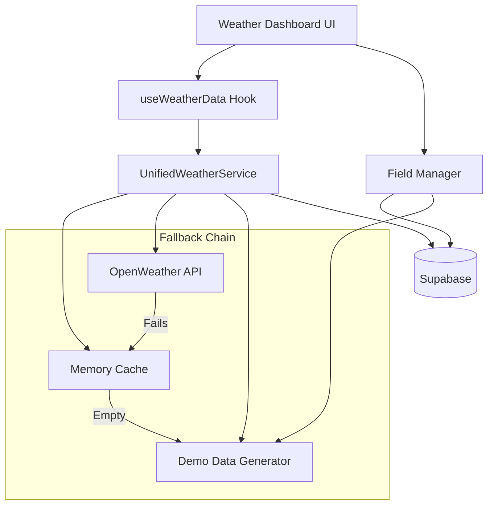
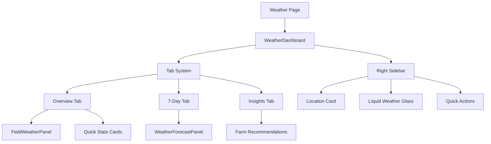

# Weather System Redesign - Design Document

## Overview

This design document outlines the architecture for a resilient, user-friendly weather intelligence system that provides farmers with reliable weather data regardless of network conditions, authentication status, or field configuration. The system prioritizes graceful degradation and immediate functionality.

## Architecture

### High-Level Architecture



### Component Hierarchy



## Components and Interfaces

### 1. WeatherDashboard Component

**Purpose:** Main orchestrator component that manages field selection, tab state, and overall layout.

**Key Features:**
- Field selection dropdown with demo fallback
- Tab management (Overview, 7-Day, Insights)
- Quick stats display
- Responsive layout with sidebar

**Props Interface:**
```typescript
interface WeatherDashboardProps {
  selectedField?: Field;
  onFieldChange?: (field: Field) => void;
}
```

**State Management:**
- `activeTab`: Current tab selection
- `userFields`: Array of user fields with demo fallback
- `currentField`: Currently selected field

### 2. useWeatherData Hook

**Purpose:** Custom hook that manages weather data fetching, caching, and error handling.

**Features:**
- Automatic retry logic
- Cache management
- Demo data fallback
- Loading and error states

**Interface:**
```typescript
interface UseWeatherDataProps {
  lat?: number;
  lon?: number;
  units?: 'metric' | 'imperial';
  refreshInterval?: number;
}

interface UseWeatherDataReturn {
  current: WeatherData | null;
  forecast: WeatherForecast[] | null;
  loading: boolean;
  error: string | null;
  refetch: () => void;
}
```

### 3. UnifiedWeatherService

**Purpose:** Singleton service that handles all weather data operations with robust fallback mechanisms.

**Key Methods:**
- `getWeatherByCoordinates(lat, lon)`: Primary weather fetching method
- `getWeatherForField(fieldId)`: Field-specific weather data
- `getDemoWeatherData(lat, lon)`: Generates realistic demo data
- `clearCache(lat?, lon?)`: Cache management

**Fallback Strategy:**
1. Try API call with real coordinates
2. Check memory cache (15-minute TTL)
3. Generate demo data with location-appropriate values
4. Never throw errors - always return data

### 4. Field Management System

**Purpose:** Handles field loading, selection, and demo field generation.

**Demo Field Strategy:**
- Unauthenticated users: Single demo field for Nairobi
- Authenticated users with no fields: Demo field with "Add your field" prompt
- Authenticated users with fields: Load actual fields from Supabase

**Field Interface Enhancement:**
```typescript
interface Field {
  id: string;
  user_id: string;
  name: string;
  size: number;
  size_unit: string;
  latitude?: number;
  longitude?: number;
  crop_type?: string;
  // ... other properties
}
```

## Data Models

### WeatherData Model

```typescript
interface WeatherData {
  temperature: number;
  humidity: number;
  windSpeed: number;
  condition: string;
  description: string;
  icon: string;
  feelsLike: number;
  pressure: number;
  visibility: number;
  uvIndex: number;
  location: string;
  country: string;
  lat: number;
  lon: number;
  timestamp: number;
}
```

### WeatherForecast Model

```typescript
interface WeatherForecast {
  date: number;
  temp: {
    min: number;
    max: number;
    day: number;
    night: number;
  };
  humidity: number;
  windSpeed: number;
  condition: string;
  description: string;
  rainProb: number;
  pressure: number;
}
```

### Demo Data Generation Strategy

**Realistic Demo Data:**
- Temperature: 20-35°C range for East Africa
- Humidity: 40-90% based on season simulation
- Wind: 5-25 km/h with realistic patterns
- Conditions: Weighted probability (Clear 40%, Cloudy 30%, Rain 20%, Storm 10%)
- 7-day forecast with logical weather progression

## Error Handling

### Error Handling Strategy

1. **API Failures:** Graceful fallback to demo data
2. **Network Issues:** Use cached data or demo data
3. **Authentication Errors:** Continue with demo fields
4. **Field Loading Errors:** Provide demo field
5. **Component Errors:** Error boundaries with fallback UI

### Error Logging

```typescript
interface WeatherError {
  type: 'api' | 'network' | 'auth' | 'field' | 'component';
  message: string;
  coordinates?: { lat: number; lon: number };
  timestamp: number;
  fallbackUsed: boolean;
}
```

## Testing Strategy

### Unit Testing

1. **UnifiedWeatherService Tests:**
   - API success scenarios
   - API failure scenarios
   - Cache behavior
   - Demo data generation

2. **useWeatherData Hook Tests:**
   - Loading states
   - Error handling
   - Data transformation
   - Refetch functionality

3. **Component Tests:**
   - WeatherDashboard rendering
   - Tab switching
   - Field selection
   - Error states

### Integration Testing

1. **Weather Flow Tests:**
   - End-to-end weather data loading
   - Field switching scenarios
   - Offline behavior
   - Authentication scenarios

2. **Performance Tests:**
   - Initial load time
   - Tab switching speed
   - Memory usage
   - Cache efficiency

### Manual Testing Scenarios

1. **Network Conditions:**
   - Online with valid API key
   - Online with invalid API key
   - Offline mode
   - Slow network

2. **User States:**
   - Unauthenticated user
   - Authenticated user with no fields
   - Authenticated user with multiple fields

3. **Device Testing:**
   - Desktop browsers
   - Mobile devices
   - Different screen sizes

## Performance Considerations

### Optimization Strategies

1. **Caching:**
   - 15-minute memory cache for weather data
   - Field data caching
   - Component memoization

2. **Lazy Loading:**
   - Tab content loaded on demand
   - Forecast data loaded when tab is accessed
   - Images and icons optimized

3. **Bundle Optimization:**
   - Tree shaking for unused weather icons
   - Code splitting for weather components
   - Minimal external dependencies

### Performance Targets

- Initial render: < 1 second
- Weather data load: < 3 seconds
- Tab switching: < 200ms
- Field switching: < 2 seconds
- Memory usage: < 50MB for weather components

## Security Considerations

### API Key Management

- Environment variable for OpenWeather API key
- Fallback to demo mode if key is invalid
- No API key exposure in client code

### Data Privacy

- Weather data not stored permanently without user consent
- Field coordinates handled securely
- Demo mode for privacy-conscious users

### Input Validation

- Coordinate validation (lat: -90 to 90, lon: -180 to 180)
- Field data sanitization
- Error message sanitization

## Accessibility

### WCAG 2.1 AA Compliance

1. **Keyboard Navigation:**
   - Tab navigation through all interactive elements
   - Focus indicators on all controls
   - Keyboard shortcuts for common actions

2. **Screen Reader Support:**
   - Semantic HTML structure
   - ARIA labels for weather data
   - Live regions for dynamic updates

3. **Visual Accessibility:**
   - High contrast weather icons
   - Scalable text and UI elements
   - Color-blind friendly weather indicators

4. **Motor Accessibility:**
   - Large touch targets (44px minimum)
   - No time-based interactions
   - Alternative input methods

## Deployment Strategy

### Development Environment

- Hot reload for rapid development
- Mock API responses for testing
- Demo data always available

### Staging Environment

- Real API integration testing
- Performance monitoring
- User acceptance testing

### Production Environment

- CDN for weather icons
- Error monitoring and alerting
- Performance analytics
- Gradual rollout strategy

## Monitoring and Analytics

### Key Metrics

1. **Performance Metrics:**
   - Page load time
   - Weather data fetch time
   - Error rates
   - Cache hit rates

2. **User Experience Metrics:**
   - Tab usage patterns
   - Field selection frequency
   - Error recovery success
   - User session duration

3. **Technical Metrics:**
   - API response times
   - Cache efficiency
   - Memory usage
   - Bundle size

### Error Monitoring

- Real-time error tracking
- Weather API failure alerts
- Performance degradation alerts
- User experience issue detection