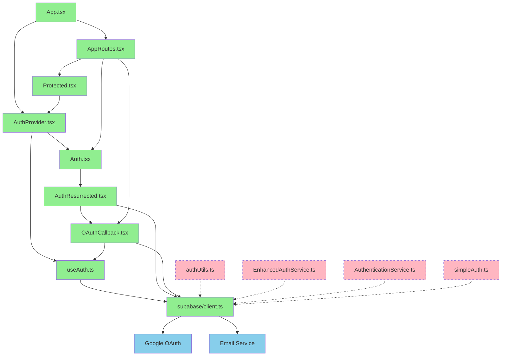

# Authentication System Dependency Graph

## Mermaid Diagram



## Text Adjacency List

### Core Authentication Flow
```
App.tsx
├── AuthProvider.tsx (React Context)
│   ├── useAuth.ts (Primary Auth Hook)
│   │   └── supabase/client.ts (Supabase Instance)
│   ├── Auth.tsx (Auth Page Wrapper)
│   │   └── AuthResurrected.tsx (Main Auth UI)
│   │       └── supabase/client.ts
│   └── Protected.tsx (Route Guard)
│
├── AppRoutes.tsx (Route Definitions)
│   ├── /auth → Auth.tsx
│   ├── /auth/callback → OAuthCallback.tsx
│   │   ├── supabase/client.ts
│   │   └── useAuth.ts (via AuthProvider)
│   └── Protected Routes → Protected.tsx
│
└── OAuthCallback.tsx
    ├── supabase/client.ts (Session handling)
    └── React Router (Navigation)
```

### Redundant Components (DELETE)
```
authUtils.ts (REDUNDANT)
├── signInWithGoogle() → supabase.auth.signInWithOAuth
├── signInWithEmail() → supabase.auth.signInWithPassword
├── signUpWithEmail() → supabase.auth.signUp
├── resetPassword() → supabase.auth.resetPasswordForEmail
└── signOutUser() → supabase.auth.signOut

EnhancedAuthService.ts (REDUNDANT)
├── Singleton Pattern
├── State Management
├── Multiple Auth Methods
└── Competing with useAuth.ts

AuthenticationService.ts (REDUNDANT)
├── Simple Wrapper Functions
└── Unused Imports

simpleAuth.ts (RISK)
├── Wrong Callback URL (/oauth/callback)
└── Potential Redirect Conflicts
```

### External Dependencies
```
supabase/client.ts
├── @supabase/supabase-js
├── Environment Variables
│   ├── VITE_SUPABASE_URL
│   └── VITE_SUPABASE_ANON_KEY
└── Google OAuth Provider

External Services
├── Google OAuth 2.0
│   ├── accounts.google.com
│   └── Redirect URI Configuration
└── Email Service (SMTP)
    ├── Supabase Default (Current)
    └── Custom Provider (Recommended)
```

## Import Analysis

### Files Importing Auth Components

**useAuth.ts** (PRIMARY):
- Used in: `AuthProvider.tsx`, `Protected.tsx`, `OAuthCallback.tsx`
- Status: ✅ CORE - Keep

**authUtils.ts** (REDUNDANT):
- Imports found: 0 active imports
- Status: ❌ DELETE - No dependencies

**EnhancedAuthService.ts** (REDUNDANT):
- Imports found: 0 active imports  
- Status: ❌ DELETE - No dependencies

**AuthenticationService.ts** (REDUNDANT):
- Imports found: 0 active imports
- Status: ❌ DELETE - No dependencies

**simpleAuth.ts** (RISK):
- Imports found: 0 active imports
- Status: ❌ DELETE - Wrong callback URL

### Supabase Client Usage
```
Direct imports of supabase/client.ts:
├── useAuth.ts (✅ Primary auth logic)
├── AuthResurrected.tsx (✅ Form submission)
├── OAuthCallback.tsx (✅ Session handling)
├── authUtils.ts (❌ Redundant)
├── EnhancedAuthService.ts (❌ Redundant)
├── AuthenticationService.ts (❌ Redundant)
└── simpleAuth.ts (❌ Redundant)
```

## Flow Analysis

### 1. Google OAuth Flow
```
User clicks "Continue with Google"
└── AuthResurrected.tsx:handleGoogleAuth()
    └── supabase.auth.signInWithOAuth({provider: 'google'})
        └── Redirects to Google OAuth
            └── User authorizes app
                └── Google redirects to /auth/callback
                    └── OAuthCallback.tsx:handleCallback()
                        └── supabase.auth.getSession()
                            └── Success: Navigate to /dashboard
                            └── Failure: Navigate to /auth
```

### 2. Email/Password Flow
```
User submits email/password form
└── AuthResurrected.tsx:handleEmailAuth()
    ├── Sign Up: supabase.auth.signUp()
    │   └── Email verification sent
    └── Sign In: supabase.auth.signInWithPassword()
        └── Success: AuthProvider updates state
            └── Automatic redirect to /dashboard
```

### 3. Session Management
```
Page Load
└── AuthProvider.tsx:useEffect()
    └── useAuth.ts:initAuth()
        └── supabase.auth.getSession()
            └── supabase.auth.onAuthStateChange()
                └── Update React state (user, session)
                    └── Protected.tsx uses state for route guards
```

## Critical Findings

### 1. Competing Auth State Management
- **Issue**: Multiple services managing auth state independently
- **Impact**: Race conditions, inconsistent state, infinite redirects
- **Files**: `useAuth.ts` vs `EnhancedAuthService.ts` vs `authUtils.ts`

### 2. Wrong Callback URLs
- **Issue**: `simpleAuth.ts` uses `/oauth/callback` instead of `/auth/callback`
- **Impact**: OAuth failures if this service were used
- **Fix**: Delete the file (no active imports found)

### 3. Hardcoded Credentials
- **Issue**: Fallback credentials in `supabase/client.ts`
- **Impact**: Security risk, potential credential leakage
- **Fix**: Remove fallbacks, fail fast on missing env vars

### 4. Missing Routes
- **Issue**: `/auth/reset-password` route not defined
- **Impact**: Password reset flow incomplete
- **Fix**: Add route to `AppRoutes.tsx`

## Recommended Architecture

### Simplified Auth Architecture
```
App.tsx
└── AuthProvider.tsx (Single Source of Truth)
    └── useAuth.ts (Primary Hook)
        └── supabase/client.ts (Configured Instance)

Auth Pages
├── Auth.tsx → AuthResurrected.tsx (Login/Signup UI)
├── OAuthCallback.tsx (OAuth Handler)
└── PasswordResetPage.tsx (Password Reset - NEW)

Route Protection
└── Protected.tsx (Guards using AuthProvider state)
```

This architecture eliminates redundancy while maintaining all required functionality per official Supabase documentation.