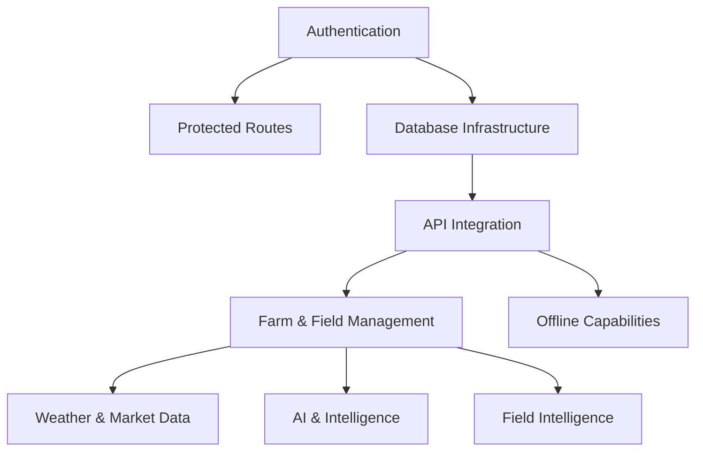

# 🚀 CROPGENIUS IMPLEMENTATION ROADMAP

## Phase 1: Core Infrastructure (Weeks 1-2)

### Priority 1: Authentication & Data Foundation
- [ ] `fix_AuthenticationService`
- [ ] `fix_DatabaseInfrastructure`
- [ ] `fix_ProtectedRoute`
- [ ] `fix_APIIntegration`

### Priority 2: Basic UI Framework
- [ ] `fix_Layout`
- [ ] `fix_GlobalMenu`
- [ ] `fix_DashboardPage`

## Phase 2: Essential Features (Weeks 3-4)

### Priority 1: Farm & Field Management
- [ ] `fix_FarmList`
- [ ] `fix_FieldSelector`
- [ ] `fix_FieldCard`
- [ ] `fix_MapSelector`

### Priority 2: Weather & Market Data
- [ ] `fix_WeatherForecast`
- [ ] `fix_ForecastPanel`
- [ ] `fix_MarketInsightsDashboard`

## Phase 3: Advanced Features (Weeks 5-6)

### Priority 1: AI & Intelligence
- [ ] `fix_CropRecommendation`
- [ ] `fix_YieldPredictionPanel`
- [ ] `fix_CropDiseaseDetector`

### Priority 2: Field Intelligence
- [ ] `fix_FieldIntelDashboard`
- [ ] `fix_SatelliteImageryDisplay`
- [ ] `fix_FieldMapView`

## Phase 4: Platform Enhancement (Weeks 7-8)

### Priority 1: Offline Capabilities
- [ ] `fix_OfflineInfrastructure`
- [ ] `fix_OfflineCapabilities`

### Priority 2: User Experience
- [ ] `fix_LanguageSelector`
- [ ] Performance optimizations
- [ ] Comprehensive testing

## Implementation Guidelines

### Development Workflow
1. **Component Assessment**: Review current implementation and BOOK_OF_TRUTH tasks
2. **Dependency Check**: Ensure required services/hooks are implemented first
3. **Implementation**: Follow the task list for each component
4. **Testing**: Create unit and integration tests
5. **Documentation**: Update component documentation

### Commit Convention
```
feat(component): implement real data fetching for ComponentName
fix(component): resolve issue with ComponentName
refactor(component): improve ComponentName implementation
test(component): add tests for ComponentName
```

### Definition of Done
- Component uses real data from APIs/database
- All UI elements are functional
- Error states are properly handled
- Loading states are implemented
- Tests are passing
- Documentation is updated

## Critical Path Dependencies



## Risk Assessment

### High Risk Areas
- **Authentication**: Complex, security-critical
- **Satellite Imagery**: Requires external API integration
- **AI Components**: Dependent on external services

### Mitigation Strategies
- Start with authentication and database infrastructure
- Implement fallbacks for external dependencies
- Create mock services for development

## Progress Tracking

Track implementation progress in the project management tool with these statuses:
- 🔴 Not Started
- 🟡 In Progress
- 🟢 Completed
- ⚪ Blocked

Update this roadmap weekly to reflect current progress and adjust priorities as needed.